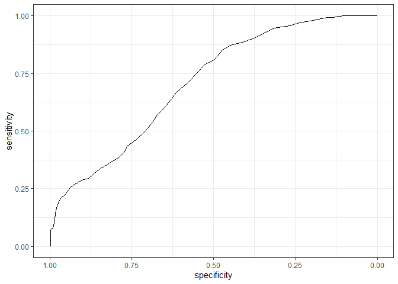
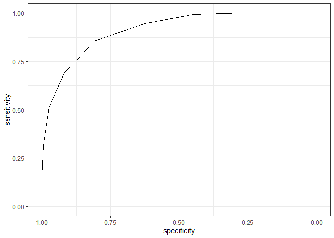

## Загрузка и проверка датасета


``` r
trauma_data <- readxl::read_excel("data/trauma.xlsx")
# Изменим единицы измерения роста и масы тела пациента на м и кг.
### Почему-то версия кода с пайпом не работает
# trauma_data %>%
#   mutate(Height_cm = Height %>% gsub("\"", "") %>% as.numeric())
  
trauma_data %>% 
  mutate(Height = as.numeric(gsub("\"", "", Height) ) * 2.54 / 100,
         Weight = Weight / 2.2,
         Sex = as.factor(Sex),
         Death = as.factor(Death),
         ) -> trauma_data


# Переменная FOUR может иметь 0 в значении. Однако переменная Hb  - не может иметь 0(получается что у пациента совсем не было гемоглобина). Подставим в наблюдения где Hb == 0 значение NA
trauma_data$Hb <- na_if(trauma_data$Hb,  0)
```

## Задание 1

Дайте описательную статистику для переменных, включённых в датасет. Дополнительно рассчитайте, у какого количества пациентов и в каком проценте случаев у пациентов был снижен уровень гемоглобина? Используйте следующие референтные значения (Мужчины: 13.5--16 г/дл, Женщины: 12--14 г/дл).


``` r
# описательные статистики

skimr::skim(trauma_data)
```


Table: Data summary

|                         |            |
|:------------------------|:-----------|
|Name                     |trauma_data |
|Number of rows           |1024        |
|Number of columns        |12          |
|_______________________  |            |
|Column type frequency:   |            |
|character                |1           |
|factor                   |2           |
|numeric                  |9           |
|________________________ |            |
|Group variables          |None        |


**Variable type: character**

|skim_variable | n_missing| complete_rate| min| max| empty| n_unique| whitespace|
|:-------------|---------:|-------------:|---:|---:|-----:|--------:|----------:|
|Name          |         0|             1|   9|  25|     0|     1023|          0|


**Variable type: factor**

|skim_variable | n_missing| complete_rate|ordered | n_unique|top_counts         |
|:-------------|---------:|-------------:|:-------|--------:|:------------------|
|Sex           |         0|             1|FALSE   |        2|Mal: 640, Fem: 384 |
|Death         |         0|             1|FALSE   |        2|0: 615, 1: 409     |


**Variable type: numeric**

|skim_variable | n_missing| complete_rate|   mean|     sd|    p0|    p25|    p50|    p75|    p100|hist                                     |
|:-------------|---------:|-------------:|------:|------:|-----:|------:|------:|------:|-------:|:----------------------------------------|
|id            |         0|          1.00| 512.50| 295.75|  1.00| 256.75| 512.50| 768.25| 1024.00|▇▇▇▇▇ |
|Age           |         0|          1.00|  40.94|  13.66| 18.00|  29.00|  41.00|  53.00|   64.00|▇▆▆▇▇ |
|Height        |         0|          1.00|   1.84|   0.08|  1.62|   1.77|   1.85|   1.91|    2.03|▁▅▆▇▂ |
|Weight        |         0|          1.00|  87.97|   8.29| 60.59|  82.58|  88.14|  93.38|  115.05|▁▃▇▃▁ |
|SBP           |         0|          1.00| 110.78|   7.45| 90.00| 106.00| 110.00| 116.00|  134.00|▁▅▇▃▁ |
|DBP           |         0|          1.00|  84.78|   8.42| 58.00|  78.00|  84.00|  90.00|  110.00|▁▅▇▅▁ |
|FOUR          |         0|          1.00|   8.85|   3.01|  0.00|   7.00|   9.00|  11.00|   16.00|▁▅▇▇▂ |
|GSC           |         0|          1.00|   7.79|   2.69|  3.00|   6.00|   8.00|  10.00|   14.00|▆▇▇▆▂ |
|Hb            |        16|          0.98|  13.01|   1.28|  9.40|  12.10|  13.10|  14.00|   16.20|▁▅▇▇▂ |


``` r
# Дополнительно рассчитайте у какого количества пациентов и в каком проценте случаев у пациентов был снижен уровень гемоглобина?
# Для этого введем новую переменную low_HB и применим функцию case_when, так как будем задачать несколько условий одновременно.

trauma_data %>%
  filter(!is.na(Hb)) %>%
  mutate(Low_HB = case_when(
    Sex == "Male" & Hb <= 13.5 ~ TRUE,
    Sex == "Female" & Hb <= 12 ~ TRUE,
    .default = FALSE
  )) %>%
  group_by(Sex) %>%
  # Расчитаем общее количество пациентов и процент пациетов с низким гемоглобином
  summarise(
    n = n(),
    count_lowHb_patients = sum(Low_HB),
    percent_lowHb_patients = round(sum(Low_HB) / n * 100, 2),
    
  ) %>%
  ungroup() %>%
  # Теперь добавим сторчку  "всего"
  bind_rows(
    summarise(
      . ,
      Sex = "Total*",
      count_lowHb_patients = sum(count_lowHb_patients),
      percent_lowHb_patients = round(sum(count_lowHb_patients) / sum(n) * 100, 2),
      n = sum(n)
    )
  ) %>%
  flextable() %>%
  theme_box() %>%
  color(color = "black") %>%
  align(align = "center", part = "all") %>% 
  add_footer_lines("*16 missing values")
```

```{=html}
<div class="tabwid"><style>.cl-7fa32ac4{}.cl-7f92650e{font-family:'Arial';font-size:11pt;font-weight:bold;font-style:normal;text-decoration:none;color:rgba(0, 0, 0, 1.00);background-color:transparent;}.cl-7f926522{font-family:'Arial';font-size:11pt;font-weight:normal;font-style:normal;text-decoration:none;color:rgba(0, 0, 0, 1.00);background-color:transparent;}.cl-7f98a798{margin:0;text-align:center;border-bottom: 0 solid rgba(0, 0, 0, 1.00);border-top: 0 solid rgba(0, 0, 0, 1.00);border-left: 0 solid rgba(0, 0, 0, 1.00);border-right: 0 solid rgba(0, 0, 0, 1.00);padding-bottom:5pt;padding-top:5pt;padding-left:5pt;padding-right:5pt;line-height: 1;background-color:transparent;}.cl-7f98a7ac{margin:0;text-align:left;border-bottom: 0 solid rgba(0, 0, 0, 1.00);border-top: 0 solid rgba(0, 0, 0, 1.00);border-left: 0 solid rgba(0, 0, 0, 1.00);border-right: 0 solid rgba(0, 0, 0, 1.00);padding-bottom:5pt;padding-top:5pt;padding-left:5pt;padding-right:5pt;line-height: 1;background-color:transparent;}.cl-7f98e0f0{width:0.75in;background-color:transparent;vertical-align: middle;border-bottom: 0.75pt solid rgba(102, 102, 102, 1.00);border-top: 0.75pt solid rgba(102, 102, 102, 1.00);border-left: 0.75pt solid rgba(102, 102, 102, 1.00);border-right: 0.75pt solid rgba(102, 102, 102, 1.00);margin-bottom:0;margin-top:0;margin-left:0;margin-right:0;}.cl-7f98e104{width:0.75in;background-color:transparent;vertical-align: middle;border-bottom: 0.75pt solid rgba(102, 102, 102, 1.00);border-top: 0 solid rgba(0, 0, 0, 1.00);border-left: 0.75pt solid rgba(102, 102, 102, 1.00);border-right: 0.75pt solid rgba(102, 102, 102, 1.00);margin-bottom:0;margin-top:0;margin-left:0;margin-right:0;}.cl-7f98e105{width:0.75in;background-color:transparent;vertical-align: middle;border-bottom: 0 solid rgba(255, 255, 255, 0.00);border-top: 0 solid rgba(255, 255, 255, 0.00);border-left: 0 solid rgba(255, 255, 255, 0.00);border-right: 0 solid rgba(255, 255, 255, 0.00);margin-bottom:0;margin-top:0;margin-left:0;margin-right:0;}</style><table data-quarto-disable-processing='true' class='cl-7fa32ac4'><thead><tr style="overflow-wrap:break-word;"><th class="cl-7f98e0f0"><p class="cl-7f98a798"><span class="cl-7f92650e">Sex</span></p></th><th class="cl-7f98e0f0"><p class="cl-7f98a798"><span class="cl-7f92650e">n</span></p></th><th class="cl-7f98e0f0"><p class="cl-7f98a798"><span class="cl-7f92650e">count_lowHb_patients</span></p></th><th class="cl-7f98e0f0"><p class="cl-7f98a798"><span class="cl-7f92650e">percent_lowHb_patients</span></p></th></tr></thead><tbody><tr style="overflow-wrap:break-word;"><td class="cl-7f98e104"><p class="cl-7f98a798"><span class="cl-7f926522">Female</span></p></td><td class="cl-7f98e104"><p class="cl-7f98a798"><span class="cl-7f926522">376</span></p></td><td class="cl-7f98e104"><p class="cl-7f98a798"><span class="cl-7f926522">240</span></p></td><td class="cl-7f98e104"><p class="cl-7f98a798"><span class="cl-7f926522">63.83</span></p></td></tr><tr style="overflow-wrap:break-word;"><td class="cl-7f98e0f0"><p class="cl-7f98a798"><span class="cl-7f926522">Male</span></p></td><td class="cl-7f98e0f0"><p class="cl-7f98a798"><span class="cl-7f926522">632</span></p></td><td class="cl-7f98e0f0"><p class="cl-7f98a798"><span class="cl-7f926522">259</span></p></td><td class="cl-7f98e0f0"><p class="cl-7f98a798"><span class="cl-7f926522">40.98</span></p></td></tr><tr style="overflow-wrap:break-word;"><td class="cl-7f98e0f0"><p class="cl-7f98a798"><span class="cl-7f926522">Total*</span></p></td><td class="cl-7f98e0f0"><p class="cl-7f98a798"><span class="cl-7f926522">1,008</span></p></td><td class="cl-7f98e0f0"><p class="cl-7f98a798"><span class="cl-7f926522">499</span></p></td><td class="cl-7f98e0f0"><p class="cl-7f98a798"><span class="cl-7f926522">49.50</span></p></td></tr></tbody><tfoot><tr style="overflow-wrap:break-word;"><td  colspan="4"class="cl-7f98e105"><p class="cl-7f98a7ac"><span class="cl-7f926522">*16 missing values</span></p></td></tr></tfoot></table></div>
```

## Задание 2

Рассчитайте индекс массы тела у пациентов (кг / м2). Каков был средний (M (SD)) уровень ИМТ у пациентов, включённых в исследование? Какая доля пациентов имела ожирение (ИМТ \> 30)


``` r
# для ответа нужно сделать новую переменную body mass index, BMI
trauma_data %>% 
  mutate(BMI = Weight / (Height^2))-> trauma_data 
tibble(
  "Mean BMI" = round(mean(trauma_data$BMI, na.rm = TRUE),2),
  "Sd BMI" = round(sd(trauma_data$BMI, na.rm = TRUE),2),
  "% obesity" = round(sum(trauma_data$BMI > 30, na.rm = TRUE)/NROW(trauma_data$BMI)*100, 2)
)%>%
  flextable() %>%
  theme_box() %>%
  color(color = "black") %>%
  align(align = "center", part = "all") %>% 
  add_footer_lines("n patients = 1024")
```

```{=html}
<div class="tabwid"><style>.cl-7fcf4104{}.cl-7fbc48ce{font-family:'Arial';font-size:11pt;font-weight:bold;font-style:normal;text-decoration:none;color:rgba(0, 0, 0, 1.00);background-color:transparent;}.cl-7fbc48e2{font-family:'Arial';font-size:11pt;font-weight:normal;font-style:normal;text-decoration:none;color:rgba(0, 0, 0, 1.00);background-color:transparent;}.cl-7fc453e8{margin:0;text-align:center;border-bottom: 0 solid rgba(0, 0, 0, 1.00);border-top: 0 solid rgba(0, 0, 0, 1.00);border-left: 0 solid rgba(0, 0, 0, 1.00);border-right: 0 solid rgba(0, 0, 0, 1.00);padding-bottom:5pt;padding-top:5pt;padding-left:5pt;padding-right:5pt;line-height: 1;background-color:transparent;}.cl-7fc45406{margin:0;text-align:left;border-bottom: 0 solid rgba(0, 0, 0, 1.00);border-top: 0 solid rgba(0, 0, 0, 1.00);border-left: 0 solid rgba(0, 0, 0, 1.00);border-right: 0 solid rgba(0, 0, 0, 1.00);padding-bottom:5pt;padding-top:5pt;padding-left:5pt;padding-right:5pt;line-height: 1;background-color:transparent;}.cl-7fc4984e{width:0.75in;background-color:transparent;vertical-align: middle;border-bottom: 0.75pt solid rgba(102, 102, 102, 1.00);border-top: 0.75pt solid rgba(102, 102, 102, 1.00);border-left: 0.75pt solid rgba(102, 102, 102, 1.00);border-right: 0.75pt solid rgba(102, 102, 102, 1.00);margin-bottom:0;margin-top:0;margin-left:0;margin-right:0;}.cl-7fc49862{width:0.75in;background-color:transparent;vertical-align: middle;border-bottom: 0.75pt solid rgba(102, 102, 102, 1.00);border-top: 0 solid rgba(0, 0, 0, 1.00);border-left: 0.75pt solid rgba(102, 102, 102, 1.00);border-right: 0.75pt solid rgba(102, 102, 102, 1.00);margin-bottom:0;margin-top:0;margin-left:0;margin-right:0;}.cl-7fc4986c{width:0.75in;background-color:transparent;vertical-align: middle;border-bottom: 0 solid rgba(255, 255, 255, 0.00);border-top: 0 solid rgba(255, 255, 255, 0.00);border-left: 0 solid rgba(255, 255, 255, 0.00);border-right: 0 solid rgba(255, 255, 255, 0.00);margin-bottom:0;margin-top:0;margin-left:0;margin-right:0;}</style><table data-quarto-disable-processing='true' class='cl-7fcf4104'><thead><tr style="overflow-wrap:break-word;"><th class="cl-7fc4984e"><p class="cl-7fc453e8"><span class="cl-7fbc48ce">Mean BMI</span></p></th><th class="cl-7fc4984e"><p class="cl-7fc453e8"><span class="cl-7fbc48ce">Sd BMI</span></p></th><th class="cl-7fc4984e"><p class="cl-7fc453e8"><span class="cl-7fbc48ce">% obesity</span></p></th></tr></thead><tbody><tr style="overflow-wrap:break-word;"><td class="cl-7fc49862"><p class="cl-7fc453e8"><span class="cl-7fbc48e2">26.06</span></p></td><td class="cl-7fc49862"><p class="cl-7fc453e8"><span class="cl-7fbc48e2">2.57</span></p></td><td class="cl-7fc49862"><p class="cl-7fc453e8"><span class="cl-7fbc48e2">6.93</span></p></td></tr></tbody><tfoot><tr style="overflow-wrap:break-word;"><td  colspan="3"class="cl-7fc4986c"><p class="cl-7fc45406"><span class="cl-7fbc48e2">n patients = 1024</span></p></td></tr></tfoot></table></div>
```

## Задание 3

Как выглядит ROC-кривая для предсказания летального исхода в течение 24 часов по переменной, характеризующей уровень гемоглобина? Постройте график. Чем может быть обусловлена такая форма кривой?


``` r
roc_curve_Hb <- roc(Death ~ Hb, 
                   data = trauma_data,
                   ci = TRUE)
```

```
## Setting levels: control = 0, case = 1
```

```
## Setting direction: controls > cases
```

``` r
roc_curve_Hb
```

```
## 
## Call:
## roc.formula(formula = Death ~ Hb, data = trauma_data, ci = TRUE)
## 
## Data: Hb in 605 controls (Death 0) > 403 cases (Death 1).
## Area under the curve: 0.7078
## 95% CI: 0.6763-0.7392 (DeLong)
```

``` r
roc_curve_Hb %>% 
    ggroc() + 
    theme_bw()
```

<!-- -->

``` r
### ROC- кривая близка к  диагонали, а  AUC 0.71, что свидетельствует о низком предсказании данной модели. 
```

## Задание 4

Чему равна площадь под ROC-кривой, которую вы построили в вопросе 3? Чему равен 95% двусторонний ДИ для площади под ROC-кривой, которую вы построили в вопросе 3?


``` r
tibble(
  AUC = roc_curve_Hb$auc, 
  CI_min = roc_curve_Hb$ci[1], 
  CI_max = roc_curve_Hb$ci[3]
)
```

```
## # A tibble: 1 x 3
##   AUC       CI_min CI_max
##   <auc>      <dbl>  <dbl>
## 1 0.7077702  0.676  0.739
```

## Задание 5

Проведите ROC-анализ и определите, какое пороговое значение является оптимальным для предсказания летального исхода в течение 24 часов по шкале комы Глазго. Какой чувствительностью и специфичностью обладает данный порог?


``` r
roc_curve_GSC <- roc(Death ~ GSC, 
                   data = trauma_data,
                   ci = TRUE)
```

```
## Setting levels: control = 0, case = 1
```

```
## Setting direction: controls > cases
```

``` r
roc_curve_GSC 
```

```
## 
## Call:
## roc.formula(formula = Death ~ GSC, data = trauma_data, ci = TRUE)
## 
## Data: GSC in 615 controls (Death 0) > 409 cases (Death 1).
## Area under the curve: 0.9124
## 95% CI: 0.8959-0.9289 (DeLong)
```

``` r
roc_curve_GSC %>% 
    ggroc() + 
    theme_bw()
```

<!-- -->

``` r
# Найдем "лучшие" координаты 

roc_curve_GSC  %>% coords(x = "best", best.method = "closest.topleft")
```

```
##   threshold specificity sensitivity
## 1       7.5   0.8081301   0.8557457
```

7.5 оптимальное значение для предсказания летального исхода в течение 24 часов по шкале комы Глазго. (При данном значении чувствительность и специфичной модели будет максимальными)

## Задание 6

Какая из количественных переменных в датасете (включая рассчитанный вами ранее ИМТ) обладает наибольшей площадью под ROC-кривой? Как вы можете интерпретировать это знание? Какая количественная переменная имеет наименьшую площадь?


``` r
###### Дополнение. На занятии мы ввели новую переменную - среднее АД, давайте введем ее и решение

trauma_data <- trauma_data %>% 
  mutate(MeanBP = (DBP + 1/3 * (SBP - DBP)) %>% round(2))

# Изменим датасет и найдем AUC у всех количественных переменных
roc_curve_all <- trauma_data %>% 
  select(Death, where(is.numeric) & -c(id)) %>% 
  pivot_longer(cols = !Death) %>% 
  group_by(name) %>% 
  # ci[2] - это сам AUC, ci[1] и ci[3] - 95 % ДИ
  summarise(AUC = roc(Death, value, ci = T)$ci[2] %>% round(3),
              AUC_min = roc(Death, value, ci = T)$ci[1] %>% round(3),
              AUC_max = roc(Death, value, ci = T)$ci[3] %>% round(3))
```

```
## Setting levels: control = 0, case = 1
```

```
## Setting direction: controls < cases
```

```
## Setting levels: control = 0, case = 1
```

```
## Setting direction: controls > cases
```

```
## Setting levels: control = 0, case = 1
```

```
## Setting direction: controls > cases
```

```
## Setting levels: control = 0, case = 1
```

```
## Setting direction: controls > cases
```

```
## Setting levels: control = 0, case = 1
```

```
## Setting direction: controls > cases
```

```
## Setting levels: control = 0, case = 1
```

```
## Setting direction: controls > cases
```

```
## Setting levels: control = 0, case = 1
```

```
## Setting direction: controls < cases
```

```
## Setting levels: control = 0, case = 1
```

```
## Setting direction: controls > cases
```

```
## Setting levels: control = 0, case = 1
```

```
## Setting direction: controls > cases
```

```
## Setting levels: control = 0, case = 1
```

```
## Setting direction: controls > cases
```

```
## Setting levels: control = 0, case = 1
```

```
## Setting direction: controls < cases
```

```
## Setting levels: control = 0, case = 1
```

```
## Setting direction: controls > cases
```

```
## Setting levels: control = 0, case = 1
```

```
## Setting direction: controls > cases
```

```
## Setting levels: control = 0, case = 1
```

```
## Setting direction: controls > cases
```

```
## Setting levels: control = 0, case = 1
```

```
## Setting direction: controls > cases
```

```
## Setting levels: control = 0, case = 1
```

```
## Setting direction: controls > cases
```

```
## Setting levels: control = 0, case = 1
```

```
## Setting direction: controls < cases
```

```
## Setting levels: control = 0, case = 1
```

```
## Setting direction: controls > cases
```

```
## Setting levels: control = 0, case = 1
```

```
## Setting direction: controls > cases
```

```
## Setting levels: control = 0, case = 1
```

```
## Setting direction: controls > cases
```

```
## Setting levels: control = 0, case = 1
```

```
## Setting direction: controls < cases
```

```
## Setting levels: control = 0, case = 1
```

```
## Setting direction: controls > cases
```

```
## Setting levels: control = 0, case = 1
```

```
## Setting direction: controls > cases
```

```
## Setting levels: control = 0, case = 1
```

```
## Setting direction: controls > cases
```

```
## Setting levels: control = 0, case = 1
```

```
## Setting direction: controls > cases
```

```
## Setting levels: control = 0, case = 1
```

```
## Setting direction: controls > cases
```

```
## Setting levels: control = 0, case = 1
```

```
## Setting direction: controls < cases
```

```
## Setting levels: control = 0, case = 1
```

```
## Setting direction: controls > cases
```

```
## Setting levels: control = 0, case = 1
```

```
## Setting direction: controls > cases
```

```
## Setting levels: control = 0, case = 1
```

```
## Setting direction: controls > cases
```

``` r
roc_curve_all
```

```
## # A tibble: 10 x 4
##    name     AUC AUC_min AUC_max
##    <chr>  <dbl>   <dbl>   <dbl>
##  1 Age    0.527   0.491   0.563
##  2 BMI    0.502   0.465   0.538
##  3 DBP    0.744   0.714   0.774
##  4 FOUR   0.934   0.92    0.948
##  5 GSC    0.912   0.896   0.929
##  6 Hb     0.708   0.676   0.739
##  7 Height 0.482   0.445   0.518
##  8 MeanBP 0.765   0.736   0.794
##  9 SBP    0.786   0.759   0.814
## 10 Weight 0.518   0.482   0.554
```

``` r
#### теперь найдем переменную с максимальным и миниммаьным AUC

cat("Наибольшей площадью под ROC-кривой обладает переменная:",  
    roc_curve_all %>%
    filter(AUC == max(AUC)) %>%
    pull(name), 
    ". AUC = ",  
    roc_curve_all %>%
    filter(AUC == max(AUC)) %>% 
       pull(AUC), "\n\n")
```

```
## Наибольшей площадью под ROC-кривой обладает переменная: FOUR . AUC =  0.934
```

``` r
#### Можно автоматизировать, но надо писть функцию.
 roc_curve_FOUR <- roc(Death ~ FOUR,
    data = trauma_data,
    ci = TRUE) 
```

```
## Setting levels: control = 0, case = 1
## Setting direction: controls > cases
```

``` r
roc_curve_FOUR %>%
  coords(x = "best", best.method = "closest.topleft")
```

```
##   threshold specificity sensitivity
## 1       8.5   0.8308943   0.8948655
```

``` r
cat("Наименьшей площадью под ROC-кривой обладает переменная:",  
    roc_curve_all %>%
    filter(AUC == min(AUC)) %>%
    pull(name), 
    ". AUC = ",  
    roc_curve_all %>%
    filter(AUC == min(AUC)) %>% 
       pull(AUC))
```

```
## Наименьшей площадью под ROC-кривой обладает переменная: Height . AUC =  0.482
```

Наибольшей площадью под ROC-кривой обладает переменная: FOUR . AUC =  0.934  Возможно это связано с тем , что данная шкала "имеет преимущества перед шкалой комы Глазго, а именно: точнее детализирует неврологический статус, распознает синдром запертого человека, дает оценку рефлексам ствола мозга, дает оценку дыхательному паттерну, выявляет различные стадии дислокации (вклинения) мозга"

Наименьшей площадью под ROC-кривой обладает переменная: Height . AUC =  0.482 (Врядли рост как либо будет Смертность) 
