## ЗАгрузка датасета


``` r
  hogwarts <- read.csv("data/hogwarts_2024.csv", fileEncoding = "Windows-1251")


# Changing some variables type to factors
hogwarts <- hogwarts |> mutate(
  across(c(house, course, sex, wandCore, bloodStatus), ~ as.factor(.x))
)
```

## Столбчатые диаграммы

### Столбчатые диаграммы Задание 1

Постройте барплот (столбчатую диаграмму), отражающую распределение числа
студентов по курсу обучения. Примените любую из встроенных тем ggplot.
Раскрасьте столбики любым понравившимся вам цветом (можно использовать
как словесные обозначения, так и гекскоды). Добавьте цвет контура
столбиков.


``` r
ggplot(hogwarts)+
  geom_bar(aes(x = course), colour = "black", fill="chocolate")+ 
  theme_classic()
```

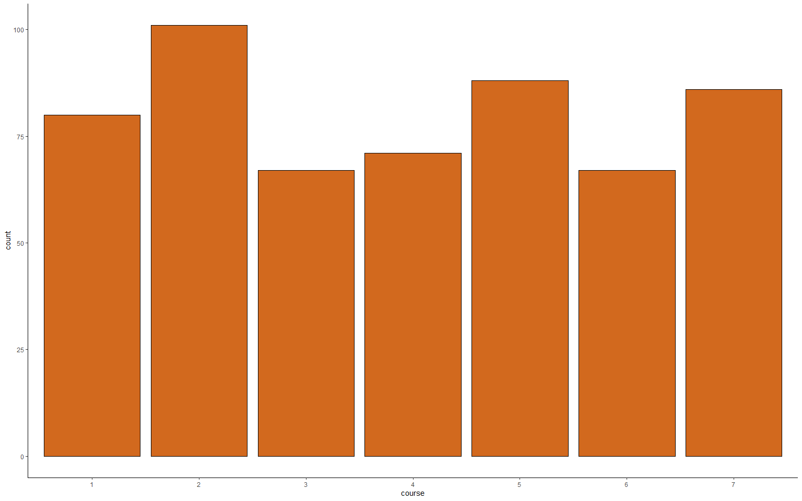<!-- -->

### Столбчатые диаграммы Задание 2

Создайте новый барплот, отражающий распределение числа студентов по
факультету. Добавьте на график вторую факторную переменную --
происхождение (bloodStatus). Модифицируйте при помощи аргумента position
графика так, чтобы каждый столбец показывал распределение факультета по
чистоте крови в долях. Примените произвольную тему. Запишите текстом в
rmd-документе, какой вывод можно сделать из графика?


``` r
theme_custom <- theme(
    axis.text = element_text(size = 20),
    axis.title = element_text(size = 25),
    axis.text.x = element_text(angle = 0),
    legend.title = element_text(size = 20),
    legend.text = element_text(size = 20)
  )

ggplot(hogwarts)+
  geom_bar(aes(x = house, fill=bloodStatus), colour = "black",  position = "fill")+ 
  theme_get()+
  theme_custom
```

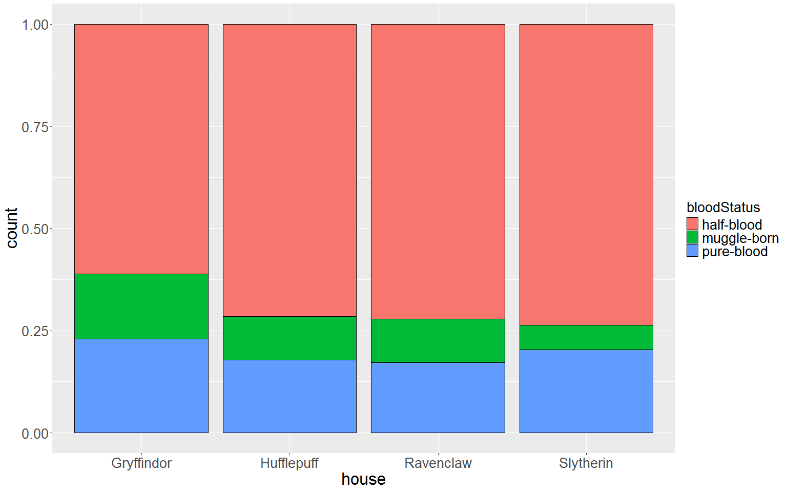<!-- -->

На данном графике отчетливо видно что наибольшая доля muggle-born
студентов находится на Griffindor, наименьшая доля на Slytherin.
Противоположная картина со студентами со статусом крови half-blood. На
факультете Slytherin их наибольшая доля, на факультете Griffindor -
наименьшая.

### Столбчатые диаграммы Задание 3

Модифицируйте датасет таким образом, чтобы в нем остались только
чистокровные (pure-blood) и маглорожденные студенты (muggle-born).
Создайте на основе этих данных график из пункта 2. Добавьте
горизонтальную пунктирную линию произвольного цвета на уровне 50%. Дайте
осям название на русском языке (1б). Дополнительно: переименуйте на
русский язык категории легенды pure-blood и muggle-born (0.5 б).


``` r
hogwarts |> 
  filter(bloodStatus %in% c("muggle-born", "pure-blood") ) %>%  # отобрали только чистокровные (pure-blood) и маглорожденные студенты (muggle-born)
  ggplot()+
  geom_bar(aes(x = house, 
               fill=bloodStatus),
           colour = "black",
           position = "fill")+ 
    geom_hline(yintercept = 0.5, 
             linetype = "dashed", 
             linewidth = 3, 
             colour = "red")+
  theme_get()+
  labs(
title = "Распределение числа студентов по факультету и происхождению (bloodStatus)",
subtitle = "только чистокровные (pure-blood) и маглорожденные студенты (muggle-born).",
y = "Распределение студентов по чистоте крови в долях.",
x = "Факультет",
fill = "Статус крови")+
   theme_custom+
 scale_fill_manual(values = c("muggle-born" = "green4", "pure-blood" = "blue"),
                    labels = c("muggle-born" = "магглорожденный", "pure-blood" = "чистокровный"))
```

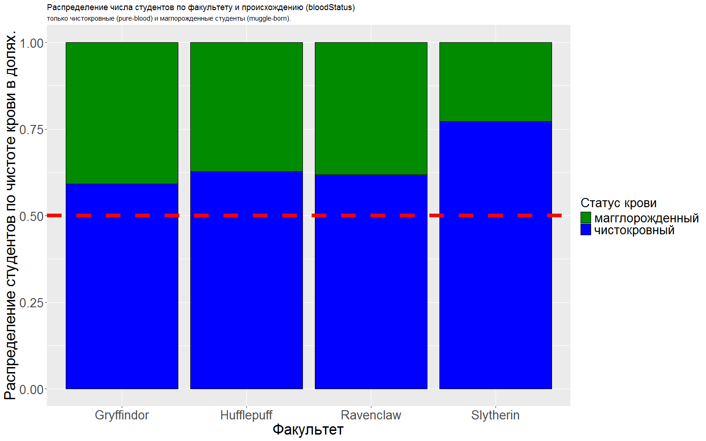<!-- -->

## Боксплоты

### Боксплоты Задание 1

Отобразите распределение баллов, заработанных студентами на 3-й неделе
обучения, по факультетам. Отсортируйте факультеты в порядке убывания
медианного балла за 3-ю неделю (мы не останавливались на этом в лекции,
но упомянутая в ней функция по умолчанию сортирует именно по медиане,
так что в этом случае дополнительных аргументов передавать не следует).
(1 б.)


``` r
ggplot(hogwarts)+
  geom_boxplot(aes(y = week_3, x = fct_reorder(house, week_3, .desc = TRUE)))+
  theme_gray()+
   labs(
y = "Баллы за 3 неделю",
x = "факультет")+
  theme_custom
```

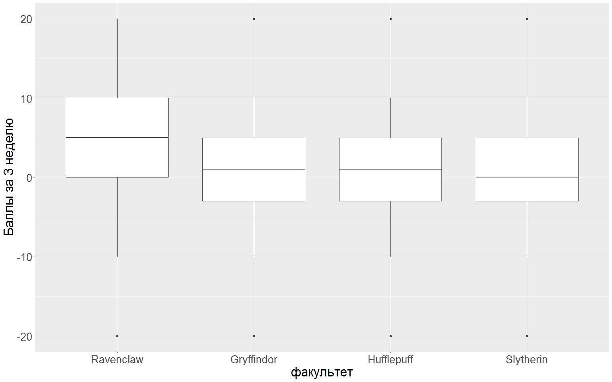<!-- -->

### Боксплоты Задание 2

Добавьте отображение разными цветами для происхождения студентов
(bloodStatus). Добавьте на боксплот вырезку (notch). Настройте для
данного чанка размер изображения 14:14 дюймов. Приведите названия осей к
корректному виду.


``` r
boxplot_1 <- ggplot(hogwarts)+
  geom_boxplot(aes(y = week_3,
                   x = fct_reorder(house, week_3, .desc = TRUE),
                   # fill= bloodStatus),
                    fill= fct_reorder(bloodStatus, week_3, .desc = TRUE)),
                   notch = TRUE)+
  theme_gray()+
   labs(
y = "Баллы за 3 неделю",
x = "Факультет",
fill= "Происхождение")+
  theme_custom

print(boxplot_1)
```

```
## Notch went outside hinges
## i Do you want `notch = FALSE`?
## Notch went outside hinges
## i Do you want `notch = FALSE`?
## Notch went outside hinges
## i Do you want `notch = FALSE`?
## Notch went outside hinges
## i Do you want `notch = FALSE`?
```

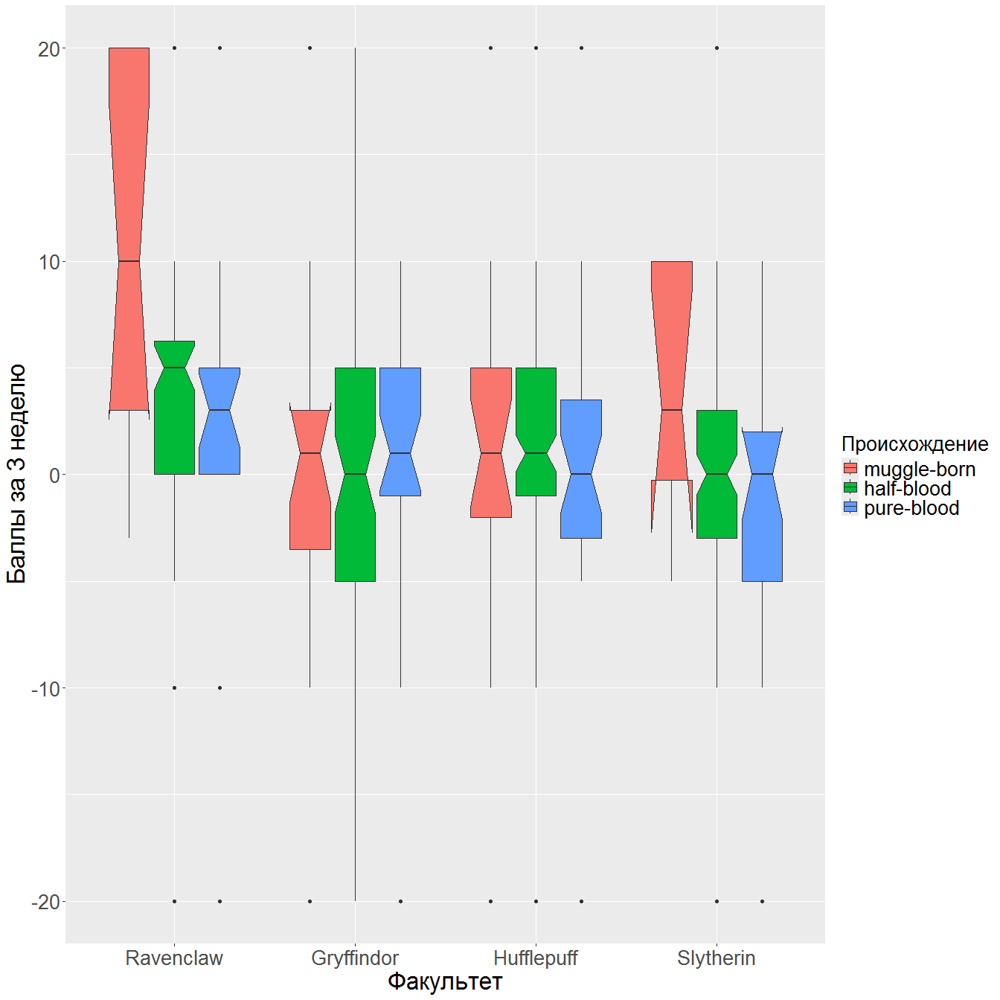<!-- -->

### Боксплоты Задание 3

Добавьте на график джиттер-плот. Удалите отображение выбросов у
боксплота. Видоизмените по своему вкусу толщину линий и ширину
боксплота. (1 б.) Дополнительно: Добавьте название графика и подпись
(0.5 б.)


``` r
ggplot(hogwarts)+
  geom_boxplot(aes(y = week_3,
                   x = fct_reorder(house, week_3, .desc = TRUE),
                   # fill= bloodStatus),
                    fill= fct_reorder(bloodStatus, week_3, .desc = TRUE)),
                   notch = TRUE, outliers = FALSE, linewidth = 0.5, width = 0.5)+
  theme_gray()+
   labs(
y = "Баллы за 3 неделю",
x = "Факультет",
fill= "Происхождение")+
  theme_custom+
  geom_jitter( aes(x= house, y= week_3, fill= bloodStatus),
               size = 2, width = 0.3, height= 0.2, col="orange")+
  labs(
    title = "Распределение  полученных баллов за 3 неделю по факультетам и происхождению",
    # subtitle = "",
    caption = "Какую подпись добавить? Made in China")+
  theme(plot.title = element_text(size = 20, hjust = 0.5))
```

```
## Notch went outside hinges
## i Do you want `notch = FALSE`?
## Notch went outside hinges
## i Do you want `notch = FALSE`?
## Notch went outside hinges
## i Do you want `notch = FALSE`?
## Notch went outside hinges
## i Do you want `notch = FALSE`?
```

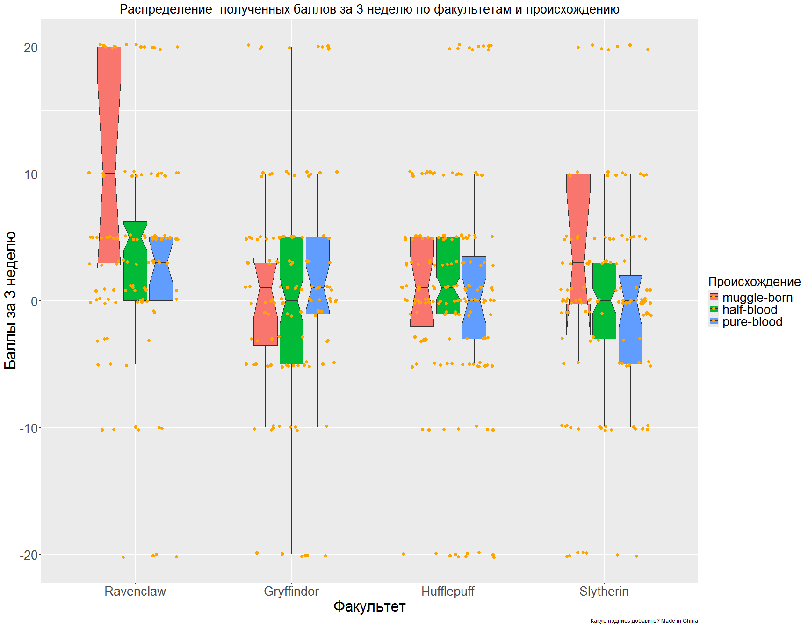<!-- -->

## Разное

### Разное Задание 1

Постройте "леденцовый график" (lollipop-plot) для количества набранных
студентами 5-го курса баллов за весь учебный год (по оси ординат -- id
студента, по оси абсцисс -- итоговый балл). Отсортируйте студентов в
порядке убывания итогового балла. Раскрасьте точки на "леденцах" в
зависимости от сердцевины волшебной палочки. Палочки с сердечной жилой
дракона должны быть красного цвета, с пером феникса -- желтого, с
волосом единорога -- серого. (1 б.)


``` r
hogwarts |> 
  filter(course == 5) |> 
  mutate(id = as.factor(id)) |> 
  ggplot()+
  geom_segment(aes(y = fct_reorder(id, result, .desc = TRUE), 
                   yend = fct_reorder(id, result, .desc = TRUE), 
                   x = 0, 
                   xend = result))+
  geom_point(aes(y = fct_reorder(id, result, .desc = TRUE), 
                 x = result, col= wandCore), 
              size = 3)+
   labs(x = "итоговый балл",
        y = "id",
       title = " Количество баллов, набранных студентами 5-го курса  за весь учебный год")+
       # subtitle = "подзаголовок графика",
       # caption = "Подпись внизу графика")+
 
  theme_custom+
  theme(
    plot.title = element_text(size = 20, hjust = 0.5),
    plot.subtitle = element_text(size = 15, hjust = 0.5),
    axis.text = element_text(size = 10),
    axis.title = element_text(size = 25),
        )+
  scale_color_manual(name = "Серцевина палочки",
                  labels = c("dragon heartstring"= "Cердечная жила дракона", "phoenix feather"="Перо феникса", "unicorn hair"= "Волос единорога"),
                  values = c("dragon heartstring"= "red", "phoenix feather"="gold", "unicorn hair"="grey"))
```

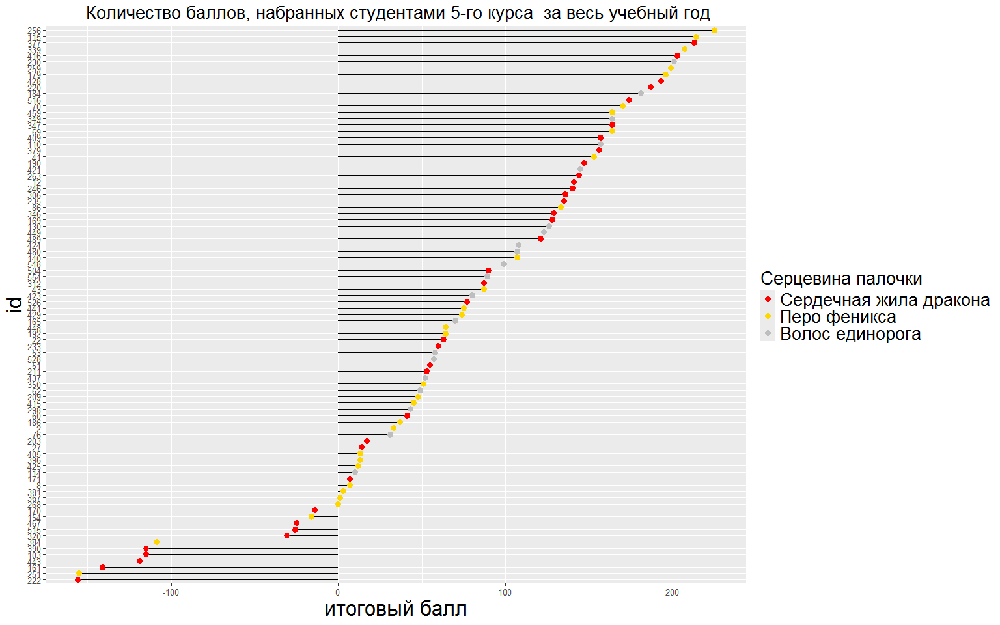<!-- -->


``` r
hogwarts |> 
  filter(course == 5) |> 
  mutate(id = as.factor(id)) |> 
  ggplot()+
  geom_segment(aes(x = fct_reorder(id, result, .desc = TRUE), 
                   xend = fct_reorder(id, result, .desc = TRUE), 
                   y = 0, 
                   yend = result))+
  geom_point(aes(x = fct_reorder(id, result), 
                 y = result, col= wandCore), 
              size = 3)+
   labs(x = "id",
       title = "Количество баллов, набранных студентами 5-го курса  за весь учебный год",
       subtitle = "**НЕ ПРАВИЬНЫЙ ГРАФИК**"
       # caption = "Подпись внизу графика"
       )+
       
  theme_bw()+
  theme_custom+
  theme(
    plot.title = element_text(size = 20, hjust = 0.5),
    plot.subtitle = element_text(size = 15, hjust = 0.5),
    axis.text = element_text(size = 10),
    axis.title = element_text(size = 25),
    axis.text.x = element_text(angle = 90)
  )+
  scale_color_manual(name = "Серцевина палочки",
                  labels = c("dragon heartstring"= "Cердечная жила дракона", "phoenix feather"="Перо феникса", "unicorn hair"= "Волос единорога"),
                  values = c("dragon heartstring"= "red", "phoenix feather"="gold", "unicorn hair"="grey"))
```

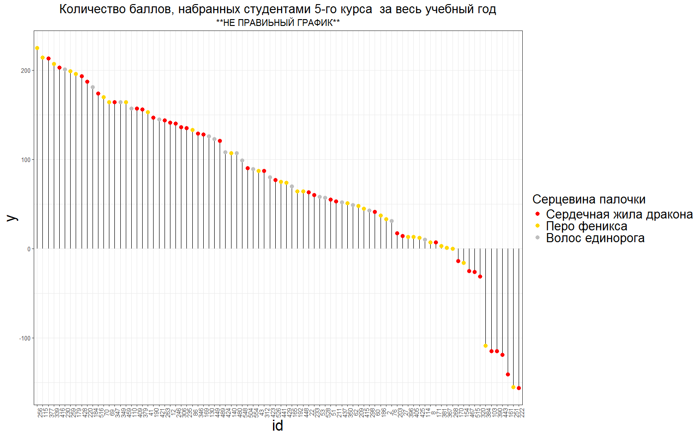<!-- -->

### Разное Задание 2

Постройте гистограмму распредления баллов за экзамен по астрономии.
Выделите цветом факультет Слизерин. Примените 18-й кегль к тексту на
осях x, y и легенды. Название оси y и легенды запишите 20-м кеглем, оси
x -- 22-м. Измените название оси y на "Number of students". (1 б.)


``` r
ggplot(hogwarts)+
  geom_histogram( aes(x = Astronomy.exam, fill= (house =="Slytherin")), col="black")+ 
  theme_bw()+
  scale_fill_manual(name = "Факультет",
                  labels = c("TRUE"= "Слизерин", "FALSE"="Другие факультеты"),
                  values = c("TRUE"= "#1F5D25", "FALSE"="grey"))+
  theme(
    axis.text = element_text(size = 18),
    axis.title.y = element_text(size = 20),
    axis.title.x = element_text(size = 22),
    legend.title = element_text(size = 20),
    legend.text = element_text(size = 18)
  )+
  labs(
    y = "Number of students"
  )
```

```
## `stat_bin()` using `bins = 30`. Pick better value with `binwidth`.
```

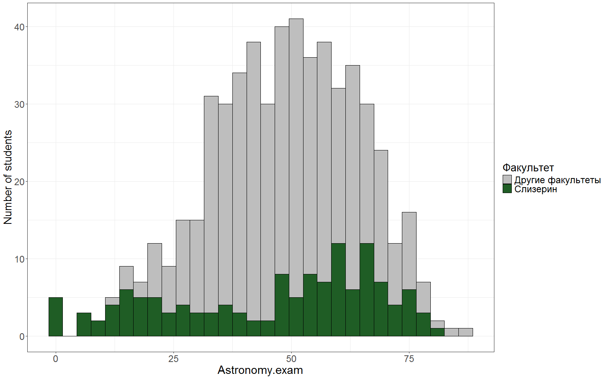<!-- -->

### Разное Задание 3

На лекции мы использовали комбинацию theme_bw(), и созданной нами
theme_custom, чтобы одновременно сделать фон белым и увеличить шрифт.
Модифицируйте theme_custom таким образом, чтобы она и выполняла свои
прежние функции, и делала фон белым без помощи theme_bw(). Примените
новую кастомную тему к графику, полученному в последнем пункте блока по
боксплотам (1.5 б).


``` r
theme_custom_2 <- theme(
    axis.text = element_text(size = 20),
    axis.title = element_text(size = 25),
    axis.text.x = element_text(angle = 0),
    legend.title = element_text(size = 20),
    legend.text = element_text(size = 20),
    panel.background = element_rect(fill = "white"),
    plot.title = element_text(size = 20, hjust = 0.5)
  )

 ggplot(hogwarts)+
  geom_boxplot(aes(y = week_3,
                   x = fct_reorder(house, week_3, .desc = TRUE),
                   # fill= bloodStatus),
                    fill= fct_reorder(bloodStatus, week_3, .desc = TRUE)),
                   notch = TRUE, outliers = FALSE, linewidth = 0.5, width = 0.5)+
    labs(
      y = "Баллы за 3 неделю",
      x = "Факультет",
      fill= "Происхождение"
      )+
   geom_jitter( aes(x= house, y= week_3, fill= bloodStatus),
               size = 2, width = 0.3, height= 0.2, col="orange"
               )+
  labs(
    title = "Распределение  полученных баллов за 3 неделю по факультетам и происхождению",
    # subtitle = "",
    caption = "Какую подпись добавить? Made in China"
    )+
   theme_custom_2
```

```
## Notch went outside hinges
## i Do you want `notch = FALSE`?
## Notch went outside hinges
## i Do you want `notch = FALSE`?
## Notch went outside hinges
## i Do you want `notch = FALSE`?
## Notch went outside hinges
## i Do you want `notch = FALSE`?
```

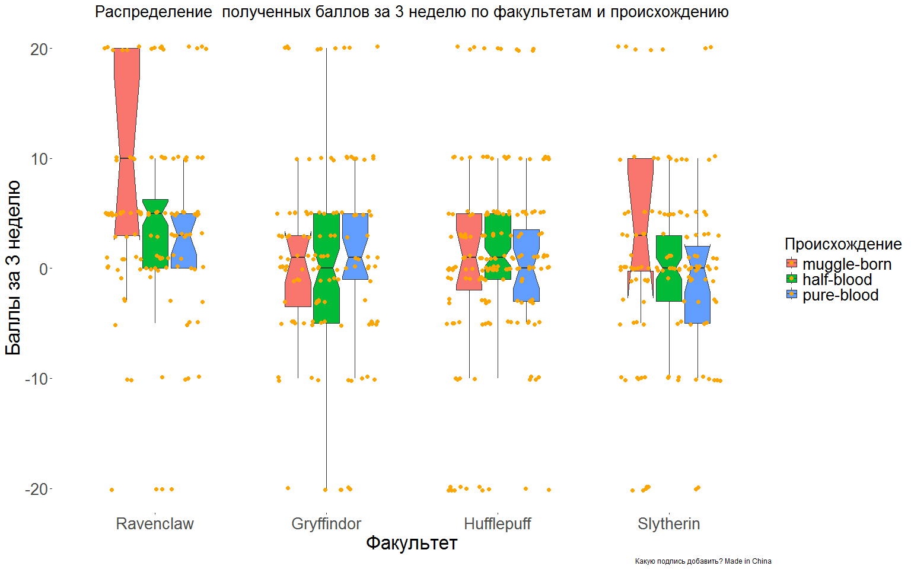<!-- -->

## Фасетирование

### Фасетирование Задание 1

Напишите, какой, по вашему мнению, способ фасетирования (по строкам или
по столбцам) лучше использовать для визуализации гистограммы. Почему? А
какой для визуализации violin-plot? Почему? Можно ли вывести общее
правило? (1.5 б)


``` r
ggplot(hogwarts)+
  geom_histogram(aes(Astronomy.exam),
                 fill="white", 
                 col="black", 
                 bins=9
                 )+
  labs(
    title = "Гистограмма, фасет по столбцам"
    )+
  facet_grid(.~house)
```

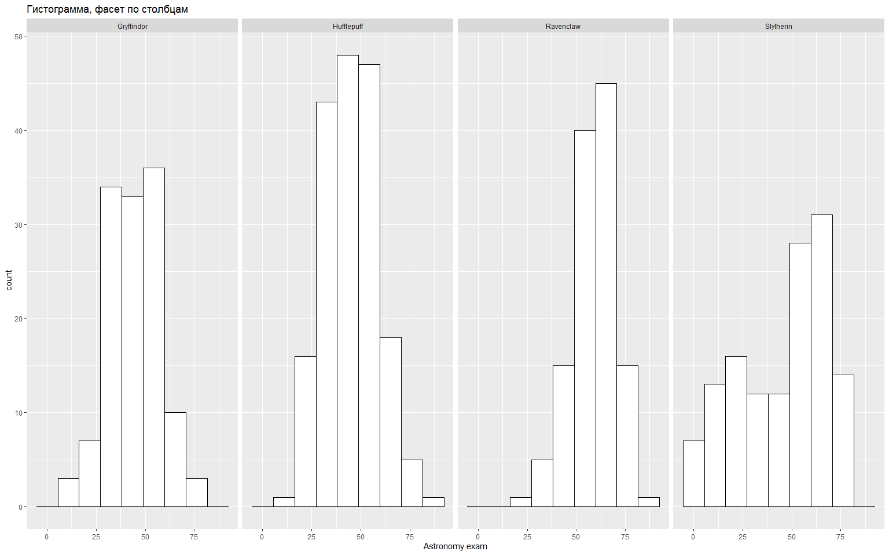<!-- -->


``` r
ggplot(hogwarts)+
  geom_histogram(aes(Astronomy.exam),
                 fill="white", 
                 col="black", 
                 bins=9
                 )+
  labs(
    title = "Гистограмма, фасет по строкам"
    )+
  facet_grid(house~.)
```

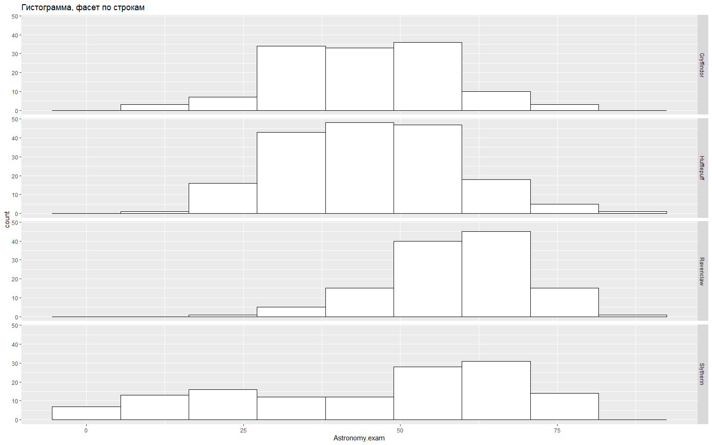<!-- -->

на мой взгляд, для гистограммы лучше использовать фасетирование по
столбцам. Так как для графиков будет испотзоваться одна вертикальная ось
с одинаковыми интервалами.


``` r
ggplot(hogwarts)+
  geom_violin(aes(y=Astronomy.exam, x=wandCore),
                 fill="white", 
                 col="black"
                 )+
  labs(
    title = "Виолин-плот, фасет по столбцам"
    )+
  facet_grid(.~house)
```

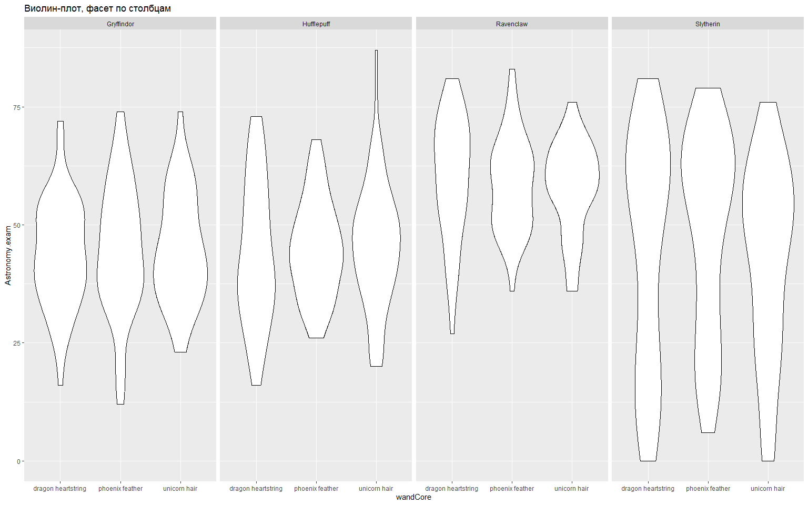<!-- -->


``` r
ggplot(hogwarts)+
  geom_violin(aes(y=Astronomy.exam, x=wandCore),
                 fill="white", 
                 col="black"
                 )+
   labs(
    title = "Виолин-плот, фасет по строкам"
    )+
  facet_grid(house~.)
```

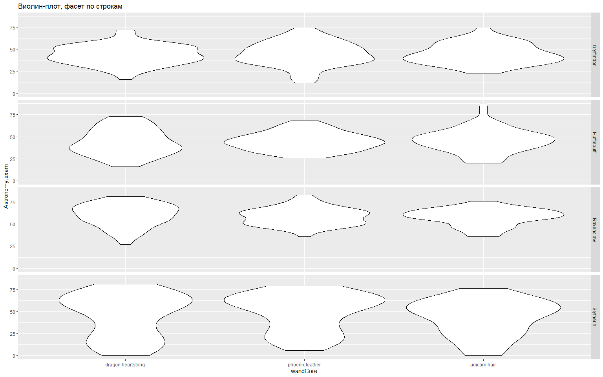<!-- -->

В случае с violin-plot, фасетирование по **строкам** выглядит лучше чем
по столбцам так как будут видны различия в "размахе" данных.

Общее правило - фасетирование **не должно уменьшать** масштаб "главной"
оси графика, что бы сохранились визуальные отличия.

### Фасетирование Задание 2

Постройте гистограмму для результата любого выбранного вами экзамена,
кроме зельеварения. Настройте оптимальное на ваш взгляд число столбцов
гистограммы. Выполните фасетирование по курсу. Постарайтесь, чтобы
график был по возможности компактным. (1 б.).


``` r
ggplot(hogwarts)+
  geom_histogram(aes(Herbology.exam),
                 fill="chocolate", 
                 col="black", 
                 bins=10
                 )+
  labs(
    title = "Распределение студетов по баллу за экзамен по Гербологии в зависимости от факультета и курса обучения"
    )+
  # facet_grid(.~course)
  facet_wrap( 
    vars(course), 
    # scales = "free_y" # Сделал разный масштаб оси y, что бы было нагядно видно характер распредения столбцов. # При этом сложнее сравнивать графики
    )
```

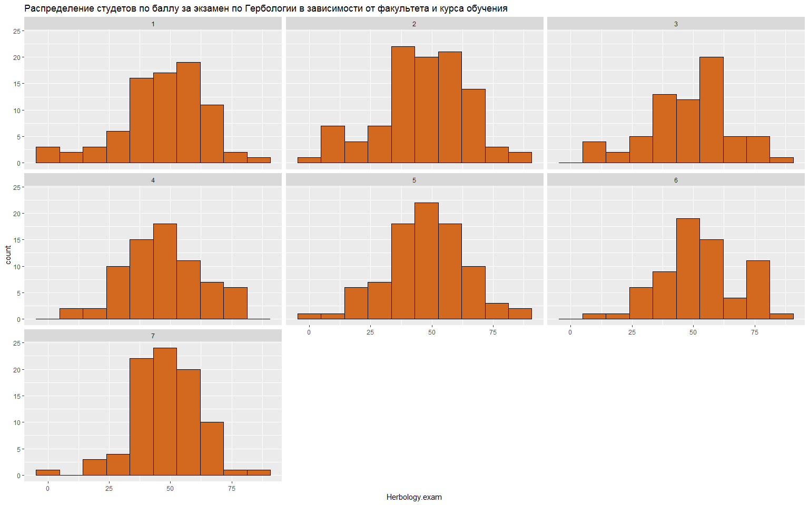<!-- -->

### Фасетирование Задание 3

Отобразите на одном графике распределение плотности вероятности для
оценки студентов на экзамене по защите от темных искусств и на экзамене
по травологии. Раскрасьте их в любые выбранные вами цвета, постарайтесь,
чтобы оба распределения отображались целиком. Примените тему из 3-го
пункта блока "Разное". Сделайте фасетирование по полу (1 б.).


``` r
ggplot(hogwarts)+
  geom_density(aes(Herbology.exam),
                 fill="green", 
                 alpha =0.5,
               adjust = 0.9
               )+
  geom_density(aes(Defence.against.the.dark.arts.exam),
                 fill="blue", 
                 col="black", 
               alpha =0.5,
               adjust = 0.9
               )+
  labs(
    title = "Распределение плотности вероятности для
оценки студентов на экзамене по защите от темных искусств и на экзамене
по травологии в зависимости от пола"
    )+
  theme_custom_2+
  facet_wrap(
    vars(sex)
  )
```

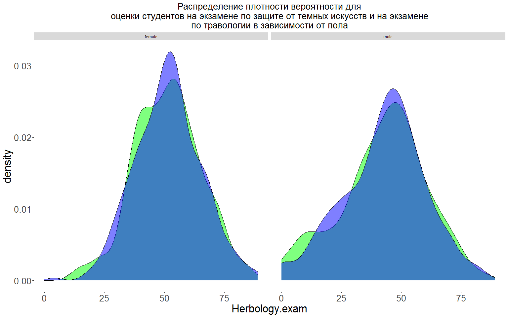<!-- -->

``` r
####   а как в этом графике сделать легенду?  Я придумал способ только с переводом таблицы в длинный вид
```


``` r
data_for_task_facet_3_ver2 <- hogwarts |> 
  select(id, sex, Defence.against.the.dark.arts.exam, Herbology.exam) |> 
  pivot_longer(-c(id, sex), names_to = "exam", values_to = "points") 
  
ggplot (data_for_task_facet_3_ver2, aes(x = points, fill = exam)) +
  geom_density(alpha = 0.5, adjust = 0.9) + 
  scale_fill_manual(
    values = c("Defence.against.the.dark.arts.exam" = "blue", "Herbology.exam" = "green"),
    labels = c("Defence.against.the.dark.arts.exam" = "Защита от темных искусств", "Herbology.exam" = "Травология")
    ) +  
  labs(title = "Распределение плотности вероятности для
оценки студентов на экзамене по защите от темных искусств и на экзамене
по травологии в зависимости от пола",
       x = "Оценки",
       y = "Плотность вероятности",
       fill = "Предмет") +  
  facet_wrap(
    vars(sex)
  )
```

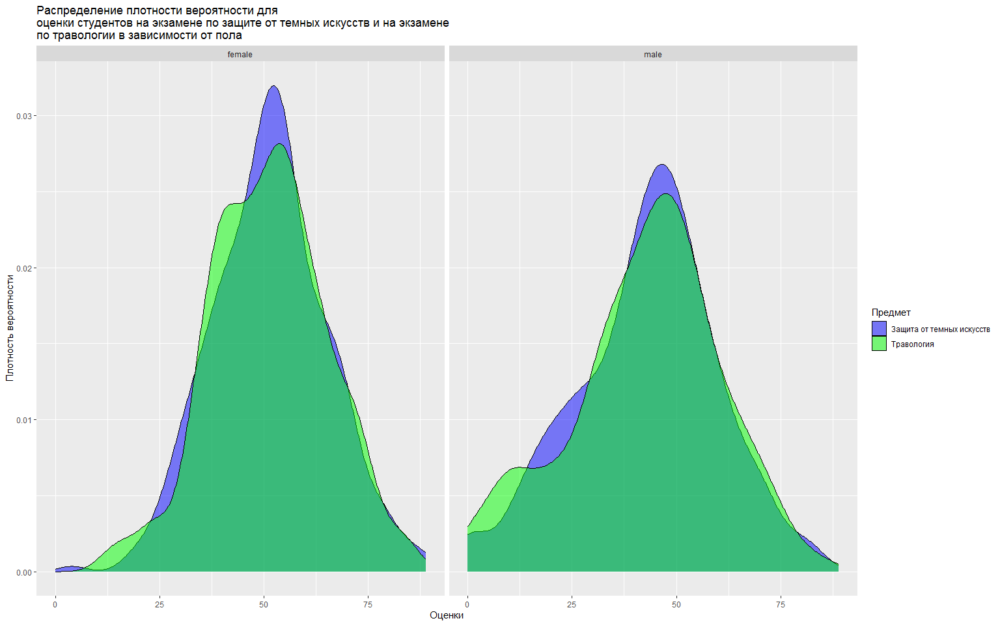<!-- -->

``` r
#
```
