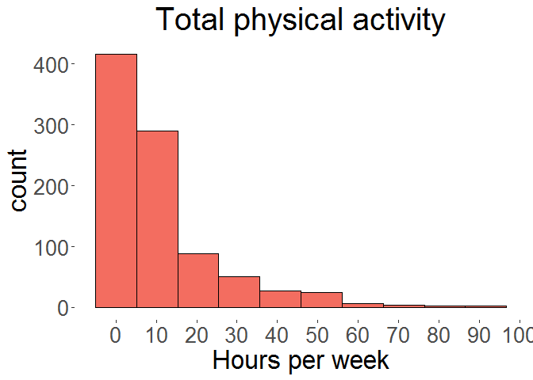
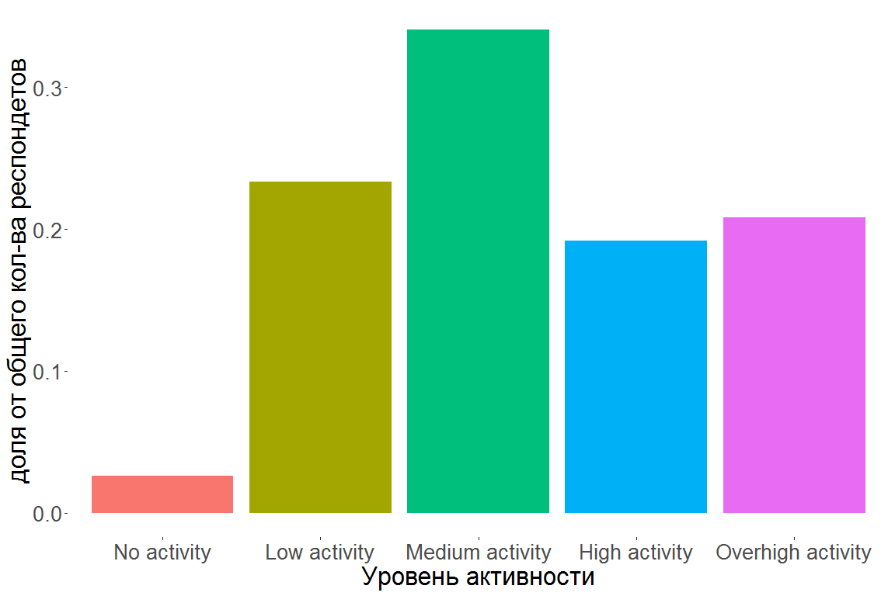
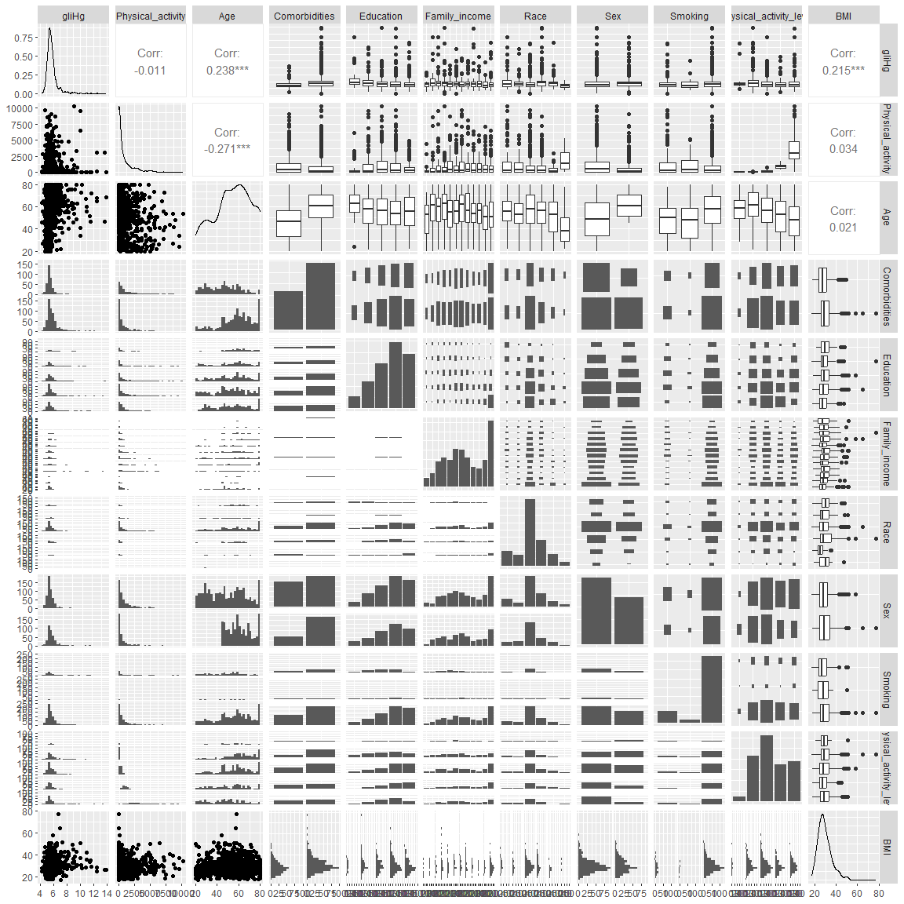
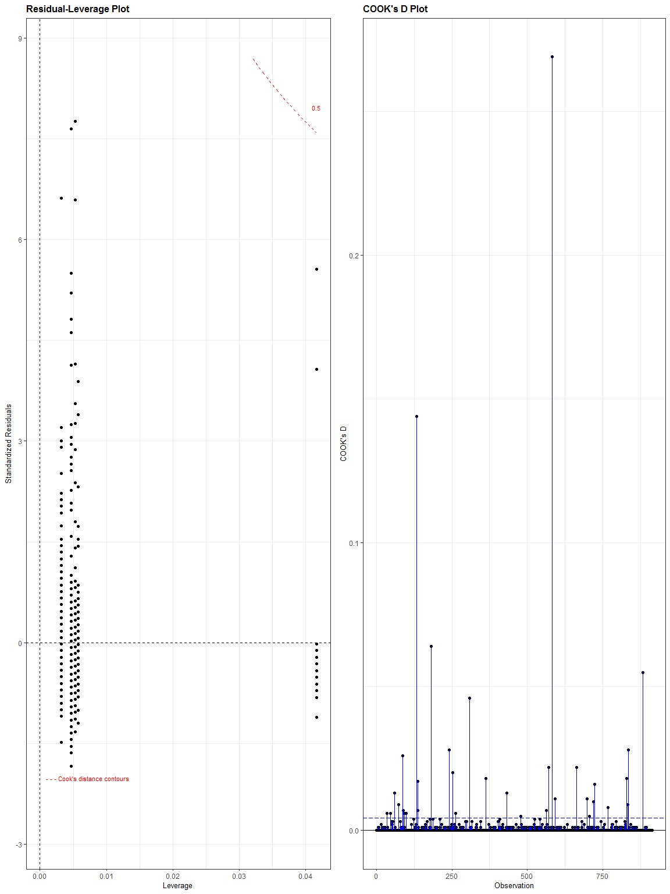

Table: Data summary

|                         |           |
|:------------------------|:----------|
|Name                     |Piped data |
|Number of rows           |916        |
|Number of columns        |74         |
|_______________________  |           |
|Column type frequency:   |           |
|factor                   |24         |
|numeric                  |50         |
|________________________ |           |
|Group variables          |None       |


**Variable type: factor**

|skim_variable | n_missing| complete_rate|ordered | n_unique|top_counts           |
|:-------------|---------:|-------------:|:-------|--------:|:--------------------|
|DRD340        |         0|             1|FALSE   |        2|1: 479, 0: 437       |
|DRD360        |         0|             1|FALSE   |        3|1: 653, 0: 262, 9: 1 |
|DRQSDIET      |         0|             1|FALSE   |        2|0: 760, 1: 156       |
|BPQ020        |         0|             1|FALSE   |        3|0: 506, 1: 409, 9: 1 |
|BPQ050A       |         0|             1|FALSE   |        2|0: 602, 1: 314       |
|MCQ010        |         0|             1|FALSE   |        2|0: 772, 1: 144       |
|MCQ035        |         0|             1|FALSE   |        2|0: 832, 1: 84        |
|MCQ160B       |         0|             1|FALSE   |        2|0: 882, 1: 34        |
|MCQ160C       |         0|             1|FALSE   |        2|0: 870, 1: 46        |
|MCQ160E       |         0|             1|FALSE   |        2|0: 875, 1: 41        |
|MCQ160F       |         0|             1|FALSE   |        2|0: 884, 1: 32        |
|MCQ160M       |         0|             1|FALSE   |        3|0: 786, 1: 128, 9: 2 |
|MCQ160O       |         0|             1|FALSE   |        2|0: 877, 1: 39        |
|MCQ170M       |         0|             1|FALSE   |        2|0: 822, 1: 94        |
|MCQ220        |         0|             1|FALSE   |        2|0: 812, 1: 104       |
|PAQ605        |         0|             1|FALSE   |        2|0: 740, 1: 176       |
|PAQ620        |         0|             1|FALSE   |        2|0: 600, 1: 316       |
|PAQ635        |         0|             1|FALSE   |        2|0: 705, 1: 211       |
|PAQ650        |         0|             1|FALSE   |        2|0: 725, 1: 191       |
|PAQ665        |         0|             1|FALSE   |        2|0: 525, 1: 391       |
|DIQ010        |         0|             1|FALSE   |        2|0: 772, 1: 144       |
|DIQ070        |         0|             1|FALSE   |        2|0: 714, 1: 202       |
|SMQ020        |         0|             1|FALSE   |        2|0: 488, 1: 428       |
|ALQ101        |         0|             1|FALSE   |        2|1: 688, 0: 228       |


**Variable type: numeric**

|skim_variable | n_missing| complete_rate|     mean|      sd|       p0|      p25|      p50|      p75|     p100|hist                                     |
|:-------------|---------:|-------------:|--------:|-------:|--------:|--------:|--------:|--------:|--------:|:----------------------------------------|
|SEQN          |         0|             1| 78749.87| 2968.55| 73557.00| 76158.75| 78867.50| 81432.00| 83724.00|▇▆▇▇▇ |
|DMDEDUC2      |         0|             1|     3.61|    1.18|     1.00|     3.00|     4.00|     5.00|     5.00|▂▃▆▇▆ |
|DMDHHSIZ      |         0|             1|     2.89|    1.60|     1.00|     2.00|     2.00|     4.00|     7.00|▇▃▂▂▁ |
|DMDHHSZA      |         0|             1|     0.18|    0.51|     0.00|     0.00|     0.00|     0.00|     3.00|▇▁▁▁▁ |
|DMDHHSZB      |         0|             1|     0.38|    0.81|     0.00|     0.00|     0.00|     0.00|     4.00|▇▂▁▁▁ |
|DMDHHSZE      |         0|             1|     0.74|    0.82|     0.00|     0.00|     1.00|     1.00|     3.00|▇▅▁▃▁ |
|DMDMARTL      |         0|             1|     2.27|    1.68|     1.00|     1.00|     1.00|     3.00|     6.00|▇▂▁▂▁ |
|INDFMIN2      |         0|             1|     7.48|    3.32|     1.00|     5.00|     7.00|    11.00|    12.00|▃▅▆▃▇ |
|RIAGENDR      |         0|             1|     1.41|    0.49|     1.00|     1.00|     1.00|     2.00|     2.00|▇▁▁▁▆ |
|RIDAGEYR      |         0|             1|    54.70|   16.40|    20.00|    45.00|    56.00|    67.00|    80.00|▃▃▇▇▇ |
|RIDRETH3      |         0|             1|     3.25|    1.36|     1.00|     3.00|     3.00|     4.00|     7.00|▃▇▃▁▂ |
|DR1TALCO      |         0|             1|    11.49|   32.29|     0.00|     0.00|     0.00|     8.05|   591.40|▇▁▁▁▁ |
|DR1TCHOL      |         0|             1|   312.09|  272.02|     0.00|   134.00|   233.00|   426.00|  2584.00|▇▂▁▁▁ |
|DR1TFIBE      |         0|             1|    17.52|   11.38|     1.00|     9.70|    15.00|    22.50|   107.00|▇▂▁▁▁ |
|DR1TKCAL      |         0|             1|  2140.25| 1066.02|   358.00|  1424.75|  1936.50|  2626.25| 12108.00|▇▂▁▁▁ |
|DR1TMFAT      |         0|             1|    28.60|   17.37|     0.92|    16.65|    25.40|    36.87|   185.83|▇▂▁▁▁ |
|DR1TPFAT      |         0|             1|    19.77|   14.34|     0.22|     9.99|    16.38|    24.85|   135.35|▇▂▁▁▁ |
|DR1TSFAT      |         0|             1|    26.45|   16.82|     1.37|    14.75|    23.88|    34.59|   177.47|▇▂▁▁▁ |
|DR1TSUGR      |         0|             1|   107.66|   76.50|     2.75|    56.29|    90.46|   142.70|   835.70|▇▂▁▁▁ |
|DR1TTFAT      |         0|             1|    82.59|   48.62|     3.93|    49.53|    73.96|   105.91|   548.38|▇▂▁▁▁ |
|DRQSDT1       |         0|             1|     1.93|    0.25|     1.00|     2.00|     2.00|     2.00|     2.00|▁▁▁▁▇ |
|DRQSDT10      |         0|             1|     2.00|    0.07|     1.00|     2.00|     2.00|     2.00|     2.00|▁▁▁▁▇ |
|DRQSDT2       |         0|             1|     1.98|    0.15|     1.00|     2.00|     2.00|     2.00|     2.00|▁▁▁▁▇ |
|DRQSDT3       |         0|             1|     1.98|    0.15|     1.00|     2.00|     2.00|     2.00|     2.00|▁▁▁▁▇ |
|DRQSDT4       |         0|             1|     1.99|    0.08|     1.00|     2.00|     2.00|     2.00|     2.00|▁▁▁▁▇ |
|DRQSDT7       |         0|             1|     1.96|    0.19|     1.00|     2.00|     2.00|     2.00|     2.00|▁▁▁▁▇ |
|DRQSDT8       |         0|             1|     1.99|    0.07|     1.00|     2.00|     2.00|     2.00|     2.00|▁▁▁▁▇ |
|DRQSDT9       |         0|             1|     1.99|    0.10|     1.00|     2.00|     2.00|     2.00|     2.00|▁▁▁▁▇ |
|DRQSDT91      |         0|             1|     1.99|    0.12|     1.00|     2.00|     2.00|     2.00|     2.00|▁▁▁▁▇ |
|BMXBMI        |         0|             1|    29.38|    6.73|    17.00|    24.80|    28.10|    32.73|    77.50|▇▅▁▁▁ |
|BMXHT         |         0|             1|   168.80|   10.40|   142.60|   161.07|   169.10|   176.40|   199.40|▂▇▇▅▁ |
|BMXWT         |         0|             1|    83.97|   21.52|    40.20|    68.88|    80.00|    94.88|   180.10|▃▇▃▁▁ |
|LBXGH         |         0|             1|     5.80|    1.04|     4.20|     5.30|     5.60|     5.90|    13.90|▇▁▁▁▁ |
|PAD615        |         0|             1|    32.27|   88.64|     0.00|     0.00|     0.00|     0.00|   660.00|▇▁▁▁▁ |
|PAD630        |         0|             1|    48.25|   97.80|     0.00|     0.00|     0.00|    60.00|   660.00|▇▁▁▁▁ |
|PAD645        |         0|             1|    13.31|   39.39|     0.00|     0.00|     0.00|     0.00|   480.00|▇▁▁▁▁ |
|PAD660        |         0|             1|    15.78|   39.09|     0.00|     0.00|     0.00|     0.00|   360.00|▇▁▁▁▁ |
|PAD675        |         0|             1|    26.95|   47.13|     0.00|     0.00|     0.00|    45.00|   300.00|▇▁▁▁▁ |
|PAD680        |         0|             1|   450.12|  488.23|    10.00|   285.00|   480.00|   540.00|  9999.00|▇▁▁▁▁ |
|PAQ610        |         0|             1|     0.79|    1.81|     0.00|     0.00|     0.00|     0.00|     7.00|▇▁▁▁▁ |
|PAQ625        |         0|             1|     1.44|    2.25|     0.00|     0.00|     0.00|     3.00|     7.00|▇▁▁▂▁ |
|PAQ640        |         0|             1|     1.10|    2.21|     0.00|     0.00|     0.00|     0.00|     7.00|▇▁▁▁▁ |
|PAQ655        |         0|             1|     0.72|    1.59|     0.00|     0.00|     0.00|     0.00|     7.00|▇▁▁▁▁ |
|PAQ670        |         0|             1|     1.45|    2.07|     0.00|     0.00|     0.00|     3.00|     7.00|▇▁▂▁▁ |
|SMQ040        |         0|             1|     2.68|    0.71|     1.00|     3.00|     3.00|     3.00|     3.00|▂▁▁▁▇ |
|ALQ120Q       |         0|             1|     3.69|   17.68|     0.00|     0.00|     1.00|     3.00|   350.00|▇▁▁▁▁ |
|ALQ120U       |         0|             1|     1.57|    0.82|     1.00|     1.00|     1.00|     2.00|     3.00|▇▁▂▁▂ |
|ALQ130        |         0|             1|     2.84|   33.03|     0.00|     0.00|     1.00|     2.00|   999.00|▇▁▁▁▁ |
|BPXDI         |         0|             1|    70.15|   13.16|     0.00|    64.00|    71.33|    78.00|   110.00|▁▁▅▇▁ |
|BPXSY         |         0|             1|   126.50|   16.91|    64.67|   115.17|   124.67|   136.67|   202.67|▁▆▇▂▁ |

## Задание 01.

1.  Каким образом вы будете оценивать физическую активность
    респондентов? Есть ли у вас предварительные предположения
    относительно того, каким образом выбранный вами показатель может
    быть ассоциирован с гликированным гемоглобином?
    

**ОТВЕТ:** физичекая активность будет измеряна в часах в неделю
коэфициенты: 1 для умеренной нагрузки
            1.5 для интенсивной 
            0.3 для сидячей

уровень гликированного гемоглобина будет обратно пропорционален
физичекой активности

<!-- -->
введм категориальную переменную уровня активности
0 часов - `No activity` 
1-3  - `low activity`
4-8 - `Medium activity`
9- 16 - `High activity`
17+  - `Overhigh activity`
<!-- -->


## Задание 02.

2.  Ковариаты для каких показателей вы включите в модель для коррекции
    эффекта физической активности в отношении гликированного
    гемоглобина? Каким образом вы будете их оценивать по имеющимся
    данным? Бонусное задание: для представленного DAG'а укажите роль
    каждого показателя по отношению к изучаемой ассоциации между
    физической активностью и гликированным гемоглобином (конфаундеры (в
    том числе proxy конфаундеры), коллайдеры, медиаторы)

**ОТВЕТ:**

Буду использовать следующме ковариаты 1 Аge (переменная RIAGENDR) 2
Comorbidities (переменные MCQ010 , MCQ035 , MCQ160C, MCQ160B, MCQ160E,
MCQ160F, MCQ160M, MCQ170M, MCQ160O, MCQ220 , BPQ020 , DIQ010. Создадим
новую дихотомическую переменную ) 3 Education (переменная DMDEDUC2) 4
Family income (переменная INDFMIN2) 5 Race (переменная RIDRETH3) 6 Sex
(переменная RIAGENDR ) 7 Smoking (переменная SMQ040)

Age - конфаундер(через Comorbidities), Comorbidities - конфаундер,
Education - конфаундер (через Smoking), Family income - конфаундер(через
Smoking), Race - конфаундер, Sex - конфаундер, Smoking -
прокси-конфаундер, Blood pressure - коллайдер, Diabetic medication -
коллайдер (через Comorbidities, **хотя здесь под вопросом**), BMI -
медиатор, Marital status - предшественник воздействия


## Задание 03.

3.  Проведите необходимый эксплораторный анализ перед оценкой модели.


```{=html}
<div id="lprxziwyiu" style="padding-left:0px;padding-right:0px;padding-top:10px;padding-bottom:10px;overflow-x:auto;overflow-y:auto;width:auto;height:auto;">
<style>#lprxziwyiu table {
  font-family: system-ui, 'Segoe UI', Roboto, Helvetica, Arial, sans-serif, 'Apple Color Emoji', 'Segoe UI Emoji', 'Segoe UI Symbol', 'Noto Color Emoji';
  -webkit-font-smoothing: antialiased;
  -moz-osx-font-smoothing: grayscale;
}

#lprxziwyiu thead, #lprxziwyiu tbody, #lprxziwyiu tfoot, #lprxziwyiu tr, #lprxziwyiu td, #lprxziwyiu th {
  border-style: none;
}

#lprxziwyiu p {
  margin: 0;
  padding: 0;
}

#lprxziwyiu .gt_table {
  display: table;
  border-collapse: collapse;
  line-height: normal;
  margin-left: auto;
  margin-right: auto;
  color: #333333;
  font-size: 16px;
  font-weight: normal;
  font-style: normal;
  background-color: #FFFFFF;
  width: auto;
  border-top-style: solid;
  border-top-width: 2px;
  border-top-color: #A8A8A8;
  border-right-style: none;
  border-right-width: 2px;
  border-right-color: #D3D3D3;
  border-bottom-style: solid;
  border-bottom-width: 2px;
  border-bottom-color: #A8A8A8;
  border-left-style: none;
  border-left-width: 2px;
  border-left-color: #D3D3D3;
}

#lprxziwyiu .gt_caption {
  padding-top: 4px;
  padding-bottom: 4px;
}

#lprxziwyiu .gt_title {
  color: #333333;
  font-size: 125%;
  font-weight: initial;
  padding-top: 4px;
  padding-bottom: 4px;
  padding-left: 5px;
  padding-right: 5px;
  border-bottom-color: #FFFFFF;
  border-bottom-width: 0;
}

#lprxziwyiu .gt_subtitle {
  color: #333333;
  font-size: 85%;
  font-weight: initial;
  padding-top: 3px;
  padding-bottom: 5px;
  padding-left: 5px;
  padding-right: 5px;
  border-top-color: #FFFFFF;
  border-top-width: 0;
}

#lprxziwyiu .gt_heading {
  background-color: #FFFFFF;
  text-align: center;
  border-bottom-color: #FFFFFF;
  border-left-style: none;
  border-left-width: 1px;
  border-left-color: #D3D3D3;
  border-right-style: none;
  border-right-width: 1px;
  border-right-color: #D3D3D3;
}

#lprxziwyiu .gt_bottom_border {
  border-bottom-style: solid;
  border-bottom-width: 2px;
  border-bottom-color: #D3D3D3;
}

#lprxziwyiu .gt_col_headings {
  border-top-style: solid;
  border-top-width: 2px;
  border-top-color: #D3D3D3;
  border-bottom-style: solid;
  border-bottom-width: 2px;
  border-bottom-color: #D3D3D3;
  border-left-style: none;
  border-left-width: 1px;
  border-left-color: #D3D3D3;
  border-right-style: none;
  border-right-width: 1px;
  border-right-color: #D3D3D3;
}

#lprxziwyiu .gt_col_heading {
  color: #333333;
  background-color: #FFFFFF;
  font-size: 100%;
  font-weight: normal;
  text-transform: inherit;
  border-left-style: none;
  border-left-width: 1px;
  border-left-color: #D3D3D3;
  border-right-style: none;
  border-right-width: 1px;
  border-right-color: #D3D3D3;
  vertical-align: bottom;
  padding-top: 5px;
  padding-bottom: 6px;
  padding-left: 5px;
  padding-right: 5px;
  overflow-x: hidden;
}

#lprxziwyiu .gt_column_spanner_outer {
  color: #333333;
  background-color: #FFFFFF;
  font-size: 100%;
  font-weight: normal;
  text-transform: inherit;
  padding-top: 0;
  padding-bottom: 0;
  padding-left: 4px;
  padding-right: 4px;
}

#lprxziwyiu .gt_column_spanner_outer:first-child {
  padding-left: 0;
}

#lprxziwyiu .gt_column_spanner_outer:last-child {
  padding-right: 0;
}

#lprxziwyiu .gt_column_spanner {
  border-bottom-style: solid;
  border-bottom-width: 2px;
  border-bottom-color: #D3D3D3;
  vertical-align: bottom;
  padding-top: 5px;
  padding-bottom: 5px;
  overflow-x: hidden;
  display: inline-block;
  width: 100%;
}

#lprxziwyiu .gt_spanner_row {
  border-bottom-style: hidden;
}

#lprxziwyiu .gt_group_heading {
  padding-top: 8px;
  padding-bottom: 8px;
  padding-left: 5px;
  padding-right: 5px;
  color: #333333;
  background-color: #FFFFFF;
  font-size: 100%;
  font-weight: initial;
  text-transform: inherit;
  border-top-style: solid;
  border-top-width: 2px;
  border-top-color: #D3D3D3;
  border-bottom-style: solid;
  border-bottom-width: 2px;
  border-bottom-color: #D3D3D3;
  border-left-style: none;
  border-left-width: 1px;
  border-left-color: #D3D3D3;
  border-right-style: none;
  border-right-width: 1px;
  border-right-color: #D3D3D3;
  vertical-align: middle;
  text-align: left;
}

#lprxziwyiu .gt_empty_group_heading {
  padding: 0.5px;
  color: #333333;
  background-color: #FFFFFF;
  font-size: 100%;
  font-weight: initial;
  border-top-style: solid;
  border-top-width: 2px;
  border-top-color: #D3D3D3;
  border-bottom-style: solid;
  border-bottom-width: 2px;
  border-bottom-color: #D3D3D3;
  vertical-align: middle;
}

#lprxziwyiu .gt_from_md > :first-child {
  margin-top: 0;
}

#lprxziwyiu .gt_from_md > :last-child {
  margin-bottom: 0;
}

#lprxziwyiu .gt_row {
  padding-top: 8px;
  padding-bottom: 8px;
  padding-left: 5px;
  padding-right: 5px;
  margin: 10px;
  border-top-style: solid;
  border-top-width: 1px;
  border-top-color: #D3D3D3;
  border-left-style: none;
  border-left-width: 1px;
  border-left-color: #D3D3D3;
  border-right-style: none;
  border-right-width: 1px;
  border-right-color: #D3D3D3;
  vertical-align: middle;
  overflow-x: hidden;
}

#lprxziwyiu .gt_stub {
  color: #333333;
  background-color: #FFFFFF;
  font-size: 100%;
  font-weight: initial;
  text-transform: inherit;
  border-right-style: solid;
  border-right-width: 2px;
  border-right-color: #D3D3D3;
  padding-left: 5px;
  padding-right: 5px;
}

#lprxziwyiu .gt_stub_row_group {
  color: #333333;
  background-color: #FFFFFF;
  font-size: 100%;
  font-weight: initial;
  text-transform: inherit;
  border-right-style: solid;
  border-right-width: 2px;
  border-right-color: #D3D3D3;
  padding-left: 5px;
  padding-right: 5px;
  vertical-align: top;
}

#lprxziwyiu .gt_row_group_first td {
  border-top-width: 2px;
}

#lprxziwyiu .gt_row_group_first th {
  border-top-width: 2px;
}

#lprxziwyiu .gt_summary_row {
  color: #333333;
  background-color: #FFFFFF;
  text-transform: inherit;
  padding-top: 8px;
  padding-bottom: 8px;
  padding-left: 5px;
  padding-right: 5px;
}

#lprxziwyiu .gt_first_summary_row {
  border-top-style: solid;
  border-top-color: #D3D3D3;
}

#lprxziwyiu .gt_first_summary_row.thick {
  border-top-width: 2px;
}

#lprxziwyiu .gt_last_summary_row {
  padding-top: 8px;
  padding-bottom: 8px;
  padding-left: 5px;
  padding-right: 5px;
  border-bottom-style: solid;
  border-bottom-width: 2px;
  border-bottom-color: #D3D3D3;
}

#lprxziwyiu .gt_grand_summary_row {
  color: #333333;
  background-color: #FFFFFF;
  text-transform: inherit;
  padding-top: 8px;
  padding-bottom: 8px;
  padding-left: 5px;
  padding-right: 5px;
}

#lprxziwyiu .gt_first_grand_summary_row {
  padding-top: 8px;
  padding-bottom: 8px;
  padding-left: 5px;
  padding-right: 5px;
  border-top-style: double;
  border-top-width: 6px;
  border-top-color: #D3D3D3;
}

#lprxziwyiu .gt_last_grand_summary_row_top {
  padding-top: 8px;
  padding-bottom: 8px;
  padding-left: 5px;
  padding-right: 5px;
  border-bottom-style: double;
  border-bottom-width: 6px;
  border-bottom-color: #D3D3D3;
}

#lprxziwyiu .gt_striped {
  background-color: rgba(128, 128, 128, 0.05);
}

#lprxziwyiu .gt_table_body {
  border-top-style: solid;
  border-top-width: 2px;
  border-top-color: #D3D3D3;
  border-bottom-style: solid;
  border-bottom-width: 2px;
  border-bottom-color: #D3D3D3;
}

#lprxziwyiu .gt_footnotes {
  color: #333333;
  background-color: #FFFFFF;
  border-bottom-style: none;
  border-bottom-width: 2px;
  border-bottom-color: #D3D3D3;
  border-left-style: none;
  border-left-width: 2px;
  border-left-color: #D3D3D3;
  border-right-style: none;
  border-right-width: 2px;
  border-right-color: #D3D3D3;
}

#lprxziwyiu .gt_footnote {
  margin: 0px;
  font-size: 90%;
  padding-top: 4px;
  padding-bottom: 4px;
  padding-left: 5px;
  padding-right: 5px;
}

#lprxziwyiu .gt_sourcenotes {
  color: #333333;
  background-color: #FFFFFF;
  border-bottom-style: none;
  border-bottom-width: 2px;
  border-bottom-color: #D3D3D3;
  border-left-style: none;
  border-left-width: 2px;
  border-left-color: #D3D3D3;
  border-right-style: none;
  border-right-width: 2px;
  border-right-color: #D3D3D3;
}

#lprxziwyiu .gt_sourcenote {
  font-size: 90%;
  padding-top: 4px;
  padding-bottom: 4px;
  padding-left: 5px;
  padding-right: 5px;
}

#lprxziwyiu .gt_left {
  text-align: left;
}

#lprxziwyiu .gt_center {
  text-align: center;
}

#lprxziwyiu .gt_right {
  text-align: right;
  font-variant-numeric: tabular-nums;
}

#lprxziwyiu .gt_font_normal {
  font-weight: normal;
}

#lprxziwyiu .gt_font_bold {
  font-weight: bold;
}

#lprxziwyiu .gt_font_italic {
  font-style: italic;
}

#lprxziwyiu .gt_super {
  font-size: 65%;
}

#lprxziwyiu .gt_footnote_marks {
  font-size: 75%;
  vertical-align: 0.4em;
  position: initial;
}

#lprxziwyiu .gt_asterisk {
  font-size: 100%;
  vertical-align: 0;
}

#lprxziwyiu .gt_indent_1 {
  text-indent: 5px;
}

#lprxziwyiu .gt_indent_2 {
  text-indent: 10px;
}

#lprxziwyiu .gt_indent_3 {
  text-indent: 15px;
}

#lprxziwyiu .gt_indent_4 {
  text-indent: 20px;
}

#lprxziwyiu .gt_indent_5 {
  text-indent: 25px;
}

#lprxziwyiu .katex-display {
  display: inline-flex !important;
  margin-bottom: 0.75em !important;
}

#lprxziwyiu div.Reactable > div.rt-table > div.rt-thead > div.rt-tr.rt-tr-group-header > div.rt-th-group:after {
  height: 0px !important;
}
</style>
<table class="gt_table" data-quarto-disable-processing="false" data-quarto-bootstrap="false">
  <thead>
    <tr class="gt_col_headings">
      <th class="gt_col_heading gt_columns_bottom_border gt_left" rowspan="1" colspan="1" scope="col" id="label"><span class='gt_from_md'><strong>Characteristic</strong></span></th>
      <th class="gt_col_heading gt_columns_bottom_border gt_center" rowspan="1" colspan="1" scope="col" id="stat_0"><span class='gt_from_md'><strong>N = 913</strong></span></th>
    </tr>
  </thead>
  <tbody class="gt_table_body">
    <tr><td headers="label" class="gt_row gt_left" style="font-weight: bold;">gliHg</td>
<td headers="stat_0" class="gt_row gt_center"><br /></td></tr>
    <tr><td headers="label" class="gt_row gt_left">    Mean (SD)</td>
<td headers="stat_0" class="gt_row gt_center">5.80 (1.04)</td></tr>
    <tr><td headers="label" class="gt_row gt_left">    Median (Q1-Q3)</td>
<td headers="stat_0" class="gt_row gt_center">5.60 (5.30-5.90)</td></tr>
    <tr><td headers="label" class="gt_row gt_left">    Min-Max</td>
<td headers="stat_0" class="gt_row gt_center">4.20-13.90</td></tr>
    <tr><td headers="label" class="gt_row gt_left" style="font-weight: bold;">Physical_activity</td>
<td headers="stat_0" class="gt_row gt_center"><br /></td></tr>
    <tr><td headers="label" class="gt_row gt_left">    Mean (SD)</td>
<td headers="stat_0" class="gt_row gt_center">985 (1,605)</td></tr>
    <tr><td headers="label" class="gt_row gt_left">    Median (Q1-Q3)</td>
<td headers="stat_0" class="gt_row gt_center">300 (0-1,200)</td></tr>
    <tr><td headers="label" class="gt_row gt_left">    Min-Max</td>
<td headers="stat_0" class="gt_row gt_center">0-10,260</td></tr>
    <tr><td headers="label" class="gt_row gt_left" style="font-weight: bold;">Age</td>
<td headers="stat_0" class="gt_row gt_center"><br /></td></tr>
    <tr><td headers="label" class="gt_row gt_left">    Mean (SD)</td>
<td headers="stat_0" class="gt_row gt_center">55 (16)</td></tr>
    <tr><td headers="label" class="gt_row gt_left">    Median (Q1-Q3)</td>
<td headers="stat_0" class="gt_row gt_center">56 (45-67)</td></tr>
    <tr><td headers="label" class="gt_row gt_left">    Min-Max</td>
<td headers="stat_0" class="gt_row gt_center">20-80</td></tr>
    <tr><td headers="label" class="gt_row gt_left" style="font-weight: bold;">Comorbidities</td>
<td headers="stat_0" class="gt_row gt_center"><br /></td></tr>
    <tr><td headers="label" class="gt_row gt_left">    0</td>
<td headers="stat_0" class="gt_row gt_center">335 (37%)</td></tr>
    <tr><td headers="label" class="gt_row gt_left">    1</td>
<td headers="stat_0" class="gt_row gt_center">578 (63%)</td></tr>
    <tr><td headers="label" class="gt_row gt_left" style="font-weight: bold;">Education</td>
<td headers="stat_0" class="gt_row gt_center"><br /></td></tr>
    <tr><td headers="label" class="gt_row gt_left">    1</td>
<td headers="stat_0" class="gt_row gt_center">54 (5.9%)</td></tr>
    <tr><td headers="label" class="gt_row gt_left">    2</td>
<td headers="stat_0" class="gt_row gt_center">119 (13%)</td></tr>
    <tr><td headers="label" class="gt_row gt_left">    3</td>
<td headers="stat_0" class="gt_row gt_center">201 (22%)</td></tr>
    <tr><td headers="label" class="gt_row gt_left">    4</td>
<td headers="stat_0" class="gt_row gt_center">296 (32%)</td></tr>
    <tr><td headers="label" class="gt_row gt_left">    5</td>
<td headers="stat_0" class="gt_row gt_center">243 (27%)</td></tr>
    <tr><td headers="label" class="gt_row gt_left" style="font-weight: bold;">Family_income</td>
<td headers="stat_0" class="gt_row gt_center"><br /></td></tr>
    <tr><td headers="label" class="gt_row gt_left">    1</td>
<td headers="stat_0" class="gt_row gt_center">23 (2.5%)</td></tr>
    <tr><td headers="label" class="gt_row gt_left">    2</td>
<td headers="stat_0" class="gt_row gt_center">36 (3.9%)</td></tr>
    <tr><td headers="label" class="gt_row gt_left">    3</td>
<td headers="stat_0" class="gt_row gt_center">69 (7.6%)</td></tr>
    <tr><td headers="label" class="gt_row gt_left">    4</td>
<td headers="stat_0" class="gt_row gt_center">78 (8.5%)</td></tr>
    <tr><td headers="label" class="gt_row gt_left">    5</td>
<td headers="stat_0" class="gt_row gt_center">73 (8.0%)</td></tr>
    <tr><td headers="label" class="gt_row gt_left">    6</td>
<td headers="stat_0" class="gt_row gt_center">103 (11%)</td></tr>
    <tr><td headers="label" class="gt_row gt_left">    7</td>
<td headers="stat_0" class="gt_row gt_center">100 (11%)</td></tr>
    <tr><td headers="label" class="gt_row gt_left">    8</td>
<td headers="stat_0" class="gt_row gt_center">78 (8.5%)</td></tr>
    <tr><td headers="label" class="gt_row gt_left">    9</td>
<td headers="stat_0" class="gt_row gt_center">53 (5.8%)</td></tr>
    <tr><td headers="label" class="gt_row gt_left">    10</td>
<td headers="stat_0" class="gt_row gt_center">49 (5.4%)</td></tr>
    <tr><td headers="label" class="gt_row gt_left">    11</td>
<td headers="stat_0" class="gt_row gt_center">72 (7.9%)</td></tr>
    <tr><td headers="label" class="gt_row gt_left">    12</td>
<td headers="stat_0" class="gt_row gt_center">179 (20%)</td></tr>
    <tr><td headers="label" class="gt_row gt_left" style="font-weight: bold;">Race</td>
<td headers="stat_0" class="gt_row gt_center"><br /></td></tr>
    <tr><td headers="label" class="gt_row gt_left">    Mexican American</td>
<td headers="stat_0" class="gt_row gt_center">100 (11%)</td></tr>
    <tr><td headers="label" class="gt_row gt_left">    Other Hispanic</td>
<td headers="stat_0" class="gt_row gt_center">75 (8.2%)</td></tr>
    <tr><td headers="label" class="gt_row gt_left">    Non-Hispanic White</td>
<td headers="stat_0" class="gt_row gt_center">461 (50%)</td></tr>
    <tr><td headers="label" class="gt_row gt_left">    Non-Hispanic Black</td>
<td headers="stat_0" class="gt_row gt_center">175 (19%)</td></tr>
    <tr><td headers="label" class="gt_row gt_left">    Non-Hispanic Asian</td>
<td headers="stat_0" class="gt_row gt_center">78 (8.5%)</td></tr>
    <tr><td headers="label" class="gt_row gt_left">    Other Race - Including Multi-Racial</td>
<td headers="stat_0" class="gt_row gt_center">24 (2.6%)</td></tr>
    <tr><td headers="label" class="gt_row gt_left" style="font-weight: bold;">Sex</td>
<td headers="stat_0" class="gt_row gt_center"><br /></td></tr>
    <tr><td headers="label" class="gt_row gt_left">    Male</td>
<td headers="stat_0" class="gt_row gt_center">536 (59%)</td></tr>
    <tr><td headers="label" class="gt_row gt_left">    Female</td>
<td headers="stat_0" class="gt_row gt_center">377 (41%)</td></tr>
    <tr><td headers="label" class="gt_row gt_left" style="font-weight: bold;">Smoking</td>
<td headers="stat_0" class="gt_row gt_center"><br /></td></tr>
    <tr><td headers="label" class="gt_row gt_left">    Every day</td>
<td headers="stat_0" class="gt_row gt_center">132 (14%)</td></tr>
    <tr><td headers="label" class="gt_row gt_left">    Some days</td>
<td headers="stat_0" class="gt_row gt_center">31 (3.4%)</td></tr>
    <tr><td headers="label" class="gt_row gt_left">    Not at all</td>
<td headers="stat_0" class="gt_row gt_center">750 (82%)</td></tr>
    <tr><td headers="label" class="gt_row gt_left" style="font-weight: bold;">Physical_activity_level</td>
<td headers="stat_0" class="gt_row gt_center"><br /></td></tr>
    <tr><td headers="label" class="gt_row gt_left">    No activity</td>
<td headers="stat_0" class="gt_row gt_center">24 (2.6%)</td></tr>
    <tr><td headers="label" class="gt_row gt_left">    Low activity</td>
<td headers="stat_0" class="gt_row gt_center">213 (23%)</td></tr>
    <tr><td headers="label" class="gt_row gt_left">    Medium activity</td>
<td headers="stat_0" class="gt_row gt_center">311 (34%)</td></tr>
    <tr><td headers="label" class="gt_row gt_left">    High activity</td>
<td headers="stat_0" class="gt_row gt_center">175 (19%)</td></tr>
    <tr><td headers="label" class="gt_row gt_left">    Overhigh activity</td>
<td headers="stat_0" class="gt_row gt_center">190 (21%)</td></tr>
    <tr><td headers="label" class="gt_row gt_left" style="font-weight: bold;">BMI</td>
<td headers="stat_0" class="gt_row gt_center"><br /></td></tr>
    <tr><td headers="label" class="gt_row gt_left">    Mean (SD)</td>
<td headers="stat_0" class="gt_row gt_center">29 (7)</td></tr>
    <tr><td headers="label" class="gt_row gt_left">    Median (Q1-Q3)</td>
<td headers="stat_0" class="gt_row gt_center">28 (25-33)</td></tr>
    <tr><td headers="label" class="gt_row gt_left">    Min-Max</td>
<td headers="stat_0" class="gt_row gt_center">17-78</td></tr>
  </tbody>
  
  
</table>
</div>
```

<!-- -->

## Задание 04.

4.  Оцените модель для зависимости гликированного гемоглобина от
    выбранного вами показателя физической активности без ковариат и с
    ними. Проведите необходимую диагностику этих моделей -- требует ли
    что-либо коррекции и почему? В случае необходимости коррекции по
    результатам диагностики сделайте ее.


```
## # A tibble: 5 x 5
##   term                                    estimate std.error statistic   p.value
##   <chr>                                      <dbl>     <dbl>     <dbl>     <dbl>
## 1 (Intercept)                               6.02       0.209    28.7   1.10e-129
## 2 Physical_activity_levelLow activity       0.0613     0.221     0.277 7.82e-  1
## 3 Physical_activity_levelMedium activity   -0.295      0.217    -1.36  1.74e-  1
## 4 Physical_activity_levelHigh activity     -0.388      0.223    -1.74  8.29e-  2
## 5 Physical_activity_levelOverhigh activi~  -0.255      0.222    -1.15  2.51e-  1
```


<!-- --><!-- -->

Нужна корректировка на : 1. гетероскедастичность (испоьзуем эстиматоры с
коррекцией на гетероскедастичность: HC0 -- классическая коррекция, White
standard errors) и нормальность остатков= имеются выбросы


```
## # A tibble: 5 x 7
##   term                  estimate std.error statistic  p.value conf.low conf.high
##   <chr>                    <dbl>     <dbl>     <dbl>    <dbl>    <dbl>     <dbl>
## 1 (Intercept)             6.02       0.318    18.9   1.39e-67    5.39      6.64 
## 2 Physical_activity_le~   0.0613     0.331     0.185 8.53e- 1   -0.589     0.711
## 3 Physical_activity_le~  -0.295      0.321    -0.920 3.58e- 1   -0.926     0.335
## 4 Physical_activity_le~  -0.388      0.322    -1.20  2.29e- 1   -1.02      0.244
## 5 Physical_activity_le~  -0.255      0.328    -0.777 4.37e- 1   -0.899     0.389
```
Получился интересный результат, при низком уровне физ. активности  уровень gliHb увеличивается. Однако получеными результатами незначимы , ДИ пересекает 0, р>0,05.  


```
## 
## Call:
## lm(formula = gliHg ~ Physical_activity_level + Age + Comorbidities + 
##     Education + Family_income + Race + Sex + Smoking, data = lm_data)
## 
## Residuals:
##     Min      1Q  Median      3Q     Max 
## -2.2260 -0.4745 -0.1432  0.1873  7.2895 
## 
## Coefficients:
##                                           Estimate Std. Error t value Pr(>|t|)
## (Intercept)                               5.327154   0.346335  15.382  < 2e-16
## Physical_activity_levelLow activity       0.011898   0.213711   0.056   0.9556
## Physical_activity_levelMedium activity   -0.251372   0.210347  -1.195   0.2324
## Physical_activity_levelHigh activity     -0.240560   0.216904  -1.109   0.2677
## Physical_activity_levelOverhigh activity -0.075776   0.216869  -0.349   0.7269
## Age                                       0.010997   0.002408   4.566 5.67e-06
## Comorbidities1                            0.378550   0.074519   5.080 4.61e-07
## Education2                               -0.134828   0.165949  -0.812   0.4167
## Education3                               -0.256662   0.162546  -1.579   0.1147
## Education4                               -0.242698   0.160473  -1.512   0.1308
## Education5                               -0.262179   0.170627  -1.537   0.1248
## Family_income2                            0.383282   0.264174   1.451   0.1472
## Family_income3                            0.284123   0.237034   1.199   0.2310
## Family_income4                            0.340758   0.233244   1.461   0.1444
## Family_income5                            0.094582   0.234455   0.403   0.6867
## Family_income6                            0.307608   0.227932   1.350   0.1775
## Family_income7                            0.067728   0.228600   0.296   0.7671
## Family_income8                            0.201201   0.236195   0.852   0.3945
## Family_income9                            0.465326   0.246933   1.884   0.0598
## Family_income10                           0.262834   0.250989   1.047   0.2953
## Family_income11                           0.054034   0.237682   0.227   0.8202
## Family_income12                           0.231009   0.224683   1.028   0.3042
## RaceOther Hispanic                       -0.143429   0.154737  -0.927   0.3542
## RaceNon-Hispanic White                   -0.327089   0.119444  -2.738   0.0063
## RaceNon-Hispanic Black                    0.069847   0.131320   0.532   0.5949
## RaceNon-Hispanic Asian                    0.040059   0.159995   0.250   0.8024
## RaceOther Race - Including Multi-Racial  -0.387975   0.230956  -1.680   0.0933
## SexFemale                                -0.080011   0.072317  -1.106   0.2689
## SmokingSome days                         -0.053206   0.196916  -0.270   0.7871
## SmokingNot at all                        -0.019831   0.097797  -0.203   0.8394
##                                             
## (Intercept)                              ***
## Physical_activity_levelLow activity         
## Physical_activity_levelMedium activity      
## Physical_activity_levelHigh activity        
## Physical_activity_levelOverhigh activity    
## Age                                      ***
## Comorbidities1                           ***
## Education2                                  
## Education3                                  
## Education4                                  
## Education5                                  
## Family_income2                              
## Family_income3                              
## Family_income4                              
## Family_income5                              
## Family_income6                              
## Family_income7                              
## Family_income8                              
## Family_income9                           .  
## Family_income10                             
## Family_income11                             
## Family_income12                             
## RaceOther Hispanic                          
## RaceNon-Hispanic White                   ** 
## RaceNon-Hispanic Black                      
## RaceNon-Hispanic Asian                      
## RaceOther Race - Including Multi-Racial  .  
## SexFemale                                   
## SmokingSome days                            
## SmokingNot at all                           
## ---
## Signif. codes:  0 '***' 0.001 '**' 0.01 '*' 0.05 '.' 0.1 ' ' 1
## 
## Residual standard error: 0.971 on 883 degrees of freedom
## Multiple R-squared:  0.1505,	Adjusted R-squared:  0.1226 
## F-statistic: 5.396 on 29 and 883 DF,  p-value: < 2.2e-16
```

<!-- -->

Нужна корректировка на : 1. гетероскедастичность (испоьзуем эстиматоры с
коррекцией на гетероскедастичность: HC0 -- классическая коррекция, White
standard errors) 2. нормальность остатков


```
## 
## t test of coefficients:
## 
##                                            Estimate Std. Error t value
## (Intercept)                               5.3271542  0.4177262 12.7527
## Physical_activity_levelLow activity       0.0118984  0.3241299  0.0367
## Physical_activity_levelMedium activity   -0.2513720  0.3173228 -0.7922
## Physical_activity_levelHigh activity     -0.2405601  0.3171460 -0.7585
## Physical_activity_levelOverhigh activity -0.0757760  0.3215528 -0.2357
## Age                                       0.0109966  0.0019587  5.6142
## Comorbidities1                            0.3785499  0.0614759  6.1577
## Education2                               -0.1348278  0.1909226 -0.7062
## Education3                               -0.2566617  0.1827044 -1.4048
## Education4                               -0.2426979  0.1804679 -1.3448
## Education5                               -0.2621788  0.1865884 -1.4051
## Family_income2                            0.3832823  0.2534462  1.5123
## Family_income3                            0.2841230  0.2068913  1.3733
## Family_income4                            0.3407577  0.2143480  1.5897
## Family_income5                            0.0945820  0.1645610  0.5748
## Family_income6                            0.3076083  0.1711431  1.7974
## Family_income7                            0.0677283  0.1545940  0.4381
## Family_income8                            0.2012006  0.1681536  1.1965
## Family_income9                            0.4653262  0.2646030  1.7586
## Family_income10                           0.2628338  0.1869026  1.4063
## Family_income11                           0.0540337  0.1595414  0.3387
## Family_income12                           0.2310092  0.1596740  1.4468
## RaceOther Hispanic                       -0.1434291  0.1636308 -0.8765
## RaceNon-Hispanic White                   -0.3270887  0.1378929 -2.3720
## RaceNon-Hispanic Black                    0.0698469  0.1630997  0.4282
## RaceNon-Hispanic Asian                    0.0400585  0.1601469  0.2501
## RaceOther Race - Including Multi-Racial  -0.3879750  0.1727536 -2.2458
## SexFemale                                -0.0800114  0.0743923 -1.0755
## SmokingSome days                         -0.0532057  0.1714733 -0.3103
## SmokingNot at all                        -0.0198312  0.1147799 -0.1728
##                                           Pr(>|t|)    
## (Intercept)                              < 2.2e-16 ***
## Physical_activity_levelLow activity        0.97073    
## Physical_activity_levelMedium activity     0.42848    
## Physical_activity_levelHigh activity       0.44834    
## Physical_activity_levelOverhigh activity   0.81375    
## Age                                      2.645e-08 ***
## Comorbidities1                           1.120e-09 ***
## Education2                                 0.48026    
## Education3                                 0.16043    
## Education4                                 0.17903    
## Education5                                 0.16034    
## Family_income2                             0.13082    
## Family_income3                             0.17001    
## Family_income4                             0.11225    
## Family_income5                             0.56560    
## Family_income6                             0.07262 .  
## Family_income7                             0.66142    
## Family_income8                             0.23181    
## Family_income9                             0.07899 .  
## Family_income10                            0.16000    
## Family_income11                            0.73493    
## Family_income12                            0.14832    
## RaceOther Hispanic                         0.38097    
## RaceNon-Hispanic White                     0.01790 *  
## RaceNon-Hispanic Black                     0.66858    
## RaceNon-Hispanic Asian                     0.80254    
## RaceOther Race - Including Multi-Racial    0.02496 *  
## SexFemale                                  0.28243    
## SmokingSome days                           0.75642    
## SmokingNot at all                          0.86287    
## ---
## Signif. codes:  0 '***' 0.001 '**' 0.01 '*' 0.05 '.' 0.1 ' ' 1
```

``

## Задание 05.

5.  Представьте результаты оценки модели без ковариат и с ковариатами в
    виде точечной и ин- тервальной оценки эффекта физической активности.
    Дайте им словесную интерпретацию. Какие выводы мы можем сделать,
    исходя из точечной оценки? А из интервальной? Как вы думаете, можно
    ли считать эффект клинически значимым? Если затрудняетесь с ответом,
    что бы вам помогло дать ответ на этот вопрос?


```
## # A tibble: 5 x 7
##   term                  estimate std.error statistic  p.value conf.low conf.high
##   <chr>                    <dbl>     <dbl>     <dbl>    <dbl>    <dbl>     <dbl>
## 1 (Intercept)             6.02       0.318    18.9   1.39e-67    5.39      6.64 
## 2 Physical_activity_le~   0.0613     0.331     0.185 8.53e- 1   -0.589     0.711
## 3 Physical_activity_le~  -0.295      0.321    -0.920 3.58e- 1   -0.926     0.335
## 4 Physical_activity_le~  -0.388      0.322    -1.20  2.29e- 1   -1.02      0.244
## 5 Physical_activity_le~  -0.255      0.328    -0.777 4.37e- 1   -0.899     0.389
```

```
## # A tibble: 30 x 7
##    term                 estimate std.error statistic  p.value conf.low conf.high
##    <chr>                   <dbl>     <dbl>     <dbl>    <dbl>    <dbl>     <dbl>
##  1 (Intercept)            5.33     0.418     12.8    2.61e-34  4.51       6.15  
##  2 Physical_activity_l~   0.0119   0.324      0.0367 9.71e- 1 -0.624      0.648 
##  3 Physical_activity_l~  -0.251    0.317     -0.792  4.28e- 1 -0.874      0.371 
##  4 Physical_activity_l~  -0.241    0.317     -0.759  4.48e- 1 -0.863      0.382 
##  5 Physical_activity_l~  -0.0758   0.322     -0.236  8.14e- 1 -0.707      0.555 
##  6 Age                    0.0110   0.00196    5.61   2.64e- 8  0.00715    0.0148
##  7 Comorbidities1         0.379    0.0615     6.16   1.12e- 9  0.258      0.499 
##  8 Education2            -0.135    0.191     -0.706  4.80e- 1 -0.510      0.240 
##  9 Education3            -0.257    0.183     -1.40   1.60e- 1 -0.615      0.102 
## 10 Education4            -0.243    0.180     -1.34   1.79e- 1 -0.597      0.111 
## # i 20 more rows
```
оценка В модели без ковариат на каждом уровне активности, кроме низкого уровня снижает уровень гемоглобина (на 0.3%; 0.4%; 0.3%), Если говорим про интервальную оценку - то она клинически значима, так как просиходит снижение на десятые доли %. Однако с точки зрения статистики все данные не значимы, так как ДИ пересекает 0 и р>0.05

В модели с ковариатами физическая активность так же не будет имет стат. значимости. Однако Возраст (увеличивает gliHB на 0.01%), сопутствующие заболевания (увеличивает gliHB на 0.38%) и Раса (уменьшает gliHB на 0.33%) статистически значимы (ДИ не пересекасет 0, р<0.05). 

Обычно снижение HbA1c рассматривается как клинически значимое, если достигает хотя бы значений в 0,5–1%, поскольку такие изменения напрямую влияют на снижение риска долгосрочных осложнений диабета, таких как ретинопатия, нефропатия, сердечно-сосудистые заболевания и др. 

С точки зрения клин значимости РАса (RaceNon-Hispanic White) клинически ЗНАЧИМА (-0.59772466	-0.05645264), возраст не значим (ДИ: 0.00715233	0.01484090, нужна разница в 50 лет что бы увидить клин. значимость), Сопутсвтующие заболевания (ДИ: 0.25789387	0.49920591) можно зназвать клин. значимыми


## Задание 06.

6.  Проверьте гипотезу об отсутствии ассоциации между физической
    активностью и гликиро- ванным гемоглобином. Сделайте выводы по
    полученным результатам.
    
    


```
## 
## Linear hypothesis test:
## Physical_activity_levelLow activity = 0
## Physical_activity_levelMedium activity = 0
## Physical_activity_levelHigh activity = 0
## Physical_activity_levelOverhigh activity = 0
## 
## Model 1: restricted model
## Model 2: gliHg ~ Physical_activity_level + Age + Comorbidities + Education + 
##     Family_income + Race + Sex + Smoking
## 
## Note: Coefficient covariance matrix supplied.
## 
##   Res.Df Df     F  Pr(>F)  
## 1    887                   
## 2    883  4 2.309 0.05632 .
## ---
## Signif. codes:  0 '***' 0.001 '**' 0.01 '*' 0.05 '.' 0.1 ' ' 1
```

Мы **не отвергаем** Н0.  Это свидетельствует о том, что **уровень физической активности НЕ оказывает статистически значимое влияние** на уровень gliHb.

## Задание 07.

7.  Является ли пол модификатором эффекта физической активности в
    отношении гликированного гемоглобина? Если да, каков эффект для
    мужчин и женщин и насколько он отличается между ними?

 

```
## # A tibble: 10 x 7
##    term                  estimate std.error statistic p.value conf.low conf.high
##    <chr>                    <dbl>     <dbl>     <dbl>   <dbl>    <dbl>     <dbl>
##  1 (Intercept)             5.62      0.0770    72.9   0          5.47      5.77 
##  2 Physical_activity_le~   0.457     0.166      2.76  0.00595    0.132     0.783
##  3 Physical_activity_le~   0.0786    0.104      0.759 0.448     -0.125     0.282
##  4 Physical_activity_le~  -0.0346    0.0953    -0.363 0.717     -0.222     0.153
##  5 Physical_activity_le~   0.102     0.119      0.859 0.391     -0.131     0.335
##  6 SexFemale               0.533     0.431      1.24  0.217     -0.313     1.38 
##  7 Physical_activity_le~  -0.526     0.470     -1.12  0.264     -1.45      0.397
##  8 Physical_activity_le~  -0.476     0.441     -1.08  0.280     -1.34      0.389
##  9 Physical_activity_le~  -0.391     0.446     -0.877 0.381     -1.27      0.485
## 10 Physical_activity_le~  -0.356     0.476     -0.748 0.455     -1.29      0.579
```

```
## Analysis of Variance Table
## 
## Model 1: gliHg ~ Physical_activity_level
## Model 2: gliHg ~ Physical_activity_level * Sex
##   Res.Df    RSS Df Sum of Sq      F Pr(>F)
## 1    908 955.23                           
## 2    903 951.82  5    3.4062 0.6463 0.6644
```
    При сравнении двух мделей мы видим стат. различия. Пол является модификатором  эффекта физической активности в отношении гликированного гемоглобина.
    Любопытно, что в самой модели с полом, теперь есть стат. и клин. значимый эффект низкой физ активности у мужчин. При низкой физ. активности у мужчин уровень gliHb повысится на 0.45733333 по сравнению с отсутствием активности.
    КАК такое возмоно??? 
    
В полной модели с ковариатами пол **не является** модификатором эффекта физической активности в отношении гликированного гемоглобина.
    

```
## # A tibble: 34 x 7
##    term                 estimate std.error statistic  p.value conf.low conf.high
##    <chr>                   <dbl>     <dbl>     <dbl>    <dbl>    <dbl>     <dbl>
##  1 (Intercept)           5.09      0.367     13.9    8.81e-40  4.37       5.81  
##  2 Physical_activity_l~  0.284     0.270      1.05   2.93e- 1 -0.245      0.813 
##  3 Physical_activity_l~ -0.00910   0.248     -0.0367 9.71e- 1 -0.496      0.477 
##  4 Physical_activity_l~ -0.0101    0.245     -0.0414 9.67e- 1 -0.490      0.470 
##  5 Physical_activity_l~  0.141     0.243      0.581  5.61e- 1 -0.336      0.619 
##  6 SexFemale             0.236     0.483      0.488  6.25e- 1 -0.712      1.18  
##  7 Age                   0.0110    0.00199    5.52   4.44e- 8  0.00709    0.0149
##  8 Comorbidities1        0.374     0.0623     6.01   2.78e- 9  0.252      0.496 
##  9 Education2           -0.132     0.199     -0.666  5.06e- 1 -0.522      0.258 
## 10 Education3           -0.252     0.190     -1.33   1.85e- 1 -0.625      0.121 
## # i 24 more rows
```

```
## Analysis of Variance Table
## 
## Model 1: gliHg ~ Physical_activity_level + Age + Comorbidities + Education + 
##     Family_income + Race + Sex + Smoking
## Model 2: gliHg ~ Physical_activity_level * Sex + Age + Comorbidities + 
##     Education + Family_income + Race + Sex + Smoking
##   Res.Df    RSS Df Sum of Sq     F Pr(>F)
## 1    883 832.57                          
## 2    879 831.75  4   0.82909 0.219 0.9279
```
 
    

## Задание 08.

8.  Соответствуют ли полученные вами результаты вашему исходному
    предположению? Как ме- няется оценка эффекта физической активности
    при добавлении ковариат в модель и почему? 
    
 Итак, результаты не соответствуют исходному преположению, что чем больше активность, тем меньше gliHb. При добавалении ковариат эффект активности падает, так как коварианты  "забрали" на себя часть разброса gliHb.
 
    
## Задание Бонусное 

Бонусное задание: оцените
    прямой (direct) эффект физической активности на гликирован- ный
    гемоглобин (со всей необходимой диагностикой и коррекциями). Как он
    отличается от общего (total) эффекта? В чем причина/ механизм этих
    различий?
    
    Добавим в модель переменную BMI
    

```
## # A tibble: 30 x 7
##    term                 estimate std.error statistic  p.value conf.low conf.high
##    <chr>                   <dbl>     <dbl>     <dbl>    <dbl>    <dbl>     <dbl>
##  1 (Intercept)            5.33     0.439     12.1    1.67e-31  4.47       6.19  
##  2 Physical_activity_l~   0.0119   0.343      0.0347 9.72e- 1 -0.661      0.685 
##  3 Physical_activity_l~  -0.251    0.336     -0.747  4.55e- 1 -0.912      0.409 
##  4 Physical_activity_l~  -0.241    0.336     -0.716  4.74e- 1 -0.900      0.419 
##  5 Physical_activity_l~  -0.0758   0.340     -0.223  8.24e- 1 -0.744      0.592 
##  6 Age                    0.0110   0.00200    5.49   5.32e- 8  0.00706    0.0149
##  7 Comorbidities1         0.379    0.0629     6.02   2.51e- 9  0.255      0.502 
##  8 Education2            -0.135    0.197     -0.685  4.93e- 1 -0.521      0.251 
##  9 Education3            -0.257    0.188     -1.37   1.73e- 1 -0.626      0.112 
## 10 Education4            -0.243    0.186     -1.31   1.92e- 1 -0.607      0.122 
## # i 20 more rows
```

```
## # A tibble: 31 x 7
##    term                 estimate std.error statistic  p.value conf.low conf.high
##    <chr>                   <dbl>     <dbl>     <dbl>    <dbl>    <dbl>     <dbl>
##  1 (Intercept)           4.49      0.426     10.6    1.37e-24  3.66       5.33  
##  2 Physical_activity_l~ -0.00387   0.337     -0.0115 9.91e- 1 -0.666      0.658 
##  3 Physical_activity_l~ -0.238     0.330     -0.721  4.71e- 1 -0.886      0.410 
##  4 Physical_activity_l~ -0.201     0.329     -0.612  5.41e- 1 -0.847      0.445 
##  5 Physical_activity_l~ -0.0717    0.335     -0.214  8.30e- 1 -0.729      0.585 
##  6 Age                   0.0124    0.00190    6.51   1.29e-10  0.00865    0.0161
##  7 Comorbidities1        0.321     0.0599     5.36   1.05e- 7  0.204      0.439 
##  8 Education2           -0.116     0.193     -0.599  5.49e- 1 -0.495      0.264 
##  9 Education3           -0.262     0.185     -1.42   1.57e- 1 -0.624      0.101 
## 10 Education4           -0.225     0.182     -1.23   2.17e- 1 -0.582      0.133 
## # i 21 more rows
```
    При **прямом** эффекте коэфициенты будут (0.01,   -0.25, -0.24, -0.08), 
    при **полном** эффекте коэфициенты будут (-0.004, -0.24, -0.20	-0.07) Эффект снизится, так как часть эфекта от физической активности пойдет на снижение ИМТ.
