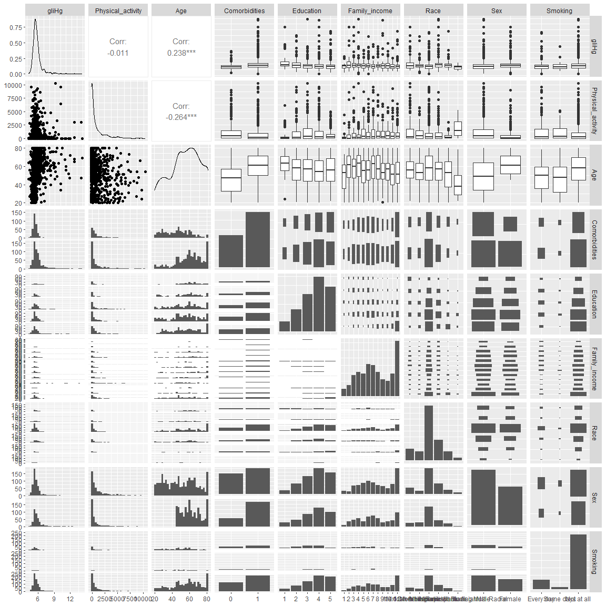
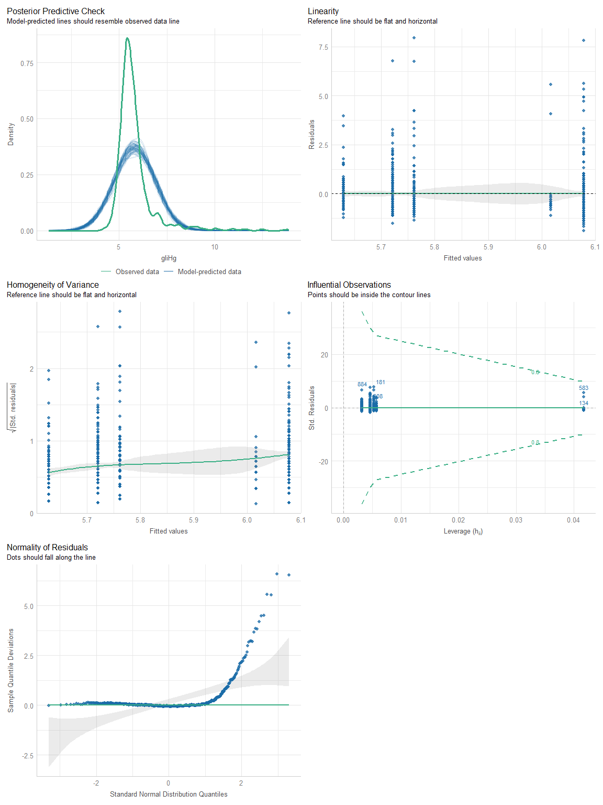
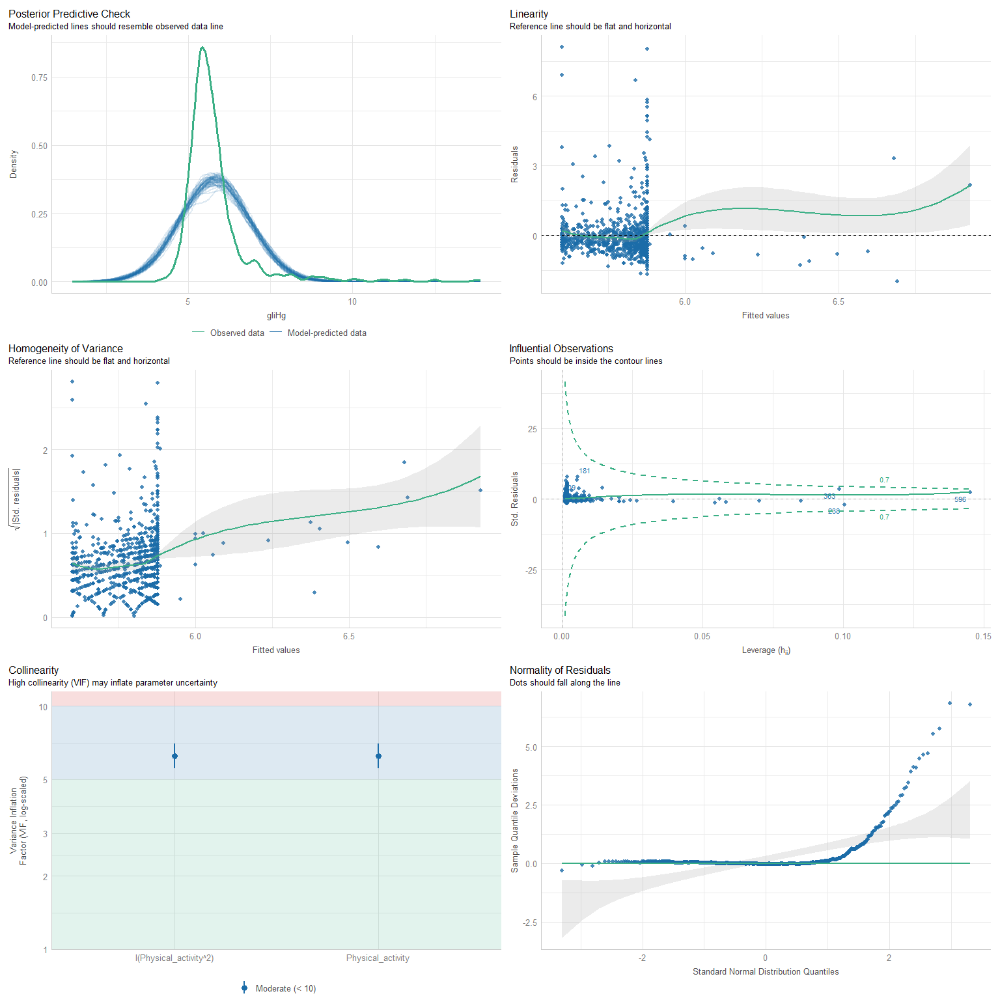
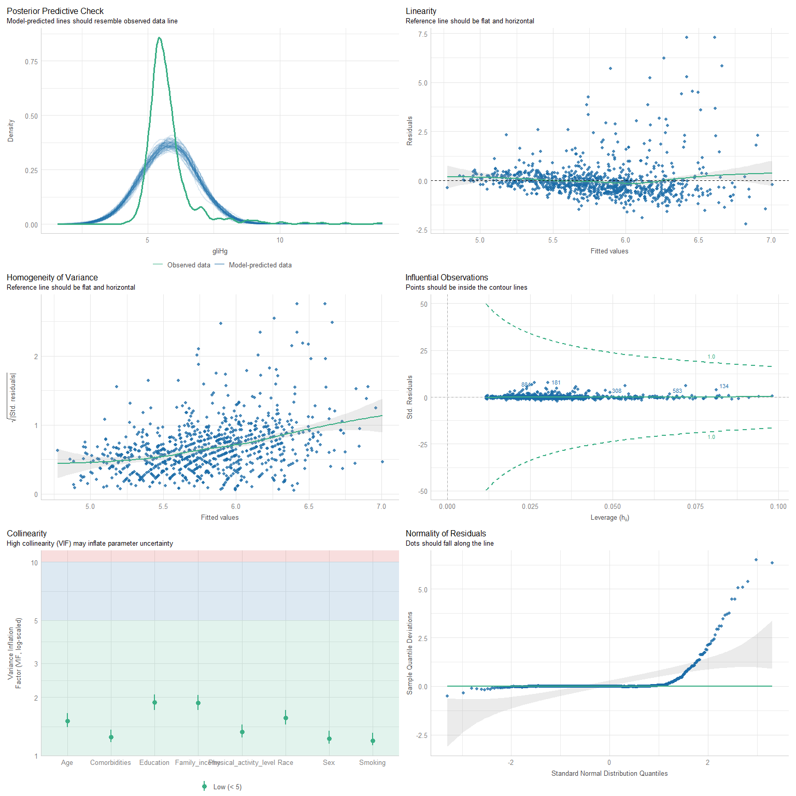
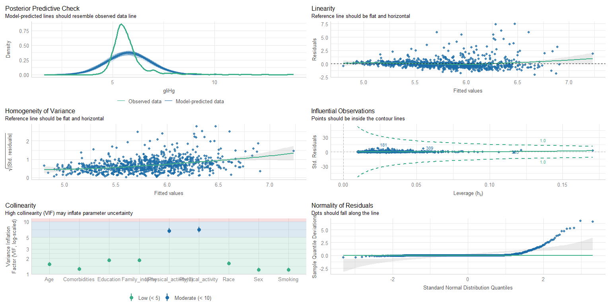
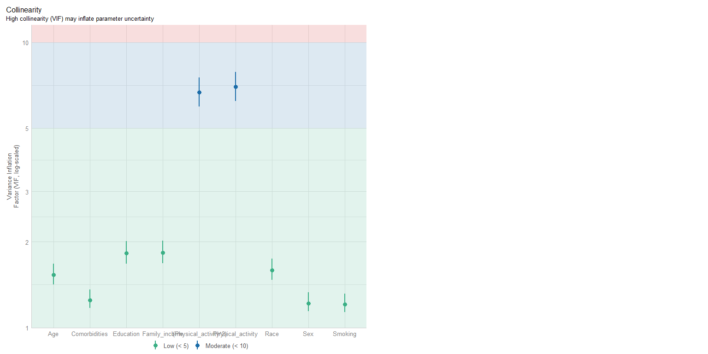

``` r
# загрузка датасета
HW_data <- readxl::read_xlsx("HW_data.xlsx")

# Заменим значения в дихотомических переменных 2 на 0
HW_data <- HW_data %>% 
  mutate(
    DRQSDIET = recode(DRQSDIET, "2" = 0),
    DRD340 = recode(DRD340, "2" = 0),
    DRD360 = recode(DRD360, "2" = 0),
    ALQ101 = recode(ALQ101, "2" = 0),
    SMQ020 = recode(SMQ020, "2" = 0),
    PAQ605 = recode(PAQ605, "2" = 0),
    PAQ620 = recode(PAQ620, "2" = 0),
    PAQ635 = recode(PAQ635, "2" = 0),
    PAQ650 = recode(PAQ650, "2" = 0),
    PAQ665 = recode(PAQ665, "2" = 0),
    MCQ010 = recode(MCQ010, "2" = 0),
    MCQ035 = recode(MCQ035, "2" = 0),
    MCQ160C = recode(MCQ160C, "2" = 0),
    MCQ160B = recode(MCQ160B, "2" = 0),
    MCQ160E = recode(MCQ160E, "2" = 0),
    MCQ160F = recode(MCQ160F, "2" = 0),
    MCQ160M = recode(MCQ160M, "2" = 0),
    MCQ170M = recode(MCQ170M, "2" = 0),
    MCQ160O = recode(MCQ160O, "2" = 0),
    MCQ220 = recode(MCQ220, "2" = 0),
    BPQ020 = recode(BPQ020, "2" = 0),
    BPQ050A = recode(BPQ050A, "2" = 0),
    DIQ010 = recode(DIQ010, "2" = 0),
    DIQ070 = recode(DIQ070, "2" = 0),
    across(c(DRQSDIET, DRD340 , DRD360 , ALQ101 , SMQ020 , PAQ605 , PAQ620 , PAQ635 , PAQ650 , PAQ665 , MCQ010 , MCQ035 , MCQ160C, MCQ160B, MCQ160E, MCQ160F, MCQ160M, MCQ170M, MCQ160O, MCQ220 , BPQ020 , BPQ050A, DIQ010 , DIQ070), as.factor)
  )
```

## Задание 01.

1.  Каким образом вы будете оценивать физическую активность
    респондентов? Есть ли у вас предварительные предположения
    относительно того, каким образом выбранный вами показатель может
    быть ассоциирован с гликированным гемоглобином?

**ОТВЕТ:** физичекая активность будет измеряна в минутах м учетом
коэфициентов:

k = 1, для умеренной активности k = 1.5 для пешей прогулки/ езде на
велосипеде k = 2, для высокой активности.
<!-- k= -0.5 для сидячей активности (Движение - это жизнь, сидячий образ жизни неполезен!!!) -->
уберем , так ака получаются "плохие" модели

уровень гликированного гемоглобина будет обратно пропорционален
физичекой активности


``` r
HW_data <- HW_data %>% 
  mutate(
    Physical_activity = PAQ610*PAD615*2+PAQ625*PAD630*2+PAQ640*PAD645*1.5+PAQ655*PAD660*2+PAQ670*PAD675*1)
```

## Задание 02.

2.  Ковариаты для каких показателей вы включите в модель для коррекции
    эффекта физической активности в отношении гликированного
    гемоглобина? Каким образом вы будете их оценивать по имеющимся
    данным? Бонусное задание: для представленного DAG'а укажите роль
    каждого показателя по отношению к изучаемой ассоциации между
    физической активностью и гликированным гемоглобином (конфаундеры (в
    том числе proxy конфаундеры), коллайдеры, медиаторы)

**ОТВЕТ:**

Буду использовать следующме ковариаты 1 Аge (переменная RIAGENDR) 2
Comorbidities (переменные MCQ010 , MCQ035 , MCQ160C, MCQ160B, MCQ160E,
MCQ160F, MCQ160M, MCQ170M, MCQ160O, MCQ220 , BPQ020 , DIQ010. Создадим
новую дихотомическую переменную ) 3 Education (переменная DMDEDUC2) 4
Family income (переменная INDFMIN2) 5 Race (переменная RIDRETH3) 6 Sex
(переменная RIAGENDR ) 7 Smoking (переменная SMQ040)

Age - конфаундер(через Comorbidities), Comorbidities - конфаундер,
Education - конфаундер (через Smoking), Family income - конфаундер(через
Smoking), Race - конфаундер, Sex - конфаундер, Smoking -
прокси-конфаундер, Blood pressure - коллайдер, Diabetic medication -
коллайдер (через Comorbidities, **хотя здесь под вопросом**), BMI -
медиатор, Marital status - предшественник воздействия


``` r
# Создадим датасет с перечислинными переменными
lm_data <- HW_data %>%
  mutate(
    gliHg = LBXGH,
    Physical_activity = PAQ610 * PAD615 * 2 + PAQ625 * PAD630 * 2 + PAQ640 *
      PAD645 * 1.5 + PAQ655 * PAD660 * 2 + PAQ670 * PAD675 * 1 , 
    # убрал + PAD680 * (-0.5)
    Age = RIDAGEYR,
    Comorbidities = as.factor(
      ifelse(
        MCQ010 == 1 |
          MCQ035 == 1 |
          MCQ160C == 1 |
          MCQ160B == 1 |
          MCQ160E == 1 |
          MCQ160F == 1 |
          MCQ160M == 1 |
          MCQ160O == 1 | MCQ220 == 1 | BPQ020 == 1 | DIQ010 == 1,
        1,
        0
      )
    ),
    Education = as.factor(DMDEDUC2),
    Family_income = as.factor(INDFMIN2),
    Race = factor(
      RIDRETH3,
      levels = c(1, 2, 3, 4, 6, 7),
      labels = c(
        "Mexican American",
        "Other Hispanic",
        "Non-Hispanic White",
        "Non-Hispanic Black",
        "Non-Hispanic Asian",
        "Other Race - Including Multi-Racial"
      )
    ),
    Sex = factor(
      RIAGENDR,
      levels = c(1, 2),
      labels = c("Male", "Female")
    ),
    Smoking = factor(
      SMQ040,
      levels = c(1, 2, 3),
      labels = c("Every day", "Some days", "Not at all")
    )
  ) %>%
  select(
    c(
      SEQN,
      gliHg,
      Physical_activity,
      Age,
      Comorbidities,
      Education,
      Family_income,
      Race,
      Sex,
      Smoking
    )
  ) 
```

## Задание 03.

3.  Проведите необходимый эксплораторный анализ перед оценкой модели.


``` r
#  сделаем по функции, данной на занятии
tbl_summary(
  lm_data, include = -c(SEQN), 
  type = list(all_continuous() ~ "continuous2"),
  statistic = list(
    all_continuous() ~ c("{mean} ({sd})", "{median} ({p25}-{p75})", "{min}-{max}")
  )) %>%
  modify_footnote(everything() ~ NA) %>%
  bold_labels()
```

```{=html}
<div id="uqjjvqgyha" style="padding-left:0px;padding-right:0px;padding-top:10px;padding-bottom:10px;overflow-x:auto;overflow-y:auto;width:auto;height:auto;">
<style>#uqjjvqgyha table {
  font-family: system-ui, 'Segoe UI', Roboto, Helvetica, Arial, sans-serif, 'Apple Color Emoji', 'Segoe UI Emoji', 'Segoe UI Symbol', 'Noto Color Emoji';
  -webkit-font-smoothing: antialiased;
  -moz-osx-font-smoothing: grayscale;
}

#uqjjvqgyha thead, #uqjjvqgyha tbody, #uqjjvqgyha tfoot, #uqjjvqgyha tr, #uqjjvqgyha td, #uqjjvqgyha th {
  border-style: none;
}

#uqjjvqgyha p {
  margin: 0;
  padding: 0;
}

#uqjjvqgyha .gt_table {
  display: table;
  border-collapse: collapse;
  line-height: normal;
  margin-left: auto;
  margin-right: auto;
  color: #333333;
  font-size: 16px;
  font-weight: normal;
  font-style: normal;
  background-color: #FFFFFF;
  width: auto;
  border-top-style: solid;
  border-top-width: 2px;
  border-top-color: #A8A8A8;
  border-right-style: none;
  border-right-width: 2px;
  border-right-color: #D3D3D3;
  border-bottom-style: solid;
  border-bottom-width: 2px;
  border-bottom-color: #A8A8A8;
  border-left-style: none;
  border-left-width: 2px;
  border-left-color: #D3D3D3;
}

#uqjjvqgyha .gt_caption {
  padding-top: 4px;
  padding-bottom: 4px;
}

#uqjjvqgyha .gt_title {
  color: #333333;
  font-size: 125%;
  font-weight: initial;
  padding-top: 4px;
  padding-bottom: 4px;
  padding-left: 5px;
  padding-right: 5px;
  border-bottom-color: #FFFFFF;
  border-bottom-width: 0;
}

#uqjjvqgyha .gt_subtitle {
  color: #333333;
  font-size: 85%;
  font-weight: initial;
  padding-top: 3px;
  padding-bottom: 5px;
  padding-left: 5px;
  padding-right: 5px;
  border-top-color: #FFFFFF;
  border-top-width: 0;
}

#uqjjvqgyha .gt_heading {
  background-color: #FFFFFF;
  text-align: center;
  border-bottom-color: #FFFFFF;
  border-left-style: none;
  border-left-width: 1px;
  border-left-color: #D3D3D3;
  border-right-style: none;
  border-right-width: 1px;
  border-right-color: #D3D3D3;
}

#uqjjvqgyha .gt_bottom_border {
  border-bottom-style: solid;
  border-bottom-width: 2px;
  border-bottom-color: #D3D3D3;
}

#uqjjvqgyha .gt_col_headings {
  border-top-style: solid;
  border-top-width: 2px;
  border-top-color: #D3D3D3;
  border-bottom-style: solid;
  border-bottom-width: 2px;
  border-bottom-color: #D3D3D3;
  border-left-style: none;
  border-left-width: 1px;
  border-left-color: #D3D3D3;
  border-right-style: none;
  border-right-width: 1px;
  border-right-color: #D3D3D3;
}

#uqjjvqgyha .gt_col_heading {
  color: #333333;
  background-color: #FFFFFF;
  font-size: 100%;
  font-weight: normal;
  text-transform: inherit;
  border-left-style: none;
  border-left-width: 1px;
  border-left-color: #D3D3D3;
  border-right-style: none;
  border-right-width: 1px;
  border-right-color: #D3D3D3;
  vertical-align: bottom;
  padding-top: 5px;
  padding-bottom: 6px;
  padding-left: 5px;
  padding-right: 5px;
  overflow-x: hidden;
}

#uqjjvqgyha .gt_column_spanner_outer {
  color: #333333;
  background-color: #FFFFFF;
  font-size: 100%;
  font-weight: normal;
  text-transform: inherit;
  padding-top: 0;
  padding-bottom: 0;
  padding-left: 4px;
  padding-right: 4px;
}

#uqjjvqgyha .gt_column_spanner_outer:first-child {
  padding-left: 0;
}

#uqjjvqgyha .gt_column_spanner_outer:last-child {
  padding-right: 0;
}

#uqjjvqgyha .gt_column_spanner {
  border-bottom-style: solid;
  border-bottom-width: 2px;
  border-bottom-color: #D3D3D3;
  vertical-align: bottom;
  padding-top: 5px;
  padding-bottom: 5px;
  overflow-x: hidden;
  display: inline-block;
  width: 100%;
}

#uqjjvqgyha .gt_spanner_row {
  border-bottom-style: hidden;
}

#uqjjvqgyha .gt_group_heading {
  padding-top: 8px;
  padding-bottom: 8px;
  padding-left: 5px;
  padding-right: 5px;
  color: #333333;
  background-color: #FFFFFF;
  font-size: 100%;
  font-weight: initial;
  text-transform: inherit;
  border-top-style: solid;
  border-top-width: 2px;
  border-top-color: #D3D3D3;
  border-bottom-style: solid;
  border-bottom-width: 2px;
  border-bottom-color: #D3D3D3;
  border-left-style: none;
  border-left-width: 1px;
  border-left-color: #D3D3D3;
  border-right-style: none;
  border-right-width: 1px;
  border-right-color: #D3D3D3;
  vertical-align: middle;
  text-align: left;
}

#uqjjvqgyha .gt_empty_group_heading {
  padding: 0.5px;
  color: #333333;
  background-color: #FFFFFF;
  font-size: 100%;
  font-weight: initial;
  border-top-style: solid;
  border-top-width: 2px;
  border-top-color: #D3D3D3;
  border-bottom-style: solid;
  border-bottom-width: 2px;
  border-bottom-color: #D3D3D3;
  vertical-align: middle;
}

#uqjjvqgyha .gt_from_md > :first-child {
  margin-top: 0;
}

#uqjjvqgyha .gt_from_md > :last-child {
  margin-bottom: 0;
}

#uqjjvqgyha .gt_row {
  padding-top: 8px;
  padding-bottom: 8px;
  padding-left: 5px;
  padding-right: 5px;
  margin: 10px;
  border-top-style: solid;
  border-top-width: 1px;
  border-top-color: #D3D3D3;
  border-left-style: none;
  border-left-width: 1px;
  border-left-color: #D3D3D3;
  border-right-style: none;
  border-right-width: 1px;
  border-right-color: #D3D3D3;
  vertical-align: middle;
  overflow-x: hidden;
}

#uqjjvqgyha .gt_stub {
  color: #333333;
  background-color: #FFFFFF;
  font-size: 100%;
  font-weight: initial;
  text-transform: inherit;
  border-right-style: solid;
  border-right-width: 2px;
  border-right-color: #D3D3D3;
  padding-left: 5px;
  padding-right: 5px;
}

#uqjjvqgyha .gt_stub_row_group {
  color: #333333;
  background-color: #FFFFFF;
  font-size: 100%;
  font-weight: initial;
  text-transform: inherit;
  border-right-style: solid;
  border-right-width: 2px;
  border-right-color: #D3D3D3;
  padding-left: 5px;
  padding-right: 5px;
  vertical-align: top;
}

#uqjjvqgyha .gt_row_group_first td {
  border-top-width: 2px;
}

#uqjjvqgyha .gt_row_group_first th {
  border-top-width: 2px;
}

#uqjjvqgyha .gt_summary_row {
  color: #333333;
  background-color: #FFFFFF;
  text-transform: inherit;
  padding-top: 8px;
  padding-bottom: 8px;
  padding-left: 5px;
  padding-right: 5px;
}

#uqjjvqgyha .gt_first_summary_row {
  border-top-style: solid;
  border-top-color: #D3D3D3;
}

#uqjjvqgyha .gt_first_summary_row.thick {
  border-top-width: 2px;
}

#uqjjvqgyha .gt_last_summary_row {
  padding-top: 8px;
  padding-bottom: 8px;
  padding-left: 5px;
  padding-right: 5px;
  border-bottom-style: solid;
  border-bottom-width: 2px;
  border-bottom-color: #D3D3D3;
}

#uqjjvqgyha .gt_grand_summary_row {
  color: #333333;
  background-color: #FFFFFF;
  text-transform: inherit;
  padding-top: 8px;
  padding-bottom: 8px;
  padding-left: 5px;
  padding-right: 5px;
}

#uqjjvqgyha .gt_first_grand_summary_row {
  padding-top: 8px;
  padding-bottom: 8px;
  padding-left: 5px;
  padding-right: 5px;
  border-top-style: double;
  border-top-width: 6px;
  border-top-color: #D3D3D3;
}

#uqjjvqgyha .gt_last_grand_summary_row_top {
  padding-top: 8px;
  padding-bottom: 8px;
  padding-left: 5px;
  padding-right: 5px;
  border-bottom-style: double;
  border-bottom-width: 6px;
  border-bottom-color: #D3D3D3;
}

#uqjjvqgyha .gt_striped {
  background-color: rgba(128, 128, 128, 0.05);
}

#uqjjvqgyha .gt_table_body {
  border-top-style: solid;
  border-top-width: 2px;
  border-top-color: #D3D3D3;
  border-bottom-style: solid;
  border-bottom-width: 2px;
  border-bottom-color: #D3D3D3;
}

#uqjjvqgyha .gt_footnotes {
  color: #333333;
  background-color: #FFFFFF;
  border-bottom-style: none;
  border-bottom-width: 2px;
  border-bottom-color: #D3D3D3;
  border-left-style: none;
  border-left-width: 2px;
  border-left-color: #D3D3D3;
  border-right-style: none;
  border-right-width: 2px;
  border-right-color: #D3D3D3;
}

#uqjjvqgyha .gt_footnote {
  margin: 0px;
  font-size: 90%;
  padding-top: 4px;
  padding-bottom: 4px;
  padding-left: 5px;
  padding-right: 5px;
}

#uqjjvqgyha .gt_sourcenotes {
  color: #333333;
  background-color: #FFFFFF;
  border-bottom-style: none;
  border-bottom-width: 2px;
  border-bottom-color: #D3D3D3;
  border-left-style: none;
  border-left-width: 2px;
  border-left-color: #D3D3D3;
  border-right-style: none;
  border-right-width: 2px;
  border-right-color: #D3D3D3;
}

#uqjjvqgyha .gt_sourcenote {
  font-size: 90%;
  padding-top: 4px;
  padding-bottom: 4px;
  padding-left: 5px;
  padding-right: 5px;
}

#uqjjvqgyha .gt_left {
  text-align: left;
}

#uqjjvqgyha .gt_center {
  text-align: center;
}

#uqjjvqgyha .gt_right {
  text-align: right;
  font-variant-numeric: tabular-nums;
}

#uqjjvqgyha .gt_font_normal {
  font-weight: normal;
}

#uqjjvqgyha .gt_font_bold {
  font-weight: bold;
}

#uqjjvqgyha .gt_font_italic {
  font-style: italic;
}

#uqjjvqgyha .gt_super {
  font-size: 65%;
}

#uqjjvqgyha .gt_footnote_marks {
  font-size: 75%;
  vertical-align: 0.4em;
  position: initial;
}

#uqjjvqgyha .gt_asterisk {
  font-size: 100%;
  vertical-align: 0;
}

#uqjjvqgyha .gt_indent_1 {
  text-indent: 5px;
}

#uqjjvqgyha .gt_indent_2 {
  text-indent: 10px;
}

#uqjjvqgyha .gt_indent_3 {
  text-indent: 15px;
}

#uqjjvqgyha .gt_indent_4 {
  text-indent: 20px;
}

#uqjjvqgyha .gt_indent_5 {
  text-indent: 25px;
}

#uqjjvqgyha .katex-display {
  display: inline-flex !important;
  margin-bottom: 0.75em !important;
}

#uqjjvqgyha div.Reactable > div.rt-table > div.rt-thead > div.rt-tr.rt-tr-group-header > div.rt-th-group:after {
  height: 0px !important;
}
</style>
<table class="gt_table" data-quarto-disable-processing="false" data-quarto-bootstrap="false">
  <thead>
    <tr class="gt_col_headings">
      <th class="gt_col_heading gt_columns_bottom_border gt_left" rowspan="1" colspan="1" scope="col" id="label"><span class='gt_from_md'><strong>Characteristic</strong></span></th>
      <th class="gt_col_heading gt_columns_bottom_border gt_center" rowspan="1" colspan="1" scope="col" id="stat_0"><span class='gt_from_md'><strong>N = 916</strong></span></th>
    </tr>
  </thead>
  <tbody class="gt_table_body">
    <tr><td headers="label" class="gt_row gt_left" style="font-weight: bold;">gliHg</td>
<td headers="stat_0" class="gt_row gt_center"><br /></td></tr>
    <tr><td headers="label" class="gt_row gt_left">    Mean (SD)</td>
<td headers="stat_0" class="gt_row gt_center">5.80 (1.04)</td></tr>
    <tr><td headers="label" class="gt_row gt_left">    Median (Q1-Q3)</td>
<td headers="stat_0" class="gt_row gt_center">5.60 (5.30-5.90)</td></tr>
    <tr><td headers="label" class="gt_row gt_left">    Min-Max</td>
<td headers="stat_0" class="gt_row gt_center">4.20-13.90</td></tr>
    <tr><td headers="label" class="gt_row gt_left" style="font-weight: bold;">Physical_activity</td>
<td headers="stat_0" class="gt_row gt_center"><br /></td></tr>
    <tr><td headers="label" class="gt_row gt_left">    Mean (SD)</td>
<td headers="stat_0" class="gt_row gt_center">1,006 (1,646)</td></tr>
    <tr><td headers="label" class="gt_row gt_left">    Median (Q1-Q3)</td>
<td headers="stat_0" class="gt_row gt_center">300 (0-1,215)</td></tr>
    <tr><td headers="label" class="gt_row gt_left">    Min-Max</td>
<td headers="stat_0" class="gt_row gt_center">0-10,260</td></tr>
    <tr><td headers="label" class="gt_row gt_left" style="font-weight: bold;">Age</td>
<td headers="stat_0" class="gt_row gt_center"><br /></td></tr>
    <tr><td headers="label" class="gt_row gt_left">    Mean (SD)</td>
<td headers="stat_0" class="gt_row gt_center">55 (16)</td></tr>
    <tr><td headers="label" class="gt_row gt_left">    Median (Q1-Q3)</td>
<td headers="stat_0" class="gt_row gt_center">56 (45-67)</td></tr>
    <tr><td headers="label" class="gt_row gt_left">    Min-Max</td>
<td headers="stat_0" class="gt_row gt_center">20-80</td></tr>
    <tr><td headers="label" class="gt_row gt_left" style="font-weight: bold;">Comorbidities</td>
<td headers="stat_0" class="gt_row gt_center"><br /></td></tr>
    <tr><td headers="label" class="gt_row gt_left">    0</td>
<td headers="stat_0" class="gt_row gt_center">336 (37%)</td></tr>
    <tr><td headers="label" class="gt_row gt_left">    1</td>
<td headers="stat_0" class="gt_row gt_center">580 (63%)</td></tr>
    <tr><td headers="label" class="gt_row gt_left" style="font-weight: bold;">Education</td>
<td headers="stat_0" class="gt_row gt_center"><br /></td></tr>
    <tr><td headers="label" class="gt_row gt_left">    1</td>
<td headers="stat_0" class="gt_row gt_center">54 (5.9%)</td></tr>
    <tr><td headers="label" class="gt_row gt_left">    2</td>
<td headers="stat_0" class="gt_row gt_center">119 (13%)</td></tr>
    <tr><td headers="label" class="gt_row gt_left">    3</td>
<td headers="stat_0" class="gt_row gt_center">203 (22%)</td></tr>
    <tr><td headers="label" class="gt_row gt_left">    4</td>
<td headers="stat_0" class="gt_row gt_center">297 (32%)</td></tr>
    <tr><td headers="label" class="gt_row gt_left">    5</td>
<td headers="stat_0" class="gt_row gt_center">243 (27%)</td></tr>
    <tr><td headers="label" class="gt_row gt_left" style="font-weight: bold;">Family_income</td>
<td headers="stat_0" class="gt_row gt_center"><br /></td></tr>
    <tr><td headers="label" class="gt_row gt_left">    1</td>
<td headers="stat_0" class="gt_row gt_center">23 (2.5%)</td></tr>
    <tr><td headers="label" class="gt_row gt_left">    2</td>
<td headers="stat_0" class="gt_row gt_center">36 (3.9%)</td></tr>
    <tr><td headers="label" class="gt_row gt_left">    3</td>
<td headers="stat_0" class="gt_row gt_center">69 (7.5%)</td></tr>
    <tr><td headers="label" class="gt_row gt_left">    4</td>
<td headers="stat_0" class="gt_row gt_center">78 (8.5%)</td></tr>
    <tr><td headers="label" class="gt_row gt_left">    5</td>
<td headers="stat_0" class="gt_row gt_center">73 (8.0%)</td></tr>
    <tr><td headers="label" class="gt_row gt_left">    6</td>
<td headers="stat_0" class="gt_row gt_center">104 (11%)</td></tr>
    <tr><td headers="label" class="gt_row gt_left">    7</td>
<td headers="stat_0" class="gt_row gt_center">100 (11%)</td></tr>
    <tr><td headers="label" class="gt_row gt_left">    8</td>
<td headers="stat_0" class="gt_row gt_center">78 (8.5%)</td></tr>
    <tr><td headers="label" class="gt_row gt_left">    9</td>
<td headers="stat_0" class="gt_row gt_center">54 (5.9%)</td></tr>
    <tr><td headers="label" class="gt_row gt_left">    10</td>
<td headers="stat_0" class="gt_row gt_center">49 (5.3%)</td></tr>
    <tr><td headers="label" class="gt_row gt_left">    11</td>
<td headers="stat_0" class="gt_row gt_center">73 (8.0%)</td></tr>
    <tr><td headers="label" class="gt_row gt_left">    12</td>
<td headers="stat_0" class="gt_row gt_center">179 (20%)</td></tr>
    <tr><td headers="label" class="gt_row gt_left" style="font-weight: bold;">Race</td>
<td headers="stat_0" class="gt_row gt_center"><br /></td></tr>
    <tr><td headers="label" class="gt_row gt_left">    Mexican American</td>
<td headers="stat_0" class="gt_row gt_center">101 (11%)</td></tr>
    <tr><td headers="label" class="gt_row gt_left">    Other Hispanic</td>
<td headers="stat_0" class="gt_row gt_center">75 (8.2%)</td></tr>
    <tr><td headers="label" class="gt_row gt_left">    Non-Hispanic White</td>
<td headers="stat_0" class="gt_row gt_center">463 (51%)</td></tr>
    <tr><td headers="label" class="gt_row gt_left">    Non-Hispanic Black</td>
<td headers="stat_0" class="gt_row gt_center">175 (19%)</td></tr>
    <tr><td headers="label" class="gt_row gt_left">    Non-Hispanic Asian</td>
<td headers="stat_0" class="gt_row gt_center">78 (8.5%)</td></tr>
    <tr><td headers="label" class="gt_row gt_left">    Other Race - Including Multi-Racial</td>
<td headers="stat_0" class="gt_row gt_center">24 (2.6%)</td></tr>
    <tr><td headers="label" class="gt_row gt_left" style="font-weight: bold;">Sex</td>
<td headers="stat_0" class="gt_row gt_center"><br /></td></tr>
    <tr><td headers="label" class="gt_row gt_left">    Male</td>
<td headers="stat_0" class="gt_row gt_center">539 (59%)</td></tr>
    <tr><td headers="label" class="gt_row gt_left">    Female</td>
<td headers="stat_0" class="gt_row gt_center">377 (41%)</td></tr>
    <tr><td headers="label" class="gt_row gt_left" style="font-weight: bold;">Smoking</td>
<td headers="stat_0" class="gt_row gt_center"><br /></td></tr>
    <tr><td headers="label" class="gt_row gt_left">    Every day</td>
<td headers="stat_0" class="gt_row gt_center">133 (15%)</td></tr>
    <tr><td headers="label" class="gt_row gt_left">    Some days</td>
<td headers="stat_0" class="gt_row gt_center">31 (3.4%)</td></tr>
    <tr><td headers="label" class="gt_row gt_left">    Not at all</td>
<td headers="stat_0" class="gt_row gt_center">752 (82%)</td></tr>
  </tbody>
  
  
</table>
</div>
```

``` r
# А что за вопросы возникли в таблице???
```


``` r
# 
ggpairs(lm_data %>% select(-SEQN))
```

<!-- -->

## Задание 04.

4.  Оцените модель для зависимости гликированного гемоглобина от
    выбранного вами показателя физической активности без ковариат и с
    ними. Проведите необходимую диагностику этих моделей -- требует ли
    что-либо коррекции и почему? В случае необходимости коррекции по
    результатам диагностики сделайте ее.


``` r
# модель без ковариат
lm_no_cov <- lm(gliHg ~ Physical_activity, data = lm_data)


summary(lm_no_cov)
```

```
## 
## Call:
## lm(formula = gliHg ~ Physical_activity, data = lm_data)
## 
## Residuals:
##     Min      1Q  Median      3Q     Max 
## -1.6098 -0.5085 -0.2098  0.1137  8.0902 
## 
## Coefficients:
##                     Estimate Std. Error t value Pr(>|t|)    
## (Intercept)        5.810e+00  4.010e-02 144.873   <2e-16 ***
## Physical_activity -7.102e-06  2.080e-05  -0.341    0.733    
## ---
## Signif. codes:  0 '***' 0.001 '**' 0.01 '*' 0.05 '.' 0.1 ' ' 1
## 
## Residual standard error: 1.036 on 914 degrees of freedom
## Multiple R-squared:  0.0001276,	Adjusted R-squared:  -0.0009664 
## F-statistic: 0.1166 on 1 and 914 DF,  p-value: 0.7328
```


``` r
# Диагностика модели
check_model(lm_no_cov)
```

<!-- -->

``` r
# Что же, придется её корректировать, Multiple R-squared:  0.0001276
```

Нужна корректировка на : 1. гетероскедастичность (испоьзуем эстиматоры с
коррекцией на гетероскедастичность: HC0 -- классическая коррекция, White
standard errors)

2.  Линейность модели (попробуем трансформировать переменную в степень)


``` r
lm_no_cov2 <- lm(gliHg ~ Physical_activity+I(Physical_activity^2), data = lm_data)
summary(lm_no_cov2)
```

```
## 
## Call:
## lm(formula = gliHg ~ Physical_activity + I(Physical_activity^2), 
##     data = lm_data)
## 
## Residuals:
##     Min      1Q  Median      3Q     Max 
## -1.9902 -0.5174 -0.2134  0.1444  8.1000 
## 
## Coefficients:
##                          Estimate Std. Error t value Pr(>|t|)    
## (Intercept)             5.876e+00  4.417e-02 133.035  < 2e-16 ***
## Physical_activity      -1.722e-04  5.157e-05  -3.339 0.000876 ***
## I(Physical_activity^2)  2.677e-08  7.661e-09   3.494 0.000499 ***
## ---
## Signif. codes:  0 '***' 0.001 '**' 0.01 '*' 0.05 '.' 0.1 ' ' 1
## 
## Residual standard error: 1.029 on 913 degrees of freedom
## Multiple R-squared:  0.01332,	Adjusted R-squared:  0.01116 
## F-statistic: 6.163 on 2 and 913 DF,  p-value: 0.002194
```

``` r
coeftest(lm_no_cov2, vcov. = vcovHC, type = "HC3")
```

```
## 
## t test of coefficients:
## 
##                           Estimate  Std. Error  t value Pr(>|t|)    
## (Intercept)             5.8763e+00  4.9044e-02 119.8172  < 2e-16 ***
## Physical_activity      -1.7218e-04  7.1140e-05  -2.4202  0.01571 *  
## I(Physical_activity^2)  2.6766e-08  1.2577e-08   2.1282  0.03359 *  
## ---
## Signif. codes:  0 '***' 0.001 '**' 0.01 '*' 0.05 '.' 0.1 ' ' 1
```

``` r
check_model(lm_no_cov2, vcov. = vcovHC, type = "HC3")
```

<!-- -->

``` r
# ВСе равно плохо
```


``` r
# сделаем модель с ковариатами
lm_cov1 <- lm(gliHg ~ Physical_activity+ Age + Comorbidities + Education + Family_income + Race + Sex + Smoking, data = lm_data) 
summary(lm_cov1)
```

```
## 
## Call:
## lm(formula = gliHg ~ Physical_activity + Age + Comorbidities + 
##     Education + Family_income + Race + Sex + Smoking, data = lm_data)
## 
## Residuals:
##     Min      1Q  Median      3Q     Max 
## -2.0301 -0.4684 -0.1490  0.1708  7.4674 
## 
## Coefficients:
##                                           Estimate Std. Error t value Pr(>|t|)
## (Intercept)                              5.133e+00  2.778e-01  18.479  < 2e-16
## Physical_activity                        3.822e-05  2.112e-05   1.810  0.07070
## Age                                      1.216e-02  2.415e-03   5.037 5.73e-07
## Comorbidities1                           3.829e-01  7.440e-02   5.146 3.28e-07
## Education2                              -1.657e-01  1.662e-01  -0.997  0.31913
## Education3                              -3.073e-01  1.621e-01  -1.896  0.05827
## Education4                              -3.034e-01  1.598e-01  -1.899  0.05792
## Education5                              -3.374e-01  1.690e-01  -1.997  0.04615
## Family_income2                           3.814e-01  2.637e-01   1.447  0.14834
## Family_income3                           2.494e-01  2.374e-01   1.050  0.29378
## Family_income4                           3.197e-01  2.333e-01   1.370  0.17100
## Family_income5                           8.065e-02  2.346e-01   0.344  0.73107
## Family_income6                           2.853e-01  2.273e-01   1.255  0.20985
## Family_income7                           4.137e-02  2.291e-01   0.181  0.85674
## Family_income8                           1.590e-01  2.365e-01   0.672  0.50150
## Family_income9                           4.281e-01  2.461e-01   1.740  0.08225
## Family_income10                          2.677e-01  2.507e-01   1.068  0.28587
## Family_income11                          2.448e-02  2.377e-01   0.103  0.91800
## Family_income12                          2.029e-01  2.248e-01   0.903  0.36691
## RaceOther Hispanic                      -1.378e-01  1.548e-01  -0.890  0.37368
## RaceNon-Hispanic White                  -3.137e-01  1.194e-01  -2.628  0.00874
## RaceNon-Hispanic Black                   8.287e-02  1.315e-01   0.630  0.52875
## RaceNon-Hispanic Asian                   5.751e-02  1.604e-01   0.359  0.71997
## RaceOther Race - Including Multi-Racial -3.754e-01  2.306e-01  -1.628  0.10394
## SexFemale                               -5.787e-02  7.193e-02  -0.805  0.42131
## SmokingSome days                        -2.633e-02  1.970e-01  -0.134  0.89371
## SmokingNot at all                       -1.794e-02  9.764e-02  -0.184  0.85423
##                                            
## (Intercept)                             ***
## Physical_activity                       .  
## Age                                     ***
## Comorbidities1                          ***
## Education2                                 
## Education3                              .  
## Education4                              .  
## Education5                              *  
## Family_income2                             
## Family_income3                             
## Family_income4                             
## Family_income5                             
## Family_income6                             
## Family_income7                             
## Family_income8                             
## Family_income9                          .  
## Family_income10                            
## Family_income11                            
## Family_income12                            
## RaceOther Hispanic                         
## RaceNon-Hispanic White                  ** 
## RaceNon-Hispanic Black                     
## RaceNon-Hispanic Asian                     
## RaceOther Race - Including Multi-Racial    
## SexFemale                                  
## SmokingSome days                           
## SmokingNot at all                          
## ---
## Signif. codes:  0 '***' 0.001 '**' 0.01 '*' 0.05 '.' 0.1 ' ' 1
## 
## Residual standard error: 0.9724 on 889 degrees of freedom
## Multiple R-squared:  0.1425,	Adjusted R-squared:  0.1174 
## F-statistic: 5.682 on 26 and 889 DF,  p-value: < 2.2e-16
```


``` r
# проверка модели
check_model(lm_cov1)
```

<!-- -->

Нужна корректировка на : 1. гетероскедастичность (испоьзуем эстиматоры с
коррекцией на гетероскедастичность: HC0 -- классическая коррекция, White
standard errors) 2. Линейность модели (попробуем трансформировать
переменную в степень)


``` r
lm_cov2 <- lm(gliHg ~ Physical_activity+I(Physical_activity^2)+ Age + Comorbidities + Education + Family_income + Race + Sex + Smoking, data = lm_data) 
summary(lm_cov2)
```

```
## 
## Call:
## lm(formula = gliHg ~ Physical_activity + I(Physical_activity^2) + 
##     Age + Comorbidities + Education + Family_income + Race + 
##     Sex + Smoking, data = lm_data)
## 
## Residuals:
##     Min      1Q  Median      3Q     Max 
## -2.0665 -0.4624 -0.1515  0.1805  7.4288 
## 
## Coefficients:
##                                           Estimate Std. Error t value Pr(>|t|)
## (Intercept)                              5.170e+00  2.778e-01  18.611  < 2e-16
## Physical_activity                       -6.146e-05  5.156e-05  -1.192   0.2336
## I(Physical_activity^2)                   1.586e-08  7.486e-09   2.118   0.0344
## Age                                      1.171e-02  2.420e-03   4.840 1.53e-06
## Comorbidities1                           3.762e-01  7.432e-02   5.062 5.04e-07
## Education2                              -1.776e-01  1.660e-01  -1.070   0.2849
## Education3                              -3.089e-01  1.618e-01  -1.909   0.0565
## Education4                              -3.117e-01  1.595e-01  -1.954   0.0511
## Education5                              -3.445e-01  1.687e-01  -2.042   0.0414
## Family_income2                           3.712e-01  2.632e-01   1.410   0.1588
## Family_income3                           2.565e-01  2.370e-01   1.082   0.2794
## Family_income4                           3.261e-01  2.329e-01   1.400   0.1618
## Family_income5                           1.022e-01  2.343e-01   0.436   0.6630
## Family_income6                           3.050e-01  2.271e-01   1.343   0.1795
## Family_income7                           4.530e-02  2.287e-01   0.198   0.8430
## Family_income8                           1.762e-01  2.361e-01   0.746   0.4557
## Family_income9                           4.422e-01  2.457e-01   1.800   0.0722
## Family_income10                          2.970e-01  2.506e-01   1.185   0.2362
## Family_income11                          3.468e-02  2.373e-01   0.146   0.8838
## Family_income12                          2.228e-01  2.246e-01   0.992   0.3214
## RaceOther Hispanic                      -1.084e-01  1.551e-01  -0.699   0.4846
## RaceNon-Hispanic White                  -3.000e-01  1.193e-01  -2.514   0.0121
## RaceNon-Hispanic Black                   1.009e-01  1.315e-01   0.767   0.4431
## RaceNon-Hispanic Asian                   5.985e-02  1.601e-01   0.374   0.7086
## RaceOther Race - Including Multi-Racial -3.199e-01  2.317e-01  -1.381   0.1676
## SexFemale                               -6.450e-02  7.185e-02  -0.898   0.3696
## SmokingSome days                         1.051e-03  1.970e-01   0.005   0.9957
## SmokingNot at all                       -8.127e-04  9.779e-02  -0.008   0.9934
##                                            
## (Intercept)                             ***
## Physical_activity                          
## I(Physical_activity^2)                  *  
## Age                                     ***
## Comorbidities1                          ***
## Education2                                 
## Education3                              .  
## Education4                              .  
## Education5                              *  
## Family_income2                             
## Family_income3                             
## Family_income4                             
## Family_income5                             
## Family_income6                             
## Family_income7                             
## Family_income8                             
## Family_income9                          .  
## Family_income10                            
## Family_income11                            
## Family_income12                            
## RaceOther Hispanic                         
## RaceNon-Hispanic White                  *  
## RaceNon-Hispanic Black                     
## RaceNon-Hispanic Asian                     
## RaceOther Race - Including Multi-Racial    
## SexFemale                                  
## SmokingSome days                           
## SmokingNot at all                          
## ---
## Signif. codes:  0 '***' 0.001 '**' 0.01 '*' 0.05 '.' 0.1 ' ' 1
## 
## Residual standard error: 0.9705 on 888 degrees of freedom
## Multiple R-squared:  0.1468,	Adjusted R-squared:  0.1209 
## F-statistic: 5.659 on 27 and 888 DF,  p-value: < 2.2e-16
```

``` r
coeftest(lm_cov2, vcov. = vcovHC, type = "HC1")
```

```
## 
## t test of coefficients:
## 
##                                            Estimate  Std. Error t value
## (Intercept)                              5.1696e+00  2.4871e-01 20.7854
## Physical_activity                       -6.1458e-05  6.7251e-05 -0.9139
## I(Physical_activity^2)                   1.5858e-08  1.0786e-08  1.4702
## Age                                      1.1711e-02  2.0003e-03  5.8547
## Comorbidities1                           3.7622e-01  6.0780e-02  6.1899
## Education2                              -1.7756e-01  1.8729e-01 -0.9481
## Education3                              -3.0887e-01  1.7968e-01 -1.7190
## Education4                              -3.1166e-01  1.7799e-01 -1.7510
## Education5                              -3.4449e-01  1.8237e-01 -1.8889
## Family_income2                           3.7120e-01  2.5951e-01  1.4304
## Family_income3                           2.5648e-01  2.0126e-01  1.2743
## Family_income4                           3.2607e-01  2.1253e-01  1.5342
## Family_income5                           1.0215e-01  1.6277e-01  0.6276
## Family_income6                           3.0502e-01  1.6662e-01  1.8306
## Family_income7                           4.5300e-02  1.5326e-01  0.2956
## Family_income8                           1.7623e-01  1.6742e-01  1.0526
## Family_income9                           4.4217e-01  2.5892e-01  1.7077
## Family_income10                          2.9699e-01  1.8389e-01  1.6150
## Family_income11                          3.4677e-02  1.5662e-01  0.2214
## Family_income12                          2.2281e-01  1.5573e-01  1.4307
## RaceOther Hispanic                      -1.0845e-01  1.5983e-01 -0.6785
## RaceNon-Hispanic White                  -2.9997e-01  1.3200e-01 -2.2725
## RaceNon-Hispanic Black                   1.0090e-01  1.5800e-01  0.6386
## RaceNon-Hispanic Asian                   5.9853e-02  1.5666e-01  0.3821
## RaceOther Race - Including Multi-Racial -3.1995e-01  1.6555e-01 -1.9326
## SexFemale                               -6.4499e-02  7.4732e-02 -0.8631
## SmokingSome days                         1.0513e-03  1.7212e-01  0.0061
## SmokingNot at all                       -8.1271e-04  1.1249e-01 -0.0072
##                                          Pr(>|t|)    
## (Intercept)                             < 2.2e-16 ***
## Physical_activity                         0.36103    
## I(Physical_activity^2)                    0.14185    
## Age                                     6.723e-09 ***
## Comorbidities1                          9.188e-10 ***
## Education2                                0.34336    
## Education3                                0.08596 .  
## Education4                                0.08029 .  
## Education5                                0.05923 .  
## Family_income2                            0.15296    
## Family_income3                            0.20287    
## Family_income4                            0.12533    
## Family_income5                            0.53044    
## Family_income6                            0.06750 .  
## Family_income7                            0.76762    
## Family_income8                            0.29280    
## Family_income9                            0.08804 .  
## Family_income10                           0.10666    
## Family_income11                           0.82483    
## Family_income12                           0.15287    
## RaceOther Hispanic                        0.49764    
## RaceNon-Hispanic White                    0.02329 *  
## RaceNon-Hispanic Black                    0.52323    
## RaceNon-Hispanic Asian                    0.70250    
## RaceOther Race - Including Multi-Racial   0.05360 .  
## SexFemale                                 0.38833    
## SmokingSome days                          0.99513    
## SmokingNot at all                         0.99424    
## ---
## Signif. codes:  0 '***' 0.001 '**' 0.01 '*' 0.05 '.' 0.1 ' ' 1
```


``` r
# проверка модели
check_model(lm_cov2)
```

<!-- -->

``` r
check_model(lm_cov2, check ="vif")
```

<!-- -->

``` r
car::vif(lm_cov2)
```

```
##                            GVIF Df GVIF^(1/(2*Df))
## Physical_activity      6.997400  1        2.645260
## I(Physical_activity^2) 6.684914  1        2.585520
## Age                    1.529923  1        1.236901
## Comorbidities          1.247736  1        1.117021
## Education              1.825769  4        1.078154
## Family_income          1.830375 11        1.027859
## Race                   1.589698  5        1.047446
## Sex                    1.216063  1        1.102753
## Smoking                1.204767  2        1.047673
```

``` r
check_model(lm_cov2, vcov. = vcovHC, type = "HC1")
```

<!-- -->

Ошибки все еще гетероскедастичны

## Задание 05.

5.  Представьте результаты оценки модели без ковариат и с ковариатами в
    виде точечной и ин- тервальной оценки эффекта физической активности.
    Дайте им словесную интерпретацию. Какие выводы мы можем сделать,
    исходя из точечной оценки? А из интервальной? Как вы думаете, можно
    ли считать эффект клинически значимым? Если затрудняетесь с ответом,
    что бы вам помогло дать ответ на этот вопрос?


``` r
tidy(lm_no_cov2, conf.int = TRUE)
```

```
## # A tibble: 3 x 7
##   term                   estimate std.error statistic p.value conf.low conf.high
##   <chr>                     <dbl>     <dbl>     <dbl>   <dbl>    <dbl>     <dbl>
## 1 (Intercept)             5.88e+0   4.42e-2    133.   0        5.79e+0   5.96e+0
## 2 Physical_activity      -1.72e-4   5.16e-5     -3.34 8.76e-4 -2.73e-4  -7.10e-5
## 3 I(Physical_activity^2)  2.68e-8   7.66e-9      3.49 4.99e-4  1.17e-8   4.18e-8
```

``` r
tidy(lm_cov2, conf.int = TRUE)
```

```
## # A tibble: 28 x 7
##    term                 estimate std.error statistic  p.value conf.low conf.high
##    <chr>                   <dbl>     <dbl>     <dbl>    <dbl>    <dbl>     <dbl>
##  1 (Intercept)           5.17e+0   2.78e-1     18.6  1.57e-65  4.62e+0   5.71e+0
##  2 Physical_activity    -6.15e-5   5.16e-5     -1.19 2.34e- 1 -1.63e-4   3.97e-5
##  3 I(Physical_activity~  1.59e-8   7.49e-9      2.12 3.44e- 2  1.17e-9   3.06e-8
##  4 Age                   1.17e-2   2.42e-3      4.84 1.53e- 6  6.96e-3   1.65e-2
##  5 Comorbidities1        3.76e-1   7.43e-2      5.06 5.04e- 7  2.30e-1   5.22e-1
##  6 Education2           -1.78e-1   1.66e-1     -1.07 2.85e- 1 -5.03e-1   1.48e-1
##  7 Education3           -3.09e-1   1.62e-1     -1.91 5.65e- 2 -6.26e-1   8.60e-3
##  8 Education4           -3.12e-1   1.60e-1     -1.95 5.11e- 2 -6.25e-1   1.45e-3
##  9 Education5           -3.44e-1   1.69e-1     -2.04 4.14e- 2 -6.76e-1  -1.35e-2
## 10 Family_income2        3.71e-1   2.63e-1      1.41 1.59e- 1 -1.45e-1   8.88e-1
## # i 18 more rows
```

```         
ТАк ка мы сделали трансформацию переменной теперь необходимо дать точную оценку оценку эффекта физической активности.

точная оценка будет равна B_1+B_2+2*B_2*Physical_activity, где B_1 коэф при переменной Physical_activity, а B_2 - Physical_activity^2.
-1.721754e-04   + 2.676621e-08+2*2.676621e-08*Physical_activity

В модели с ковариатами значение будет 
-6.145836e-05   + 1.585850e-08 + 2* 1.585850e-08*Physical_activity.

Что касается интервальной оценки, то в модели без ковариат 0  не входит в значения  ДИ коэффициентов регрессии, отвергаем гипотезу о равенстве коэфициентов 0.  

В модели с ковариатами 0 входит в ДИ коэфициента при Physical_activity, не отвергаем гипотезу, что данный Коэффициент равен 0.

```

## Задание 06.

6.  Проверьте гипотезу об отсутствии ассоциации между физической
    активностью и гликиро- ванным гемоглобином. Сделайте выводы по
    полученным результатам.


``` r
#  проверку можно сделать при помощи нахождения коррелияции или при помощи Хи-квадрата.
cor.test(lm_data$gliHg, (lm_data$Physical_activity))
```

```
## 
## 	Pearson's product-moment correlation
## 
## data:  lm_data$gliHg and (lm_data$Physical_activity)
## t = -0.34147, df = 914, p-value = 0.7328
## alternative hypothesis: true correlation is not equal to 0
## 95 percent confidence interval:
##  -0.07601305  0.05351953
## sample estimates:
##         cor 
## -0.01129414
```

``` r
chisq.test(x=lm_data$Physical_activity, y=lm_data$gliHg)
```

```
## 
## 	Pearson's Chi-squared test
## 
## data:  lm_data$Physical_activity and lm_data$gliHg
## X-squared = 11545, df = 14700, p-value = 1
```

Корреляция: ДИ пересекает 0, Н0 не отвергаем, отсутствует ассоциации
между физической активностью и гликированным гемоглобином. Хи-квадрат:
p-value = 1, Н0 не отвергаем, отсутствует ассоциации между физической
активностью и гликированным гемоглобином.

## Задание 07.

7.  Является ли пол модификатором эффекта физической активности в
    отношении гликированного гемоглобина? Если да, каков эффект для
    мужчин и женщин и насколько он отличается между ними?

    **ОТВЕТ:** пол модификатором эффекта физической активности не является, ДИ пересекает 0.
    
    

## Задание 08.

8.  Соответствуют ли полученные вами результаты вашему исходному
    предположению? Как ме- няется оценка эффекта физической активности
    при добавлении ковариат в модель и почему? Бонусное задание: оцените
    прямой (direct) эффект физической активности на гликирован- ный
    гемоглобин (со всей необходимой диагностикой и коррекциями). Как он
    отличается от общего (total) эффекта? В чем причина/ механизм этих
    различий?
    
    
    
    
