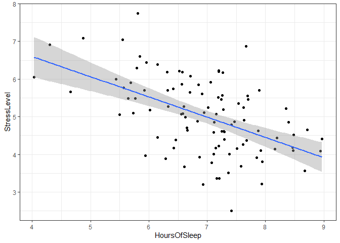

# Инструкции

Ниже приведены семь клинических (исследовательских) гипотез. В качестве задания протестируйте их, используя соответствующие статистические критерии. Решение должно содержать все элементы алгоритма проверки статистических гипотез:

• Сформулируете нулевую и альтернативную гипотезы. • Укажите уровень значимости α. • Определите статистический тест (критерий) для проверки гипотезы. При необходимости аргументируйте выбор одностороннего теста. • Укажите критическое значение статистики (используйте распределения из материалов лекции). • Определите наблюдаемое значение статистики. • Оцените статистическую значимость (p-value и/или доверительный интервал). • Оцените практическую значимость.

-   Решение необходимо загружать в формате Rmd (воспроизводимый код). \*\* Данные для анализа необходимо генерировать самостоятельно в соответствии с каждой представленной гипотезой. По возможности используйте пакет dplyr \*\*\* Предусмотрен мягкий дедлайн (17 ноября). В этом случае вы получите комментарии с возможностью повысить оценку. Сдача работы после жёсткого дедлайна (24 ноября) предусматривает снижение оценки (10 баллов).

# Гипотеза 1. Существует ассоциация между уровнем физической активности (бинарная переменная, физическая активность может быть 'высокой' и 'низкой') и частотой возникновения сердечно-сосудистых заболеваний у пациентов старше 50 лет. Попробуйте вариант с большими выборками (sample_size \<- 100). Как изменится стратегия при малых выборках (sample_size \<- 30) ?

## Генерация данных


``` r
# Воспроизводимость результатов
set.seed(42)

# Общий размер выборки 
sample_size <- 100

# Генерация данных по физической активности (бинарная переменная) в фиксированном соотношении 1:1

# activity <- rbinom(n = sample_size,
#                    size = 1, 
#                    prob = 0.5)

# В соответствии с замечаниями сделаем другую выборку
activity <-c(rep(1, sample_size/2), rep(0, sample_size/2))

# Генерация данных по наличию сердечно-сосудистых заболеваний (бинарная переменная)
# У активных людей меньше вероятность заболеть (0.5 vs 0.6)
## При помощи ifelse задаем вероятность болезни у активных или не активных
cardio <-  rbinom(n = sample_size,
                  size = 1, 
                  prob = ifelse(
                    activity == 0, 0.6, 0.5))

tab100 <- table(activity, cardio)
```


``` r
# Воспроизводимость результатов
set.seed(42)

# Общий размер выборки
sample_size <- 30

# Генерация данных по физической активности (бинарная переменная) в фиксированном соотношении 1:1


# activity <- rbinom(n = sample_size,
#                    size = 1, 
#                    prob = 0.5)

# В соответствии с замечаниями сделаем другую выборку
activity <-c(rep(1, sample_size/2), rep(0, sample_size/2))

# Генерация данных по наличию сердечно-сосудистых заболеваний (бинарная переменная)
# У активных людей меньше вероятность заболеть (0.5 vs 0.6)

cardio <- rbinom(n = sample_size,
                  size = 1, 
                  prob = ifelse(
                    activity == 0, 0.6, 0.5))

tab30 <-table (activity, cardio )
```

## Решение

##### Сформулируете нулевую и альтернативную гипотезы

Н0: частота возникновения сердечно-сосудистых заболеваний **не ассоциирована** от уровня физической активности.

$Н_0$: $p_{ССЗ\;в\;гр.\;акт.} = p_{ССЗ\;в\;гр.\;неакт.}$,

На: частота возникновения сердечно-сосудистых заболеваний **ассоциирована** от уровня физической активности.

$Н_{альт}$: $p_{ССЗ\;в\;гр.\;акт.} \neq p_{ССЗ\;в\;гр.\;неакт.}$.

##### Укажите уровень значимости α.

Зададим уровень значимости $\alpha = 0.05$.

##### Определите статистический тест (критерий) для проверки гипотезы. При необходимости аргументируйте выбор одностороннего теста.

Так как при малой выборке в в одной из групп получили 5 наблюдения, то для расчета малой выборки используем точный критерий, для большой выборки используем асимптотический тест. В нашем случае в большой выборке используем хи-квадрат для большой выборки и вариант хи-квадрата с Монте Карло для малой выборки. хи-квадрат является односторонним тестом.

##### Укажите критическое значение статистики (используйте распределения из материалов лекции).


``` r
# Критическое значение 
qchisq(p = 0.95, df = 1)
```

```
## [1] 3.841459
```

##### Определите наблюдаемое значение статистики.


``` r
chisq100 <- chisq.test(tab100)

chisq30 <- chisq.test(tab30, simulate.p.value = TRUE, B = 2000)

chisq100$statistic
```

```
## X-squared 
##         0
```

``` r
chisq30$statistic 
```

```
## X-squared 
## 0.5555556
```

##### Оцените статистическую значимость (p-value и/или доверительный интервал).


``` r
cat("p-value(для выборки 100):", chisq100$p.value, "\n")
```

```
## p-value(для выборки 100): 1
```

``` r
cat("p-value(для выборки 30):", chisq30$p.value)
```

```
## p-value(для выборки 30): 0.6951524
```

##### Оцените практическую значимость.

В выборке на 100 человек, p \> 0.05. H0 **не отвергаем**. Частота возникновения сердечно-сосудистых заболеваний **не зависит** от уровня физической активности.

В выборке на 30 человек p \> 0.05. H0 **не отвергаем**. Частота возникновения сердечно-сосудистых заболеваний **не зависит** от уровня физической активности.

# Гипотеза 2. Применение нового метода лечения для пациентов с артериальной гипертензией приведет к уменьшению среднего артериального давления по сравнению с пациентами, получающими стандартное лечение.

## Генерация данных


``` r
# Воспроизводимость результатов
set.seed(42)

# Размер выборки (в каждой группе)
sample_size <- 80


# В популяции c экспериментальным методом лечения средний уровень систолического артериального давления меньше (130 vs 135 mm) 
# Генерация данных для группы с новым методом лечения 
group1 <- rnorm( n = sample_size, mean = 130, sd = 8)  # экспериментальная группа

# Генерация данных для группы со стандартным лечением
group2 <- rnorm(  n = sample_size, mean = 135, sd = 10)  # контрольная группа
```

## Решение

##### Сформулируете нулевую и альтернативную гипотезы.

H0:𝜇1=𝜇2 среднее систолическое артериальное давление(САД) в экспериментальной группе (𝜇1) равно среднему САД в контрольной группе (𝜇2) H𝑎:𝜇1\<𝜇2 Левосторонняя гипотеза. среднее систолическое артериальное давление(САД) в экспериментальной группе (𝜇1) меньше среднему САД в контрольной группе (𝜇2)

##### Укажите уровень значимости α.

Зададим уровень значимости $\alpha = 0.05$.

##### Определите статистический тест (критерий) для проверки гипотезы. При необходимости аргументируйте выбор одностороннего теста.

> ^~`Коммент Гипотеза 2. Подумайте над выбором теста (лишнее допущение о равенстве дисперсии не рекомендуется, кроме этого выборка достаточно большая по объёму)`~^

Мы считаем что выборки были сделаны из одной генеральной совокупности, Да, мы не знаем димперсии данных выборок, но они равны. Используем t- критерий разности средних

##### Укажите критическое значение статистики (используйте распределения из материалов лекции).


``` r
# sd_x =sd(group1)
# nx   = 80
# sd_y = sd(group2)
# ny   = 80
# 
# # # Степени свободы (Welch-Satterthwaite)
# # numerator <- ((sd_x^2 / nx) + (sd_y^2 / ny))^2
# # denominator <- (sd_x^4 / (nx^2 * (nx - 1))) + (sd_y^4 / (ny^2 * (ny - 1)))

# df <- ceiling  (numerator / denominator)

# Степени свободы
df <- 80+80-2


# критическое значение статистики
t_critical_low <- qt(0.05, df = df)
t_critical_low
```

```
## [1] -1.654555
```

##### Определите наблюдаемое значение статистики.


``` r
task2_t.test <-  t.test(x = group1, y = group2,
       alternative = "less",
       var.equal = TRUE)

# наблюдаемое значение статистики.
task2_t.test$statistic
```

```
##         t 
## -2.693727
```

##### Оцените статистическую значимость (p-value и/или доверительный интервал).


``` r
task2_t.test$p.value
```

```
## [1] 0.003914578
```

``` r
task2_t.test$conf.int
```

```
## [1]      -Inf -1.462472
## attr(,"conf.level")
## [1] 0.95
```

##### Оцените практическую значимость.

H0 **отвергаем**. p \< 0.05. Cреднее систолическое артериальное давление(САД) в экспериментальной группе (𝜇1) меньше среднему САД в контрольной группе (𝜇2)

> ###### Коммент Гипотеза 2. Подумайте над выбором теста (лишнее допущение о равенстве дисперсии не рекомендуется, кроме этого выборка достаточно большая по объёму). Односторонняя гипотеза правильный выбор. Хороший комментарий про практическую значимость. Практическая значимость не оценивается по критерию отвергнута или нет нулевая гипотеза.

# Гипотеза 3. Внедрение программы реабилитации для пациентов с хронической болью в спине приведет к улучшению их физической активности (предположим что физическую активность можно оценить по шкале 0-100)

## Генерация данных


``` r
# Воспроизводимость результатов
set.seed(42)

# Размер выборки 
sample_size <- 30

# В популяции до реабилитации средний уровень физической активности меньше (50 vs 60) 
# Генерация данных до реабилитации
before <- rbinom( n = sample_size, size = 100, prob = 0.5 )

# Генерация данных после реабилитации
after <- rbinom(n = sample_size, size = 100, prob = 0.6 )  
```

## Решение

##### Сформулируете нулевую и альтернативную гипотезы.

H0:В популяции до лечения относительно популяции после лечения **отсутствует** вероятностное доминирование и наоборот,где обе выборки получены на одних и тех же респондентах до и послевоздействия (pre-posttrials).

$Н_0$: $p(X_{before} > X_{after}) = p(X_{after} > X_{before})$

Ha:В популяции до лечения относительно популяции после лечения **присутствует** вероятностное доминирование и наоборот,где обе выборки получены на одних и тех же респондентах до и послевоздействия (pre-posttrials).

$Н_a$: $p(X_{before} > X_{after}) \neq p(X_{after} > X_{before})$

> Более того, так как мы говорим об улучшении состояния, то должны расмотреть не двухстороннюю гипотезу, а именно правосторонюю

$Н_a$: $p(X_{after} > X_{before}) > p(X_{before} > X_{after})$

##### Укажите уровень значимости α.

Зададим уровень значимости $\alpha = 0.05$.

##### Определите статистический тест (критерий) для проверки гипотезы. При необходимости аргументируйте выбор одностороннего теста.

Так как распределения Биномиальные и шкала физ. активности - является ранговой переменной, то воспользуемся непараметрическим критерием Манна-Уитни-Уилкоксона для связанных выборок

##### Укажите критическое значение статистики (используйте распределения из материалов лекции).


``` r
# критическое значение статистики
w_critical_low <- qwilcox(0.95, m = 30, n = 30)

w_critical_low
```

```
## [1] 561
```

##### Определите наблюдаемое значение статистики.


``` r
w_test <- wilcox.test(y=before, x=after, alternative = "greater", paired = TRUE, conf.level = 0.95, conf.int = TRUE, exact=FALSE)

w_test
```

```
## 
## 	Wilcoxon signed rank test with continuity correction
## 
## data:  after and before
## V = 446.5, p-value = 5.576e-06
## alternative hypothesis: true location shift is greater than 0
## 95 percent confidence interval:
##  8.499972      Inf
## sample estimates:
## (pseudo)median 
##       10.99999
```

##### Оцените статистическую значимость (p-value и/или доверительный интервал).


``` r
w_test$statistic
```

```
##     V 
## 446.5
```

``` r
w_test$p.value
```

```
## [1] 5.575772e-06
```

``` r
w_test$conf.int
```

```
## [1] 8.499972      Inf
## attr(,"conf.level")
## [1] 0.95
```

``` r
w_test$estimate
```

```
## (pseudo)median 
##       10.99999
```

##### Оцените практическую значимость.

$W_{набл} < W_{крит}$ , p\<0.05 Отвергаем нулевую гипотезу. В популяции до лечения относительно популяции после лечения **присутствует** вероятностное доминирование и наоборот,где обе выборки получены на одних и тех же респондентах до и после воздействия (pre-post trials). (После лечения медиана ранга физической активности больше медианы ранга физической активности до лечения на \~ 11 пунктов.)

# Гипотеза 4. Применение нового метода лечения для пациентов с инфарктом миокарда увеличит долю вернувшихся к нормальной физической активности

## Генерация данных


``` r
# Воспроизводимость результатов
set.seed(42)

# Общий размер выборки
sample_size <- 200


# В популяции экспериментального лечения вероятность нормальной физической активности больше (0.7 vs 0.65)
# Генерация данных по статусу лечение (бинарная переменная, новый метод или стандарт) в фиксированном соотношении 1:1
treatment <- c(rep(1, sample_size/2), rep(0, sample_size/2))

# Генерация данных по физической активности после лечения (бинарная переменная)
activity <- rbinom(n = sample_size,
                  size = 1, 
                  prob = ifelse(
                    treatment == 1, 0.7, 0.65))

tab_Hart <- table(treatment, activity)
```

## Решение

##### Сформулируете нулевую и альтернативную гипотезы.

Н0: доли 'успеха' в популяции экспериментального лечения и популяции стандартного лечения равны

$Н_0:$ $p_{эксп. леч} = p_{ст. леч}$

На: доля 'успеха' в популяции экспериментального лечения **больше** доли 'успеха' в популяции стандартного лечения.

$Н_а:$ $p_{эксп. леч} > p_{ст. леч}$

##### Укажите уровень значимости α.

Зададим уровень значимости $\alpha = 0.05$.

##### Определите статистический тест (критерий) для проверки гипотезы. При необходимости аргументируйте выбор одностороннего теста.

Выбираем Z-критерий для разности долей для независимых выборок. Тaк как наблюдений в каждой группе больше 5, то выбираем асимптотический тест. ТАк как говорится о **увеличении доли**, то используем односторонний тест(правосторонний)

##### Укажите критическое значение статистики (используйте распределения из материалов лекции).


``` r
# статистика z-критерия распределена нормально, со средним значением 0 и дисперсией 1.
# для нахождения критическое значение статистики найдем значение квантиля 0,95
z_quant_low <- qnorm(0.95, mean = 0, sd = 1)
z_quant_low
```

```
## [1] 1.644854
```

##### Определите наблюдаемое значение статистики.


``` r
# Напишим функцию для проведения теста
# Функция для проведения z-теста для двух независимых долей
performTwoProportionZTest <- function(n1, x, n2, y) {
  # Расчет долей успешных исходов в выборках
  p1 <- x / n1
  p2 <- y / n2

  # Расчет объединенной доли успешных исходов
  P <- (x + y) / (n1 + n2)

  # Расчет стандартной ошибки
  SQ <- P * (1 - P) * (1/n1 + 1/n2)

  # Выполнение z-теста
  z_test_result <- (p1 - p2) / sqrt(SQ)

  return(z_test_result)
}

# Использование функции:
n1 <- 100  # Общее количество попыток для эксп. леч
x <- 66   # Количество успешных исходов для эксп. леч

n2 <- 100  # Общее количество попыток для ст. леч
y <- 61  # Количество успешных исходов для ст. леч

z_test_result <- performTwoProportionZTest(n1, x, n2, y)
print(z_test_result)
```

```
## [1] 0.7343815
```

##### Оцените статистическую значимость (p-value и/или доверительный интервал).


``` r
# нахождение p_value для одностороннего теста
p_value <- 1 -  pnorm(z_test_result)


# нахождение 95% для одностороннего теста формула CI=[(x−y)−Zα/2*SQ,+∞]

SQ <- function(n1, x, n2, y) {
  p1 <- x / n1
  p2 <- y / n2

  # Расчет объединенной доли успешных исходов
  P <- (x + y) / (n1 + n2)

  # Расчет стандартной ошибки
  SQ <- P * (1 - P) * (1/n1 + 1/n2)
return(SQ)
  }

CI_lower <- (x - y)/100 - z_quant_low * sqrt(SQ(n1, x, n2, y))
CI_upper <- Inf 
CI <- c(CI_lower, CI_upper )

# сделаем красивый вывод

cat("p-value:", p_value, "\n")
```

```
## p-value: 0.2313581
```

``` r
cat("95% Доверительный интервал:", CI, "\n")
```

```
## 95% Доверительный интервал: -0.06198905 Inf
```

##### Оцените практическую значимость.

p\> 0.05, ДИ пересекает 0, соотвествено Ho **не отвергаем**. **доли 'успеха' в популяции экспериментального лечения и популяции стандартного лечения равны**

# Гипотеза 5. Применение медитации в течение 8 недель повлияет на наличие стресса (есть/нет) у лиц с высоким уровнем тревожности.

## Генерация данных


``` r
# Воспроизводимость результатов
set.seed(42)

# Размер выборки
sample_size <- 50

# Генерация данных до медитации (бинарная переменная) в фиксированном соотношении 1:1
before <- c(rbinom(sample_size, 1, 0.4))

# Генерация данных после медитации (бинарная переменная). После медитации вероятность наличия стресса меньше (0.2 vs 0.4)
after <- c(rbinom(sample_size, 1, 0.2))

tab_stress <- table(after, before)

tab_stress
```

```
##      before
## after  0  1
##     0 19 26
##     1  3  2
```

## Решение

##### Сформулируете нулевую и альтернативную гипотезы.

H0: Доли пациентов со стрессом не изменились

$H_0:$ $p_{str. \;before}$ = $p_{str.\;after}$

Ha: Доли пациентов со стрессом не изменились

$H_a:$ $p_{str. \;before} \neq p_{str.\;after}$

##### Укажите уровень значимости α.

Зададим уровень значимости $\alpha = 0.05$.

##### Определите статистический тест (критерий) для проверки гипотезы. При необходимости аргументируйте выбор одностороннего теста.

ТАк как в двух категориях количесвто наблюдений меньше 5, то мы должны использовать точный тест, а не асимптотический. Воспользуемся тестом МакНеймора для повторных измерений.

##### Укажите критическое значение статистики (используйте распределения из материалов лекции).


``` r
# Тест МакНеймара похож на хи квадрат - так же является односторонним, воспользуемся квантилем 0,95 распределения хи квадрата для нахождения крит. занчения статистики.
qchisq(p = 0.95, df = 1)
```

```
## [1] 3.841459
```

##### Определите наблюдаемое значение статистики.


``` r
mcNemar_stress <- mcnemar.test(tab_stress)
mcNemar_stress
```

```
## 
## 	McNemar's Chi-squared test with continuity correction
## 
## data:  tab_stress
## McNemar's chi-squared = 16.69, df = 1, p-value = 4.402e-05
```

##### Оцените статистическую значимость (p-value и/или доверительный интервал).


``` r
cat("p-value:", mcNemar_stress$p.value)
```

```
## p-value: 4.402039e-05
```


``` r
#AI модель Gemini 1.5  подсказала как найти доверительный интервал

b =26
c= 3

# Разность пропорций
difference <- (b - c) / (b + c)

# Стандартная ошибка
se <- sqrt((b + c) / (b + c)^2)

# Критическое значение для 95% доверительного интервала (правосторонний тест)
z_critical <- qnorm(0.95)

# Доверительный интервал
ci_lower <- difference - z_critical * se
CI <- c(ci_lower, Inf)
cat("95% ДИ:", CI)
```

```
## 95% ДИ: 0.4876618 Inf
```

##### Оцените практическую значимость.

Статистка критерия МакНеймара больше чем критическое значение статистики (16.69 против 3.841459). p\<0.05. ДИ не пересекает 0. **Отвергаем** нулевую гипотезу. **Доля пациентов со стрессом после 8 недель медитаций изменилась по сравнению с долей пациентов со стрессом до медитации**

# Гипотеза 6. Применение альтернативного метода лечения для пациентов с биполярным расстройством приведет к значимому изменению уровня симптомов депрессии по отношению к группе, прошедшей стандартное лечение (депрессию можно определить по шкале от 0 до 100, при этом исследователь должен избегать любых предположений (кроме i.i.d.)).

## Генерация данных


``` r
# Воспроизводимость результатов
set.seed(42)

# Размер выборки для каждой группы
sample_size <- 20


# В популяции c экспериментальным методом лечения среднее депрессии меньше (55 vs 68) 

##### Так ка мы должны 
# Генерация данных для экспериментальной группы 
group1 <- rbinom(sample_size, 100, 0.55)  # экспериментальная группа

# Генерация данных для группы со стандартным лечением
group2 <- rbinom(sample_size, 100, 0.68)  # контрольная группа
```

## Решение

##### Сформулируете нулевую и альтернативную гипотезы.

H0:В популяции с альтернативным методом лечения относительно популяции со стандартным методом **отсутствует** вероятностное доминирование и наоборот

$Н_0$: $p(M_{group1} > M_{group2}) = p(M_{group1} < M_{group2})$

Ha:В популяции с альтернативным методом лечения относительно популяции со стандартным методом **присутствует** вероятностное доминирование и наоборот .

$Н_a$: $p(M_{group1} > M_{group2}) \neq p(M_{group1} < M_{group2})$

> так как мы говорим о категориальных переменных, то будем использовать непараметрический тест, поэтому мерой центральной тенденции будем использовать не мат ожидани, а медиану. В таком случаее математические выражения гипотез можем записать в таком виде

$Н_0$: $Med_{group1} = Med_{group2}$

$Н_a$: $Med_{group1} \neq Med_{group2}$

##### Укажите уровень значимости α.

Зададим уровень значимости $\alpha = 0.05$.

##### Определите статистический тест (критерий) для проверки гипотезы. При необходимости аргументируйте выбор одностороннего теста.

Из-за условия, что исследователь должен избегать любых предположений (кроме i.i.d.). и так как мы говорим о категориальных переменных, то будем использовать непараметрический тест Манна-Уитни-Уилкоксона

##### Укажите критическое значение статистики (используйте распределения из материалов лекции).


``` r
# критичекие значения будут определяться по кватилям 0,025 и 0,975
w_critical_low <- qwilcox(0.025, sample_size, sample_size)
w_critical_up <-  qwilcox(0.975, sample_size, sample_size)
w_critical_low
```

```
## [1] 128
```

``` r
w_critical_up
```

```
## [1] 272
```

##### Определите наблюдаемое значение статистики.


``` r
w_test <- wilcox.test(x= group2, y = group1, alternative = "two.sided", paired = FALSE, conf.int = TRUE, conf.level = 0.95)
```

```
## Warning in wilcox.test.default(x = group2, y = group1, alternative =
## "two.sided", : не могу подсчитать точное p-значение при наличии повторяющихся
## наблюдений
```

```
## Warning in wilcox.test.default(x = group2, y = group1, alternative =
## "two.sided", : не могу подсчитать точные доверительные интервалы при наличии
## повторяющихся наблюдений
```

``` r
w_test$statistic
```

```
##   W 
## 391
```

##### Оцените статистическую значимость (p-value и/или доверительный интервал).


``` r
cat("p-value:", w_test$p.value, "\n")
```

```
## p-value: 2.436809e-07
```

``` r
cat("95% ДИ:", w_test$conf.int, "\n")
```

```
## 95% ДИ: 9.999995 15.99996
```

``` r
cat("разница в смещении рангов", w_test$estimate)
```

```
## разница в смещении рангов 12.99992
```

##### Оцените практическую значимость.

Значение статисттики выходит за рамки критических значений. p\<0.05, ДИ не пересекает 0. Нуливую гипотезу **отвергаем**.

В популяции с альтернативным методом лечения относительно популяции со стандартным методом **присутствует** вероятностное доминирование и наоборот . (Присутсвтует разница в смещении уровня симптомов депрессии )

# Гипотеза 7. Длительность сна (в часах) ассоциирована с уровенем стресса у студентов (шкала с нормальным распределением)

## Генерация данных


``` r
library(mvtnorm) # библиотека mvtnorm для работы с многомерным нормальным распределением
```

```
## Warning: пакет 'mvtnorm' был собран под R версии 4.4.2
```

``` r
# Воспроизводимость результатов
set.seed(42)

# Размер выборки
sample_size <- 100

# Средние значения для длительности сна (HoursOfSleep) и уровня стресса (StressLevel) в популяции
means <- c(7, 5)  

# Матрица ковариации. В ислледуемой популяции HoursOfSleep и StressLevel ассоциированы отрицательно (r = -0.5)
cov_matrix <- matrix(c(1, -0.5, -0.5, 1), nrow = 2)

df <- rmvnorm(n = sample_size, 
              mean = means, 
              sigma = cov_matrix) %>% 
      as_tibble() %>%
      setNames(c("HoursOfSleep", "StressLevel"))  
```

```
## Warning: The `x` argument of `as_tibble.matrix()` must have unique column names if
## `.name_repair` is omitted as of tibble 2.0.0.
## i Using compatibility `.name_repair`.
## This warning is displayed once every 8 hours.
## Call `lifecycle::last_lifecycle_warnings()` to see where this warning was
## generated.
```

## Решение (дополните решение визуализацией)


``` r
# Для решения можем испоьзовать как корреляцию Пирсона, так и ререссионную модель (для оценки ассоциации)

#  в начале визуализация

ggplot(data = df) +
  geom_point(aes(x = HoursOfSleep, y = StressLevel)) +
  geom_smooth(aes(x = HoursOfSleep, y = StressLevel), 
              method = "lm") +
  theme_bw()
```

```
## `geom_smooth()` using formula = 'y ~ x'
```

<!-- -->

``` r
model_stress <- lm(StressLevel ~HoursOfSleep, data =df)
a <- summary(model_stress)

a
```

```
## 
## Call:
## lm(formula = StressLevel ~ HoursOfSleep, data = df)
## 
## Residuals:
##      Min       1Q   Median       3Q      Max 
## -2.25841 -0.53657  0.02167  0.62168  2.24232 
## 
## Coefficients:
##              Estimate Std. Error t value Pr(>|t|)    
## (Intercept)   8.74954    0.62128  14.083  < 2e-16 ***
## HoursOfSleep -0.53737    0.08864  -6.062 2.51e-08 ***
## ---
## Signif. codes:  0 '***' 0.001 '**' 0.01 '*' 0.05 '.' 0.1 ' ' 1
## 
## Residual standard error: 0.8552 on 98 degrees of freedom
## Multiple R-squared:  0.2727,	Adjusted R-squared:  0.2653 
## F-statistic: 36.75 on 1 and 98 DF,  p-value: 2.511e-08
```

##### Сформулируете нулевую и альтернативную гипотезы.

Если мы берем регрессионную модель, то гипотезs будут следующие. Но: Коэффициент регрессии ($β_1$) равен нулю ( т.е. между длительностью сна и уровнем стресса нет линейной зависимости)

$Н_0$: $β_1 = 0$

Нa: Коэффициент регрессии ($β_1$) **не равен** нулю ( т.е. между длительностью сна и уровнем стресса **есть** линейная зависимости)

$Н_a$: $β_1 \neq 0$

##### Укажите уровень значимости α.

Зададим уровень значимости $\alpha = 0.05$.

##### Определите статистический тест (критерий) для проверки гипотезы. При необходимости аргументируйте выбор одностороннего теста.

Для определения ассоциации воспользуемся линейной регрессией

##### Укажите критическое значение статистики (используйте распределения из материалов лекции).


``` r
# для определения критических значений воспользуемся квантиялми t-распределения
t_critical_low <- qt(0.025, 197) # 197- это степени свобод, n-р-1
t_critical_up <- qt(0.975, 197)

t_critical_low 
```

```
## [1] -1.972079
```

``` r
t_critical_up
```

```
## [1] 1.972079
```

##### Определите наблюдаемое значение статистики.


``` r
# НАблюдаемое значение статистики можно увидеть при вызове функции summery() t-value =  -6.062. Или можно найти при помощи следующего скрипта

t_value <- summary(model_stress)$coefficients[2, 3]
```

##### Оцените статистическую значимость (p-value и/или доверительный интервал).


``` r
cat("p-value:", summary(model_stress)$coefficients[2, 4])
```

```
## p-value: 2.510825e-08
```

$CI_{lower} = β_1 - t_{critical}*SE_{β_1}$

$CI_{upper} = β_1 + t_{critical}*SE_{β_1}$


``` r
# Определение 95% ДИ: 

ci_lower <-
  summary(model_stress)$coefficients [2, 1] - t_critical_up * summary(model_stress)$coefficients[2, 2]
ci_upper <-
  summary(model_stress)$coefficients [2, 1] + t_critical_up * summary(model_stress)$coefficients[2, 2]
cat("95% ДИ:","(", ci_lower, ci_upper,")")
```

```
## 95% ДИ: ( -0.7121816 -0.3625546 )
```

##### Оцените практическую значимость.

Значение статистики выходит за критические значения, p\<0.05 , ДИ не пересекает 0. **Отвергаем** нулевую гипотезу.

Коэффициент регрессии $β_1$ **не равен** нулю ( т.е. между длительностью сна и уровнем стресса **есть** линейная зависимости).

Добавлю, что коэфициент $β_1$ показывает разницу в математическом ожидании переменной $StressLevel$ при увеличении $HoursOfSleep$ на 1.
