## ЗАгрузка датасета


``` r
# базовая версия read.csv  дает навазние переменных через  точку, а read_csv через пробел, какой функцией лучше пользоваться?
  hogwarts <- read_csv("data/hogwarts_2024.csv")
```

```
## Rows: 560 Columns: 60
## -- Column specification --------------------------------------------------------
## Delimiter: ","
## chr  (4): house, sex, wandCore, bloodStatus
## dbl (56): id, course, result, Defence against the dark arts exam, Flying exa...
## 
## i Use `spec()` to retrieve the full column specification for this data.
## i Specify the column types or set `show_col_types = FALSE` to quiet this message.
```

``` r
# Переведем часть переменных в факторы
hogwarts <- hogwarts |> mutate(
  across(c(house, course, sex, wandCore, bloodStatus), ~ as.factor(.x))
)
```

{alt=""}

## Добавим кастомскую тему


``` r
theme_custom <- theme(
    panel.background = element_rect(fill = "white"),
    plot.title = element_text(size = 30, hjust = 0.5),
    plot.subtitle = element_text(size = 25, hjust = 0.5),
    strip.text = element_text(size = 20),
    axis.text = element_text(size = 20),
    axis.title = element_text(size = 25),
    legend.title = element_text(size = 25),
    legend.text = element_text(size = 20)
  )
```

## Диаграммы рассеяния (скаттерплоты)

### Диаграммы рассеяния (скаттерплоты) Задание 1

Постройте скаттерплот, визуализирующий связь между суммарным баллом студента за год и оценкой за экзамен по травологии. Добавьте на график линию тренда. Удалите доверительную область и сделайте линию прямой. Подумайте, как избежать того, чтобы записать одни и те же координаты x и y дважды. Проинтерпретируйте график. (1 б.)


``` r
#  Что бы избежать  записи одних и те же координат x и y дважды, нужно их записать в эстетику функции ggplot()
 scatter_result_Herb <- hogwarts |> 
  ggplot(aes(x = `result`, 
                 y = `Herbology exam`))+
  geom_point( 
             shape = 24, 
             size = 3, 
             stroke = 2, 
             fill = "#66ff00",
             position = position_jitter(width = 2, height = 2))+
  geom_smooth(
              se = FALSE,
              method = "lm", # но можно использовать "gml" 
              linewidth = 2)+
  theme_custom
print(scatter_result_Herb)
```

```
## `geom_smooth()` using formula = 'y ~ x'
```

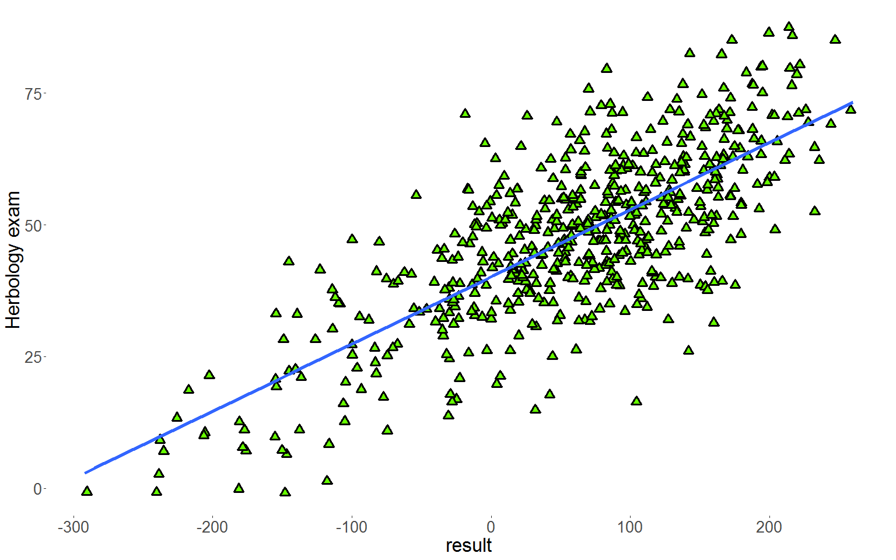<!-- -->

Чем ниже суммарный балл студента, тем ниже оценка за экзамен по травологии. (вохможно связано с тем, что студент не готовился как к занятиям, так и к экзамену)

### Диаграммы рассеяния (скаттерплоты) Задание 2

Отобразите на одной иллюстрации скаттерплоты, аналогичные тому, что вы делали на первом задании, для экзаменов по травологии, магловедению, прорицаниям и зельеварению. На иллюстрации также должна присутствовать линия тренда с характеристиками, аналогичными тем, что были в пункте 1. Раскрасьте точки в разные цвета, в соответствии с факультетами. Используйте стандартные цвета факультетов (как в лекционных rmd). Проинтерпретируйте полученный результат. (1 б). Если вы создадите иллюстрацию из этого пункта, используя только пакеты семейства tidyverse, и не привлекая дополнительные средства, вы получите дополнительные 0.5 б. 3. Видоизмените график, полученный


``` r
# вы создадите иллюстрацию из этого пункта, используя только пакеты
# семейства tidyverse, и не привлекая дополнительные средства, вы
#получите дополнительные 0.5 б. -  я конечно же хочу больше баллов. Сначала я спросил гугл. К сожалению там я не нашел дополнительного пакета из семейства  tidy. Немного погрустив и залез на сайт tidyverse.org  я посмотел там, есть ли что-то подходящее под условия https://www.tidyverse.org/blog/2024/09/patchwork-1-3-0/ я обнаружил пакет который нужен. "Ура!-  подумал я - Это то что нужно"!!! НО оказалочь что данный пакет не находится в базовом tidyverse. Я сам себя обманул. :(((((

# Задача должа иметь решение, единственное что приходит на ум, когда говорят о нескольких графиках на одной иллюстрации (Может заменить это слово? например на подложку?) - это фасетирование. Если это так, то можно именить наши данные (сделать длиную версию таблицы)

 data_for_scat_pl_2 <- hogwarts |> 
  select(id, house, result,  `Herbology exam`, `Muggle studies exam`, `Potions exam`, `Divinations exam`) |> 
  pivot_longer(-c(id, house, result), names_to = "exam", values_to = "points") 

# ТЕперь можно легко сделать график
scat_pl_2 <- data_for_scat_pl_2 |> 
  ggplot(aes(x = `result`, 
                 y = `points`))+
  geom_point( aes(fill = house),
             shape = 23, 
             size = 3, 
             stroke = 2, 
             position = position_jitter(width = 2, height = 2),
             alpha = 0.7)+
  geom_smooth(    # aes(colour = house),
              se = FALSE,
              method = "lm", # но можно использовать "gml"
              linewidth = 2)+
  scale_fill_manual(values = c("Gryffindor" = "#C50000", 
                             "Hufflepuff" = "#ECB939",
                             "Ravenclaw" = "#41A6D9",
                             "Slytherin" = "#1F5D25"))+
  # scale_colour_manual(values = c("Gryffindor" = "#C50000", 
  #                            "Hufflepuff" = "#ECB939",
  #                            "Ravenclaw" = "#41A6D9",
  #                            "Slytherin" = "#1F5D25"))+
  theme_custom+
  facet_wrap(vars(exam))

print(scat_pl_2)
```

```
## `geom_smooth()` using formula = 'y ~ x'
```

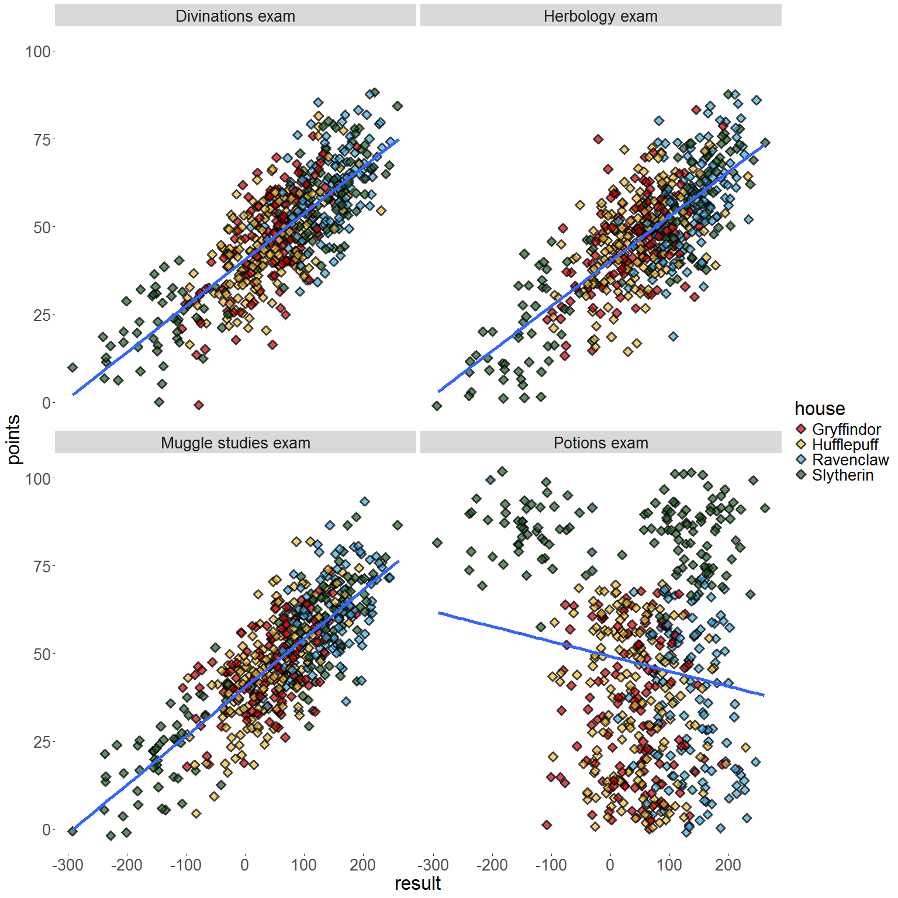<!-- -->

НА всех графиках, кроме экзамена по зельеварению сохраняется линейная завичимость оценок за экзамен от суммарного балла студента, Чем ниже балл, тем ниже оценка за экзамен. Характер распределения оценкок за экзамен по зельеварению отличается от других экзаменов возможго из-за личностных отношений препдавателя (по ЛОРу декан слизерина, который вел занятия по зельеваренью, заступался за своих студентов и занижал оценки студентов других факультетов ).

### Диаграммы рассеяния (скаттерплоты) Задание 3

Видоизмените график, полученный на предыдущем шаге. Сгруппируйте и покрасьте линии тренда в соответствии с одной из категориальных переменных (с такой, которая подсвечивает одно из наблюдений на предыдущем этапе, относящееся ко всем 4-м экзаменам). Постарайтесь избежать коллизий в легенде, при этом сохранив и цветовую палитру для раскраски точек по факультетам. (1 б.)

> Просто выполнить задание - неинтересно. добавим название, изменим название осей и название факультетов. Буду как армянский комсомолец. Добавим название графика, изменим название осей и название факультетов.
>
> ```         
> Армянские комсомольцы сами себе создают трудности, а потом сами же их успешно преодолевают. 
> ```


``` r
#  При выполнении доп.условий, что бы легенда не повторялась - нужно добавить лейбы в функцию  scale_colour_manual() и добавить название шкалы  "colour" в функцию labs()

data_for_scat_pl_2 |> 
  ggplot(aes(x = `result`, 
                 y = `points`))+
  geom_point( aes(fill = house),
             shape = 23, 
             size = 3, 
             stroke = 2, 
             position = position_jitter(width = 2, height = 2),
             alpha = 0.5)+
  geom_smooth( aes(colour = house),
              se = FALSE,
              method = "lm", # но можно использовать "gml"
              linewidth = 2)+
  scale_fill_manual(values = c("Gryffindor" = "#C50000", 
                             "Hufflepuff" = "#ECB939",
                             "Ravenclaw" = "#41A6D9",
                             "Slytherin" = "#1F5D25"),
                    labels = c("Gryffindor" = "Гриффиндор", 
                             "Hufflepuff" = "Пуфендуй",
                             "Ravenclaw" = "Когтевран",
                             "Slytherin" = "Слизерин")
                  )+
  scale_colour_manual(values = c("Gryffindor" = "#C50000",
                             "Hufflepuff" = "#ECB939",
                             "Ravenclaw" = "#41A6D9",
                             "Slytherin" = "#1F5D25"),
                      labels = c("Gryffindor" = "Гриффиндор", 
                             "Hufflepuff" = "Пуфендуй",
                             "Ravenclaw" = "Когтевран",
                             "Slytherin" = "Слизерин")
                  )+
  theme_custom+
  facet_wrap(vars(exam))+
  labs(
    title = "Cвязь между суммарным баллом студента за год и оценкой за экзамен",
    subtitle = "Экзамены за прорицание, Гербологию, Магловеденье, Зельеваренье",
    y = "Оценка за экзамен",
    x = "Суммарный балл студента за год",
    fill = "Факультет",
    colour  = "Факультет")+
  theme(legend.position = "inside",
        legend.justification = "bottom")
```

```
## `geom_smooth()` using formula = 'y ~ x'
```

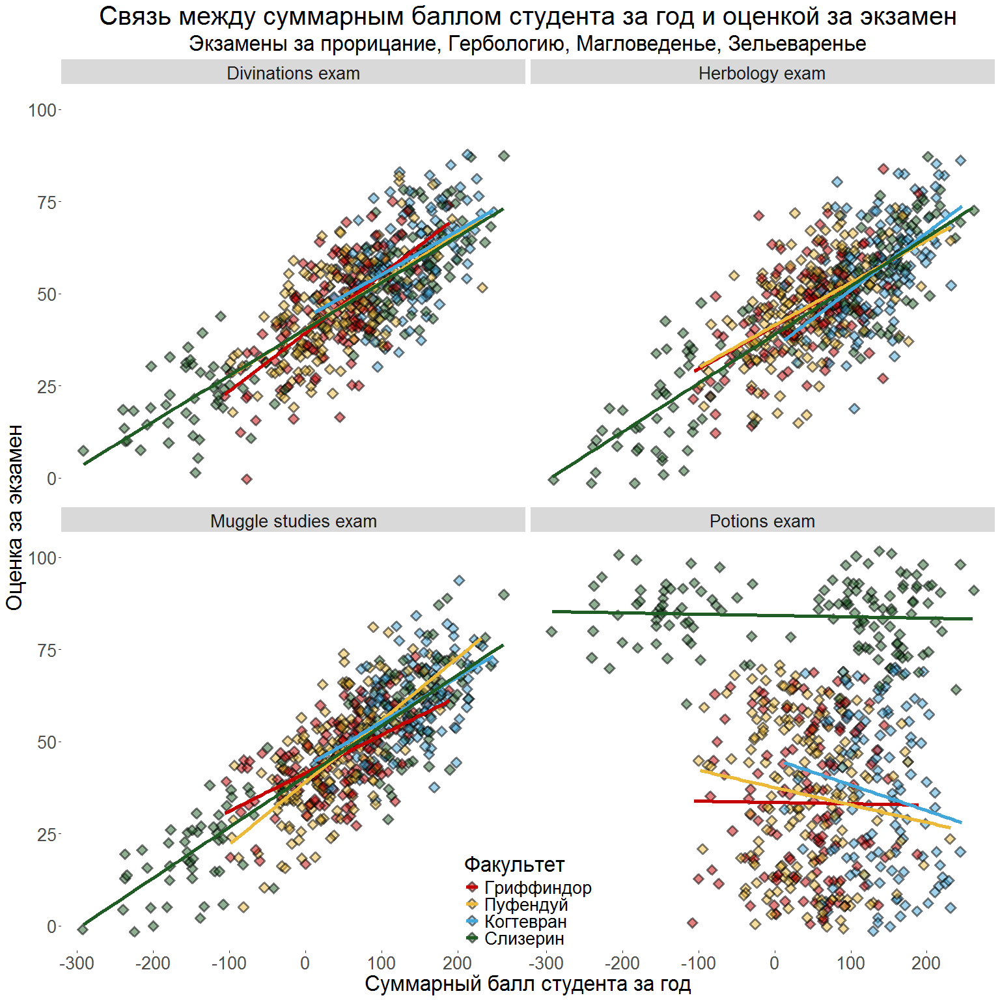<!-- -->

## geom_col и вещи вокруг него

### geom_col и вещи вокруг него Задание 1

Постройте барплот (столбиковую диаграмму) распределения набранных баллов за первый семестр (с 1-й по 17-ю неделю включительно) у студентов разного происхождения. Если у вас возникают трудности, можете обратиться к шпаргалке по dplyr от posit. Выдвиньте гипотезу (или гипотезы), почему распределение получилось именно таким. (1 б.)


``` r
# Вначале нужно выбрать данные по которым будут производиться расчеты. Сделаем это при помощи select()  интересно а как еще можно выбрать интересующие нас переменные с помощью starts_with("week")???


data_for_geom_col_1 <- hogwarts |>    
  select(bloodStatus, sex, week_1:week_17) |>  # выбрали переменные
  group_by(bloodStatus) |>  # сгрупировали по происхождению
  summarise(across(week_1:week_17, sum)) |>   # просуммировали значение переменых week
  pivot_longer(-c(bloodStatus),
               names_to = "week", 
               values_to = "points" ) |> # Сделал длиную таблицу, что бы названия недель было в 1 переменной
  mutate(week = as.factor(week))
  


ggplot(data_for_geom_col_1 )+
  geom_col(aes(x=fct_inorder(week), y=points, fill= bloodStatus), #  fct_inorder() применена для установления порядка в неделях. Без нее будут недели идти 1, 10-17, 2, 3 и тд. 
           position = "dodge")+
   theme_custom+
   theme(
     axis.text.x = element_text(angle = 45) #  для лучшего чтения надписей оси.
   )
```

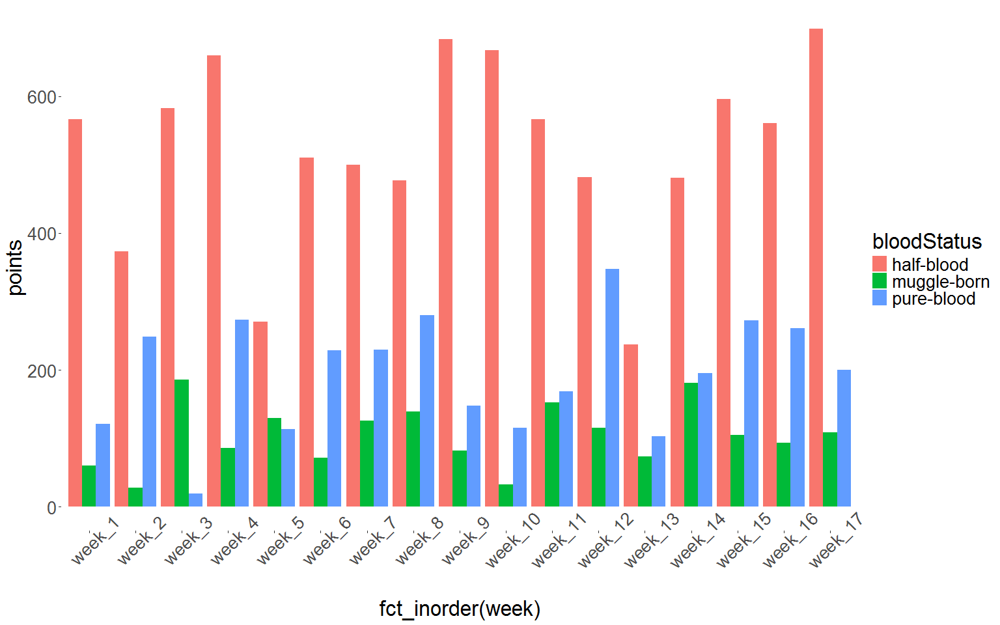<!-- -->

Гипотезы: 1. Чистокровные и полукровки лучше знают волшебный мир - поэтому им дается учеба проще, чем маглоржденым, соответственно они набираю больше баллов 2.Полукровок большинство- поэтому они набирают больше всех баллов.


``` r
# Переделаный график 


data_for_geom_col_1_corr <- hogwarts |>    
  select(bloodStatus,  week_1:week_17) |>  # выбрали переменные
  group_by(bloodStatus) |>  # сгрупировали по происхождению
  summarise(across(week_1:week_17, sum)) |> # просуммировали значение переменых week
  mutate(`points per semester` = rowSums(across(week_1:week_17)))|> 
  select(bloodStatus, `points per semester` )
  
  


ggplot(data_for_geom_col_1_corr )+
  geom_col(aes(x= bloodStatus,
               y=`points per semester`, 
               fill= bloodStatus))+
   theme_custom
```

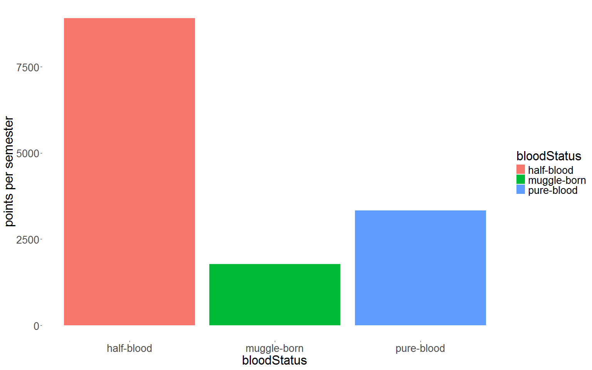<!-- -->

### geom_col и вещи вокруг него Задание 2

Модифицируйте предыдущий график -- отсортируйте столбцы в порядке убывания суммы баллов. Добавьте на график текстовые метки, отражающие число студентов каждого происхождения. Попробуйте использовать для этой задачи не geom_text, а geom_label. Настройте внешний вид geom_label по своему усмотрению. Поправьте название оси. Проинтерпретируйте график. Соотносится ли интерпретация с вашей гипотезой из пункта 1? (1 б.)


``` r
data_for_geom_col_2 <- hogwarts |>    
  select(bloodStatus, week_1:week_17) |>  # выбрали переменные
  group_by(bloodStatus) |> # сгрупировали по происхождению
  summarise(bloodStatus_count = n(), across(week_1:week_17, sum)) |>   # просуммировали значение переменых week
  pivot_longer(-c(bloodStatus, bloodStatus_count),
               names_to = "week", 
               values_to = "points" ) |> # Сделал длиную таблицу, что бы названия недель было в 1 переменной
  mutate(`blSt_and_week` = paste0(bloodStatus, " & ", week)) #  Создал новую переменную для сортировки столбцов
  

# Лучше поменять местами оси, что бы было читаемо

  geom_col_2_notCORR <- ggplot(data_for_geom_col_2 )+
   geom_col(aes( x=points, 
                y=fct_reorder( blSt_and_week,  points, .desc = FALSE), 
                fill= bloodStatus),
           position = "dodge")+
   geom_label (aes( x=points, 
                    y=fct_reorder( blSt_and_week,  points, .desc = FALSE),
                    label = paste0(bloodStatus_count, "students"),
                    hjust = -0.2,
                    fill= bloodStatus),
               size = 5)+
    xlim(0, 800)+
    theme_custom+
    theme(legend.position = "inside",
          legend.justification = "right",
          axis.text.y = element_text(hjust = 0) # Добавил, чтобы выровнять подписи по левому краю
        )+
    labs( y = " Происхождение студентов и номер недели учебы")
  print(geom_col_2_notCORR)
```

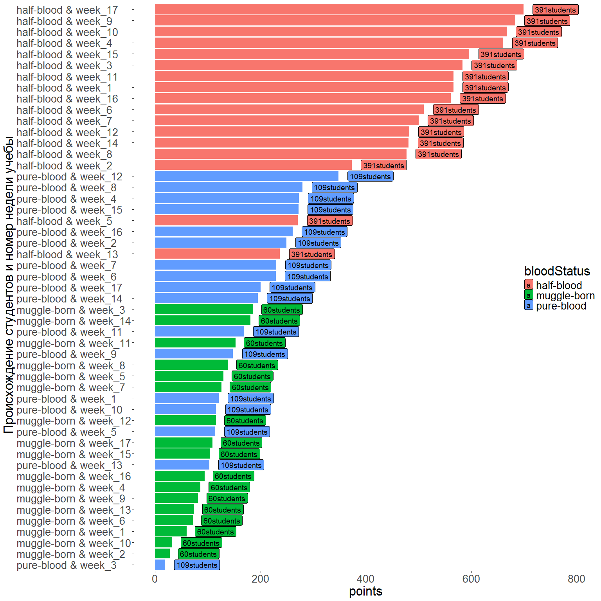<!-- -->

Количество баллов в целом зависит от количесва студентво той или иной группы. Гипотеза 2 оказалось верной.


``` r
#Правильный график

data_for_geom_col_2_corr <- hogwarts |>    
  select(bloodStatus, week_1:week_17) |>  # выбрали переменные
  group_by(bloodStatus) |> # сгрупировали по происхождению 
  summarise( bloodStatus_count = n(),   # посчитали сколько студентов в каждой группе
             across(week_1:week_17, sum)) |>   # просуммировали значение переменых week
  mutate(`points per semester` = rowSums(across(week_1:week_17)))|> 
  select(bloodStatus, bloodStatus_count, `points per semester` )

  

# После выполнения задания 4 по geom_col появилась мысль использовать функцию coord_flip()
# Что  бы график был красивым нужно изменить положение легенды. и положение значения набраных очков, например,  geom_text( aes(y=4500)...


  geom_col_2_corr <- ggplot(data_for_geom_col_2_corr )+
   geom_col(aes( y=`points per semester`, 
                x=fct_reorder( bloodStatus,  `points per semester`, .desc = TRUE), 
                fill= bloodStatus),
           position = "dodge")+
   geom_label (aes( y=9500, 
                    x=fct_reorder( bloodStatus,  `points per semester`, .desc = TRUE),
                    label = paste0(bloodStatus_count, " students"),
                    hjust = "center",
                    vjust = "center",
                    fill= bloodStatus),
               size = 9)+
    ylim(0, 10000)+
    # Дополнение добавим солой содержащий значение очков
    geom_text(
      aes(y=`points per semester`, 
          x=fct_reorder( bloodStatus,  `points per semester`, .desc = TRUE),
          label = paste0(`points per semester`, " points")
      ),
      hjust = "center",
      vjust = 1,
      size = 5
    )+
    theme_custom+
    theme( legend.position = "inside",
          legend.justification = "right"
        )+
    labs( x = "Происхождение студентов",
          y = "Баллы за 1 семестр",
          fill = "Происхождение студентов")
  
print( geom_col_2_corr)
```

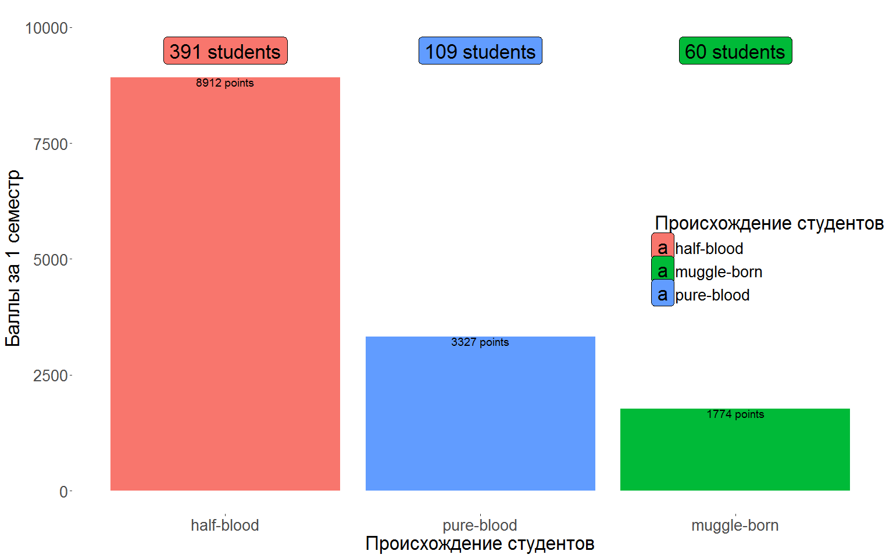<!-- -->

### geom_col и вещи вокруг него Задание 3

И снова измените график -- добавьте на него разбивку не только по происхождению, но и по полу. Раскрасьте столбцы по происхождению. Сделайте подписи к столбцам читаемыми. Дайте графику название, измените, если требуется, название осей. Сделайте шаг для оси, на которой отображены очки, через каждую тысячу баллов. Разместите текстовые метки по правому краю графика. Настройте график таким образом, чтобы метки были видны целиком и не обрезались. Сохраните график на устройство.(1.5 б.)


``` r
# Нужно создать новй датасет с разбивкой на пол и  происхождение студентов.
# Смущает уловие задания " Сделайте шаг для оси, на которой отображены очки, через каждую тысячу баллов" - так как  не набирается и 700 баллов за неделю. Возможно нужно было просуммировать баллы с 1 по 17 неделю? Если это так- то печалька :(

data_for_geom_col_3 <- hogwarts |>    
  select(bloodStatus, sex, week_1:week_17) |>  # выбрали переменные
  group_by(bloodStatus, sex) |> # сгрупировали по происхождению и полу
  summarise( bloodStatus_count = n(),   # посчитали сколько студентов в каждой группе
             across(week_1:week_17, sum)) |>   # просуммировали значение переменых week
  mutate(`points per semester` = rowSums(across(week_1:week_17)),
         `sex and bloodStatus` = paste0(sex, " & ", bloodStatus))|> 
  select(bloodStatus, sex,`sex and bloodStatus`, bloodStatus_count, `points per semester` )
```

```
## `summarise()` has grouped output by 'bloodStatus'. You can override using the
## `.groups` argument.
```

``` r
# Теперь график с разбивкой не только по происхождению, но и по полу. 


geom_col_3 <- ggplot(data_for_geom_col_3 )+
   geom_col(aes( x = `points per semester`, 
                 y = fct_reorder( `sex and bloodStatus`,
                               `points per semester`,
                               .desc = FALSE), 
                fill= bloodStatus), 
            colour = "black", 
            size = 1
          )+
  # xlim(NA, 13000)+ # 
   scale_x_continuous (breaks = seq(-2000, 10000, by = 1000))+
   geom_label (aes( x = 10000, # Ох, как намучался с этим. Если поставить x = `points per semester`, то надпии **НЕ будут** помещаться на графике, и шкала х не будет увеличина до 1200 
                    y = fct_reorder( `sex and bloodStatus`,
                                   `points per semester`,
                                   .desc = FALSE),
                    label = paste0(bloodStatus_count, " students"),
                    fill= bloodStatus),
               size = 9,
              hjust = "right")+
    theme_custom+
    theme(legend.position = "inside",
          legend.justification = "bottom",
          axis.text.y = element_text(hjust = 0), # Добавил, чтобы выровнять подписи по левому краю
         )+  # plot.margin = margin(30, 30, 30, 30)
    labs( y = "Пол и происхождение студентов",
          x = "Баллы за семестр",
          fill= "Происхождение студентов",
          title = "Количество набранных баллов в зависимости от \n происхождения и пола студентов")
```

```
## Warning: Using `size` aesthetic for lines was deprecated in ggplot2 3.4.0.
## i Please use `linewidth` instead.
## This warning is displayed once every 8 hours.
## Call `lifecycle::last_lifecycle_warnings()` to see where this warning was
## generated.
```

``` r
print(geom_col_3 )
```

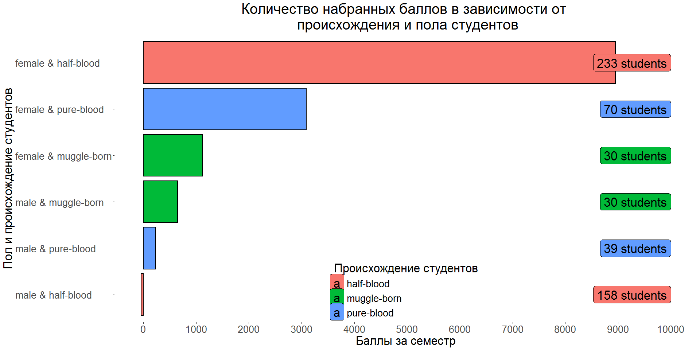<!-- -->

### geom_col и вещи вокруг него Задание 4

Изучите функцию coord_flip() . Как вы думаете, когда она может быть полезна? Как вы думаете, в чем ее плюсы и минусы? (дополнительные 0.5 б.)


``` r
# Попробуем использовать функцию coord_flip() с графиками  geom_col_2_corr и geom_col_3 и geom_col_2_notCORR

geom_col_2_corr+
  coord_flip() 
```

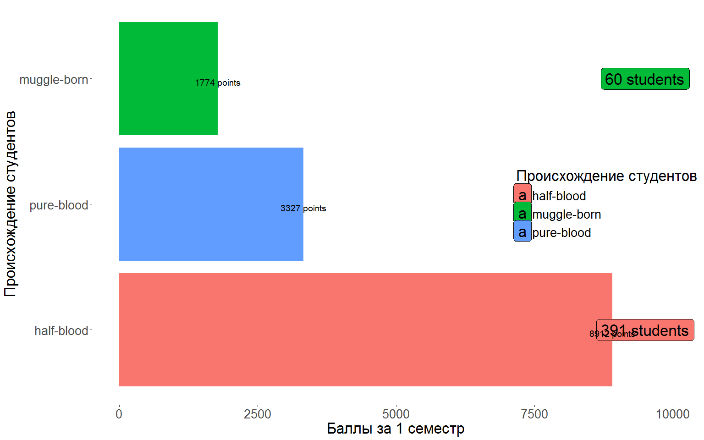<!-- -->

``` r
geom_col_3+
  coord_flip() 
```

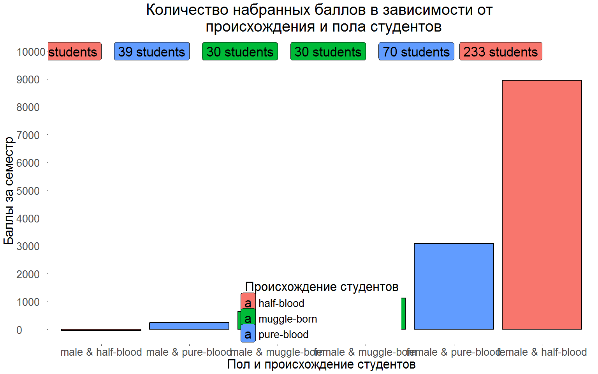<!-- -->

``` r
geom_col_2_notCORR+
  coord_flip() 
```

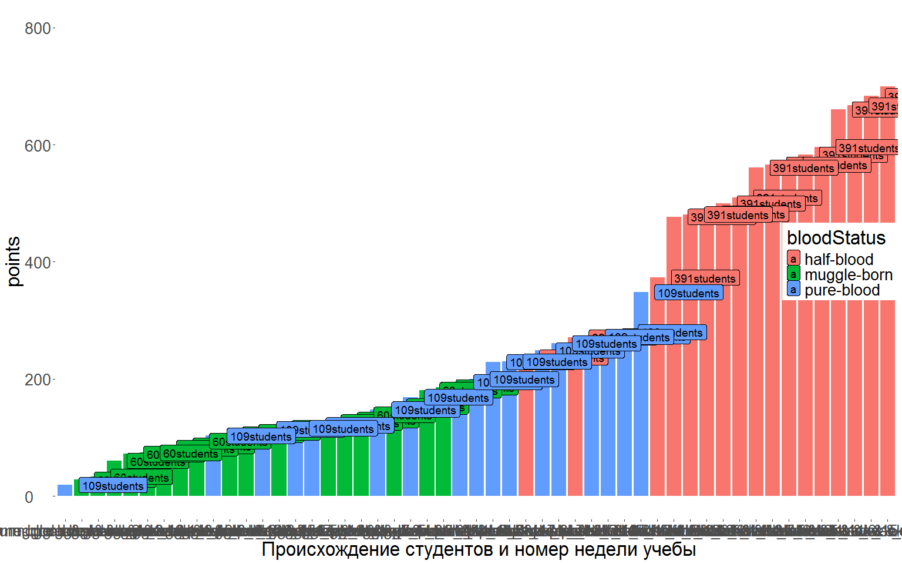<!-- -->

Минусы функции: форматированные графики с данной фукцией теряю свою "красоту" из-за появления разнообразных стилистических ошибок. Возможно при простых графиках с наименьшим количесвом собственных настроек данная ункция будет работать лучше? проверим гипотезу


``` r
scatter_result_Herb+
  coord_flip() 
```

```
## `geom_smooth()` using formula = 'y ~ x'
```

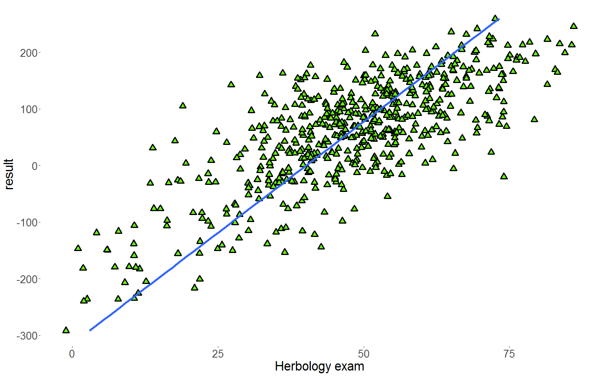<!-- -->

``` r
scat_pl_2+
  coord_flip() 
```

```
## `geom_smooth()` using formula = 'y ~ x'
```

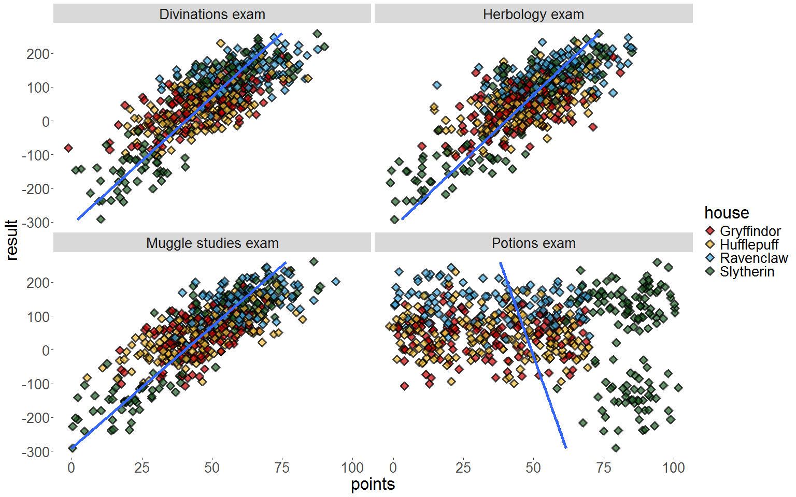<!-- -->

два графика не потеряли свою "эстетическую красоту" функция сработала на ура

ИТОГ:

Для чего полезна:

Функция полезна, когда данные лучше воспринимаются в горизонтальном формате.Пример, при построении бар-графиков с длинными столбцами. Горизонтальное расположение столцов облегчает чтение и интерпритацию графика.

Плюсы: 1. Простота использования 2. Хорошо подходит для графиков с параметрами "по умолчанию"

Минусы: 1. Плохо подходит для графиков с множеством настроеек. 2. При изменении координат некоторые графики станут **не**информативными.

## Разное

### Разное Задание 1

Сравните распределение баллов за экзамен по зельеварению и за экзамен по древним рунам. Сделайте это тремя разными способами. Под разными способами понимаются идеологически разные геомы или способы группировки. Не считаются разными способами изменения константных визуальных параметров (цвет заливки, размер фигур) на сходных в остальном графиках. Объедините графики, таким образом, чтобы результирующий график имел два столбца и 2 строки. Два графика должны находиться в верхней строке и занимать равную площадь. Третий график должен занимать нижнюю строку целиком. (2 б).


``` r
# Первый граф - боксплот
 
pic_for_varia_1_1 <- hogwarts |> 
  select(id, sex, house, `Potions exam`, `Study of ancient runes exam`) |> 
  pivot_longer(-c(id, sex, house), names_to = 'exam', values_to = 'points') |>  
  mutate(sex = factor(sex,levels = c('male', "female"), labels = c("муж", "жен"))) |> 
  mutate(exam = factor(exam,levels = c('Potions exam', "Study of ancient runes exam"), labels = c("Зельеварение", "Древние руны"))) |> 
  
  ggplot( )+
    geom_boxplot(aes(x=exam, y=points, fill= house))+
    facet_grid(.~sex)+
    scale_fill_manual(values = c("Gryffindor" = "#C50000", 
                             "Hufflepuff" = "#ECB939",
                             "Ravenclaw" = "#41A6D9",
                             "Slytherin" = "#1F5D25"))+
    theme_custom
  
pic_for_varia_1_1
```

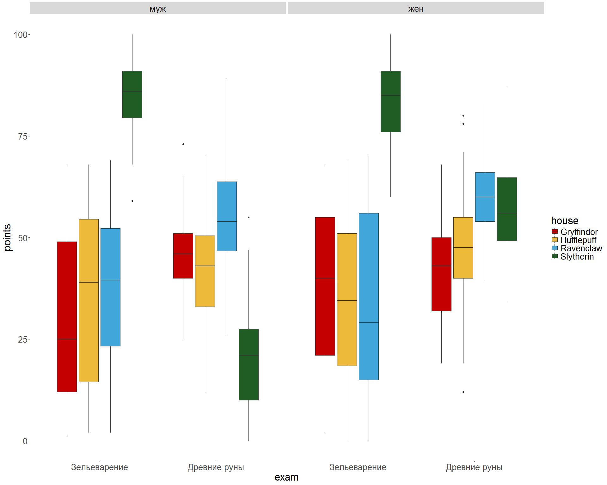<!-- -->

``` r
################################################
################################################

#  второй график - барплот

pic_for_varia_1_2 <- hogwarts |> 
  select(id, sex, house, `Potions exam`, `Study of ancient runes exam`) |> 
  pivot_longer(-c(id, sex, house), names_to = 'exam', values_to = 'points') |> 
  group_by(house, exam) |>
  summarise(points_mean= round(mean(points), digits = 2))  |> 
  mutate(exam = factor(exam,levels = c('Potions exam', "Study of ancient runes exam"), labels = c("Зельеварение", "Древние руны"))) |>  
  ggplot()+
  geom_col(aes(x=exam, y=points_mean, fill= house),
           position = "dodge2",
           alpha = 1)+
  scale_fill_manual(values = c("Gryffindor" = "#C50000", 
                             "Hufflepuff" = "#ECB939",
                             "Ravenclaw" = "#41A6D9",
                             "Slytherin" = "#1F5D25"))+

 geom_text(aes(x=exam ,
               y=points_mean ,
               # col = house, # лучше оставить текст черным, без раскрашивания
               label = points_mean),
           position = position_dodge2(width = 0.9), # Почему тут надо взять 0,9 = справка не дала ответа, возможно это связано с растояниями между столбцами в geom_col ( position = "dodge2") ??
           vjust =-0.3,
           hjust = "middle",
           size= 6)+
  theme_custom
```

```
## `summarise()` has grouped output by 'house'. You can override using the
## `.groups` argument.
```

``` r
pic_for_varia_1_2
```

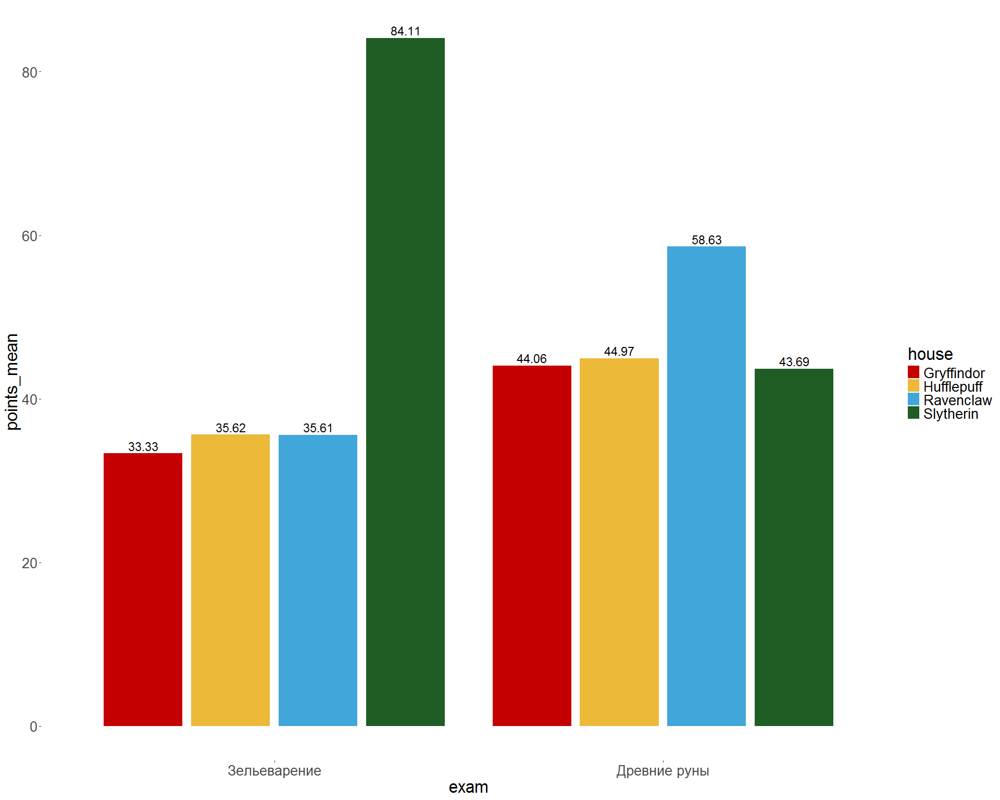<!-- -->

``` r
################################################
################################################

# Третий график диаграмма рассеяния
pic_for_varia_1_3 <- hogwarts |> 
  select(id, sex, result, house, `Potions exam`, `Study of ancient runes exam`) |> 
  pivot_longer(-c(id, sex, house, result), names_to = 'exam', values_to = 'points') |> 
  group_by(house, exam) |> 
  mutate(exam = factor(exam,levels = c('Potions exam', "Study of ancient runes exam"), labels = c("Зельеварение", "Древние руны"))) |> 
  ggplot( aes(x = result, y = points))+
  geom_point( aes( fill = exam ),
              alpha = 0.5,
             shape = 24, 
             size = 3, 
             stroke = 2, 
             position = position_jitter(width = 2.5, height = 2.5))+
  geom_smooth( aes(col = exam),
              se = FALSE,
              method = "lm", 
              linewidth = 3)+
   scale_fill_manual(values = c("Зельеварение" = "green4", 
                                "Древние руны" = "grey")
                  )+
  scale_colour_manual(values = c("Зельеварение" = "green4", 
                                "Древние руны" = "grey")
                  )+
  facet_grid(sex~.)+
  theme_custom+
   theme(legend.position = "inside",
        legend.justification.inside = c(0, 1))
 
pic_for_varia_1_3 
```

```
## `geom_smooth()` using formula = 'y ~ x'
```

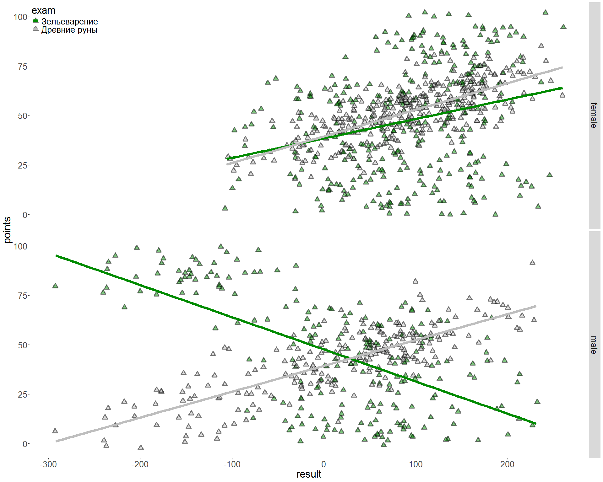<!-- -->

``` r
a1 <- ggarrange(plotlist = list(pic_for_varia_1_2,pic_for_varia_1_3),
          ncol = 2,  
          heights = c(1,1))
```

```
## Warning in grid.Call(C_textBounds, as.graphicsAnnot(x$label), x$x, x$y, :
## неизвестна ширина символа 0xc7 в кодировке CP1251
```

```
## Warning in grid.Call(C_textBounds, as.graphicsAnnot(x$label), x$x, x$y, :
## неизвестна ширина символа 0xe5 в кодировке CP1251
```

```
## Warning in grid.Call(C_textBounds, as.graphicsAnnot(x$label), x$x, x$y, :
## неизвестна ширина символа 0xeb в кодировке CP1251
```

```
## Warning in grid.Call(C_textBounds, as.graphicsAnnot(x$label), x$x, x$y, :
## неизвестна ширина символа 0xfc в кодировке CP1251
```

```
## Warning in grid.Call(C_textBounds, as.graphicsAnnot(x$label), x$x, x$y, :
## неизвестна ширина символа 0xe5 в кодировке CP1251
```

```
## Warning in grid.Call(C_textBounds, as.graphicsAnnot(x$label), x$x, x$y, :
## неизвестна ширина символа 0xe2 в кодировке CP1251
```

```
## Warning in grid.Call(C_textBounds, as.graphicsAnnot(x$label), x$x, x$y, :
## неизвестна ширина символа 0xe0 в кодировке CP1251
```

```
## Warning in grid.Call(C_textBounds, as.graphicsAnnot(x$label), x$x, x$y, :
## неизвестна ширина символа 0xf0 в кодировке CP1251
```

```
## Warning in grid.Call(C_textBounds, as.graphicsAnnot(x$label), x$x, x$y, :
## неизвестна ширина символа 0xe5 в кодировке CP1251
```

```
## Warning in grid.Call(C_textBounds, as.graphicsAnnot(x$label), x$x, x$y, :
## неизвестна ширина символа 0xed в кодировке CP1251
```

```
## Warning in grid.Call(C_textBounds, as.graphicsAnnot(x$label), x$x, x$y, :
## неизвестна ширина символа 0xe8 в кодировке CP1251
```

```
## Warning in grid.Call(C_textBounds, as.graphicsAnnot(x$label), x$x, x$y, :
## неизвестна ширина символа 0xe5 в кодировке CP1251
```

```
## Warning in grid.Call(C_textBounds, as.graphicsAnnot(x$label), x$x, x$y, :
## неизвестна ширина символа 0xc4 в кодировке CP1251
```

```
## Warning in grid.Call(C_textBounds, as.graphicsAnnot(x$label), x$x, x$y, :
## неизвестна ширина символа 0xf0 в кодировке CP1251
```

```
## Warning in grid.Call(C_textBounds, as.graphicsAnnot(x$label), x$x, x$y, :
## неизвестна ширина символа 0xe5 в кодировке CP1251
```

```
## Warning in grid.Call(C_textBounds, as.graphicsAnnot(x$label), x$x, x$y, :
## неизвестна ширина символа 0xe2 в кодировке CP1251
```

```
## Warning in grid.Call(C_textBounds, as.graphicsAnnot(x$label), x$x, x$y, :
## неизвестна ширина символа 0xed в кодировке CP1251
```

```
## Warning in grid.Call(C_textBounds, as.graphicsAnnot(x$label), x$x, x$y, :
## неизвестна ширина символа 0xe8 в кодировке CP1251
```

```
## Warning in grid.Call(C_textBounds, as.graphicsAnnot(x$label), x$x, x$y, :
## неизвестна ширина символа 0xe5 в кодировке CP1251
```

```
## Warning in grid.Call(C_textBounds, as.graphicsAnnot(x$label), x$x, x$y, :
## неизвестна ширина символа 0xf0 в кодировке CP1251
```

```
## Warning in grid.Call(C_textBounds, as.graphicsAnnot(x$label), x$x, x$y, :
## неизвестна ширина символа 0xf3 в кодировке CP1251
```

```
## Warning in grid.Call(C_textBounds, as.graphicsAnnot(x$label), x$x, x$y, :
## неизвестна ширина символа 0xed в кодировке CP1251
```

```
## Warning in grid.Call(C_textBounds, as.graphicsAnnot(x$label), x$x, x$y, :
## неизвестна ширина символа 0xfb в кодировке CP1251
```

```
## `geom_smooth()` using formula = 'y ~ x'
```

```
## Warning in grid.Call(C_textBounds, as.graphicsAnnot(x$label), x$x, x$y, :
## неизвестна ширина символа 0xc7 в кодировке CP1251
```

```
## Warning in grid.Call(C_textBounds, as.graphicsAnnot(x$label), x$x, x$y, :
## неизвестна ширина символа 0xe5 в кодировке CP1251
```

```
## Warning in grid.Call(C_textBounds, as.graphicsAnnot(x$label), x$x, x$y, :
## неизвестна ширина символа 0xeb в кодировке CP1251
```

```
## Warning in grid.Call(C_textBounds, as.graphicsAnnot(x$label), x$x, x$y, :
## неизвестна ширина символа 0xfc в кодировке CP1251
```

```
## Warning in grid.Call(C_textBounds, as.graphicsAnnot(x$label), x$x, x$y, :
## неизвестна ширина символа 0xe5 в кодировке CP1251
```

```
## Warning in grid.Call(C_textBounds, as.graphicsAnnot(x$label), x$x, x$y, :
## неизвестна ширина символа 0xe2 в кодировке CP1251
```

```
## Warning in grid.Call(C_textBounds, as.graphicsAnnot(x$label), x$x, x$y, :
## неизвестна ширина символа 0xe0 в кодировке CP1251
```

```
## Warning in grid.Call(C_textBounds, as.graphicsAnnot(x$label), x$x, x$y, :
## неизвестна ширина символа 0xf0 в кодировке CP1251
```

```
## Warning in grid.Call(C_textBounds, as.graphicsAnnot(x$label), x$x, x$y, :
## неизвестна ширина символа 0xe5 в кодировке CP1251
```

```
## Warning in grid.Call(C_textBounds, as.graphicsAnnot(x$label), x$x, x$y, :
## неизвестна ширина символа 0xed в кодировке CP1251
```

```
## Warning in grid.Call(C_textBounds, as.graphicsAnnot(x$label), x$x, x$y, :
## неизвестна ширина символа 0xe8 в кодировке CP1251
```

```
## Warning in grid.Call(C_textBounds, as.graphicsAnnot(x$label), x$x, x$y, :
## неизвестна ширина символа 0xe5 в кодировке CP1251
```

```
## Warning in grid.Call(C_textBounds, as.graphicsAnnot(x$label), x$x, x$y, :
## неизвестна ширина символа 0xc4 в кодировке CP1251
```

```
## Warning in grid.Call(C_textBounds, as.graphicsAnnot(x$label), x$x, x$y, :
## неизвестна ширина символа 0xf0 в кодировке CP1251
```

```
## Warning in grid.Call(C_textBounds, as.graphicsAnnot(x$label), x$x, x$y, :
## неизвестна ширина символа 0xe5 в кодировке CP1251
```

```
## Warning in grid.Call(C_textBounds, as.graphicsAnnot(x$label), x$x, x$y, :
## неизвестна ширина символа 0xe2 в кодировке CP1251
```

```
## Warning in grid.Call(C_textBounds, as.graphicsAnnot(x$label), x$x, x$y, :
## неизвестна ширина символа 0xed в кодировке CP1251
```

```
## Warning in grid.Call(C_textBounds, as.graphicsAnnot(x$label), x$x, x$y, :
## неизвестна ширина символа 0xe8 в кодировке CP1251
```

```
## Warning in grid.Call(C_textBounds, as.graphicsAnnot(x$label), x$x, x$y, :
## неизвестна ширина символа 0xe5 в кодировке CP1251
```

```
## Warning in grid.Call(C_textBounds, as.graphicsAnnot(x$label), x$x, x$y, :
## неизвестна ширина символа 0xf0 в кодировке CP1251
```

```
## Warning in grid.Call(C_textBounds, as.graphicsAnnot(x$label), x$x, x$y, :
## неизвестна ширина символа 0xf3 в кодировке CP1251
```

```
## Warning in grid.Call(C_textBounds, as.graphicsAnnot(x$label), x$x, x$y, :
## неизвестна ширина символа 0xed в кодировке CP1251
```

```
## Warning in grid.Call(C_textBounds, as.graphicsAnnot(x$label), x$x, x$y, :
## неизвестна ширина символа 0xfb в кодировке CP1251
```

```
## Warning in grid.Call(C_textBounds, as.graphicsAnnot(x$label), x$x, x$y, :
## неизвестна ширина символа 0xc7 в кодировке CP1251
```

```
## Warning in grid.Call(C_textBounds, as.graphicsAnnot(x$label), x$x, x$y, :
## неизвестна ширина символа 0xe5 в кодировке CP1251
```

```
## Warning in grid.Call(C_textBounds, as.graphicsAnnot(x$label), x$x, x$y, :
## неизвестна ширина символа 0xeb в кодировке CP1251
```

```
## Warning in grid.Call(C_textBounds, as.graphicsAnnot(x$label), x$x, x$y, :
## неизвестна ширина символа 0xfc в кодировке CP1251
```

```
## Warning in grid.Call(C_textBounds, as.graphicsAnnot(x$label), x$x, x$y, :
## неизвестна ширина символа 0xe5 в кодировке CP1251
```

```
## Warning in grid.Call(C_textBounds, as.graphicsAnnot(x$label), x$x, x$y, :
## неизвестна ширина символа 0xe2 в кодировке CP1251
```

```
## Warning in grid.Call(C_textBounds, as.graphicsAnnot(x$label), x$x, x$y, :
## неизвестна ширина символа 0xe0 в кодировке CP1251
```

```
## Warning in grid.Call(C_textBounds, as.graphicsAnnot(x$label), x$x, x$y, :
## неизвестна ширина символа 0xf0 в кодировке CP1251
```

```
## Warning in grid.Call(C_textBounds, as.graphicsAnnot(x$label), x$x, x$y, :
## неизвестна ширина символа 0xe5 в кодировке CP1251
```

```
## Warning in grid.Call(C_textBounds, as.graphicsAnnot(x$label), x$x, x$y, :
## неизвестна ширина символа 0xed в кодировке CP1251
```

```
## Warning in grid.Call(C_textBounds, as.graphicsAnnot(x$label), x$x, x$y, :
## неизвестна ширина символа 0xe8 в кодировке CP1251
```

```
## Warning in grid.Call(C_textBounds, as.graphicsAnnot(x$label), x$x, x$y, :
## неизвестна ширина символа 0xe5 в кодировке CP1251
```

```
## Warning in grid.Call(C_textBounds, as.graphicsAnnot(x$label), x$x, x$y, :
## неизвестна ширина символа 0xc4 в кодировке CP1251
```

```
## Warning in grid.Call(C_textBounds, as.graphicsAnnot(x$label), x$x, x$y, :
## неизвестна ширина символа 0xf0 в кодировке CP1251
```

```
## Warning in grid.Call(C_textBounds, as.graphicsAnnot(x$label), x$x, x$y, :
## неизвестна ширина символа 0xe5 в кодировке CP1251
```

```
## Warning in grid.Call(C_textBounds, as.graphicsAnnot(x$label), x$x, x$y, :
## неизвестна ширина символа 0xe2 в кодировке CP1251
```

```
## Warning in grid.Call(C_textBounds, as.graphicsAnnot(x$label), x$x, x$y, :
## неизвестна ширина символа 0xed в кодировке CP1251
```

```
## Warning in grid.Call(C_textBounds, as.graphicsAnnot(x$label), x$x, x$y, :
## неизвестна ширина символа 0xe8 в кодировке CP1251
```

```
## Warning in grid.Call(C_textBounds, as.graphicsAnnot(x$label), x$x, x$y, :
## неизвестна ширина символа 0xe5 в кодировке CP1251
```

```
## Warning in grid.Call(C_textBounds, as.graphicsAnnot(x$label), x$x, x$y, :
## неизвестна ширина символа 0xf0 в кодировке CP1251
```

```
## Warning in grid.Call(C_textBounds, as.graphicsAnnot(x$label), x$x, x$y, :
## неизвестна ширина символа 0xf3 в кодировке CP1251
```

```
## Warning in grid.Call(C_textBounds, as.graphicsAnnot(x$label), x$x, x$y, :
## неизвестна ширина символа 0xed в кодировке CP1251
```

```
## Warning in grid.Call(C_textBounds, as.graphicsAnnot(x$label), x$x, x$y, :
## неизвестна ширина символа 0xfb в кодировке CP1251
```

``` r
ggarrange(plotlist = list(a1,pic_for_varia_1_1),
          nrow = 2,  
          heights = c(1,1))
```

```
## Warning in grid.Call(C_textBounds, as.graphicsAnnot(x$label), x$x, x$y, :
## неизвестна ширина символа 0xc7 в кодировке CP1251
```

```
## Warning in grid.Call(C_textBounds, as.graphicsAnnot(x$label), x$x, x$y, :
## неизвестна ширина символа 0xe5 в кодировке CP1251
```

```
## Warning in grid.Call(C_textBounds, as.graphicsAnnot(x$label), x$x, x$y, :
## неизвестна ширина символа 0xeb в кодировке CP1251
```

```
## Warning in grid.Call(C_textBounds, as.graphicsAnnot(x$label), x$x, x$y, :
## неизвестна ширина символа 0xfc в кодировке CP1251
```

```
## Warning in grid.Call(C_textBounds, as.graphicsAnnot(x$label), x$x, x$y, :
## неизвестна ширина символа 0xe5 в кодировке CP1251
```

```
## Warning in grid.Call(C_textBounds, as.graphicsAnnot(x$label), x$x, x$y, :
## неизвестна ширина символа 0xe2 в кодировке CP1251
```

```
## Warning in grid.Call(C_textBounds, as.graphicsAnnot(x$label), x$x, x$y, :
## неизвестна ширина символа 0xe0 в кодировке CP1251
```

```
## Warning in grid.Call(C_textBounds, as.graphicsAnnot(x$label), x$x, x$y, :
## неизвестна ширина символа 0xf0 в кодировке CP1251
```

```
## Warning in grid.Call(C_textBounds, as.graphicsAnnot(x$label), x$x, x$y, :
## неизвестна ширина символа 0xe5 в кодировке CP1251
```

```
## Warning in grid.Call(C_textBounds, as.graphicsAnnot(x$label), x$x, x$y, :
## неизвестна ширина символа 0xed в кодировке CP1251
```

```
## Warning in grid.Call(C_textBounds, as.graphicsAnnot(x$label), x$x, x$y, :
## неизвестна ширина символа 0xe8 в кодировке CP1251
```

```
## Warning in grid.Call(C_textBounds, as.graphicsAnnot(x$label), x$x, x$y, :
## неизвестна ширина символа 0xe5 в кодировке CP1251
```

```
## Warning in grid.Call(C_textBounds, as.graphicsAnnot(x$label), x$x, x$y, :
## неизвестна ширина символа 0xc4 в кодировке CP1251
```

```
## Warning in grid.Call(C_textBounds, as.graphicsAnnot(x$label), x$x, x$y, :
## неизвестна ширина символа 0xf0 в кодировке CP1251
```

```
## Warning in grid.Call(C_textBounds, as.graphicsAnnot(x$label), x$x, x$y, :
## неизвестна ширина символа 0xe5 в кодировке CP1251
```

```
## Warning in grid.Call(C_textBounds, as.graphicsAnnot(x$label), x$x, x$y, :
## неизвестна ширина символа 0xe2 в кодировке CP1251
```

```
## Warning in grid.Call(C_textBounds, as.graphicsAnnot(x$label), x$x, x$y, :
## неизвестна ширина символа 0xed в кодировке CP1251
```

```
## Warning in grid.Call(C_textBounds, as.graphicsAnnot(x$label), x$x, x$y, :
## неизвестна ширина символа 0xe8 в кодировке CP1251
```

```
## Warning in grid.Call(C_textBounds, as.graphicsAnnot(x$label), x$x, x$y, :
## неизвестна ширина символа 0xe5 в кодировке CP1251
```

```
## Warning in grid.Call(C_textBounds, as.graphicsAnnot(x$label), x$x, x$y, :
## неизвестна ширина символа 0xf0 в кодировке CP1251
```

```
## Warning in grid.Call(C_textBounds, as.graphicsAnnot(x$label), x$x, x$y, :
## неизвестна ширина символа 0xf3 в кодировке CP1251
```

```
## Warning in grid.Call(C_textBounds, as.graphicsAnnot(x$label), x$x, x$y, :
## неизвестна ширина символа 0xed в кодировке CP1251
```

```
## Warning in grid.Call(C_textBounds, as.graphicsAnnot(x$label), x$x, x$y, :
## неизвестна ширина символа 0xfb в кодировке CP1251
```

```
## Warning in grid.Call(C_textBounds, as.graphicsAnnot(x$label), x$x, x$y, :
## неизвестна ширина символа 0xc7 в кодировке CP1251
```

```
## Warning in grid.Call(C_textBounds, as.graphicsAnnot(x$label), x$x, x$y, :
## неизвестна ширина символа 0xe5 в кодировке CP1251
```

```
## Warning in grid.Call(C_textBounds, as.graphicsAnnot(x$label), x$x, x$y, :
## неизвестна ширина символа 0xeb в кодировке CP1251
```

```
## Warning in grid.Call(C_textBounds, as.graphicsAnnot(x$label), x$x, x$y, :
## неизвестна ширина символа 0xfc в кодировке CP1251
```

```
## Warning in grid.Call(C_textBounds, as.graphicsAnnot(x$label), x$x, x$y, :
## неизвестна ширина символа 0xe5 в кодировке CP1251
```

```
## Warning in grid.Call(C_textBounds, as.graphicsAnnot(x$label), x$x, x$y, :
## неизвестна ширина символа 0xe2 в кодировке CP1251
```

```
## Warning in grid.Call(C_textBounds, as.graphicsAnnot(x$label), x$x, x$y, :
## неизвестна ширина символа 0xe0 в кодировке CP1251
```

```
## Warning in grid.Call(C_textBounds, as.graphicsAnnot(x$label), x$x, x$y, :
## неизвестна ширина символа 0xf0 в кодировке CP1251
```

```
## Warning in grid.Call(C_textBounds, as.graphicsAnnot(x$label), x$x, x$y, :
## неизвестна ширина символа 0xe5 в кодировке CP1251
```

```
## Warning in grid.Call(C_textBounds, as.graphicsAnnot(x$label), x$x, x$y, :
## неизвестна ширина символа 0xed в кодировке CP1251
```

```
## Warning in grid.Call(C_textBounds, as.graphicsAnnot(x$label), x$x, x$y, :
## неизвестна ширина символа 0xe8 в кодировке CP1251
```

```
## Warning in grid.Call(C_textBounds, as.graphicsAnnot(x$label), x$x, x$y, :
## неизвестна ширина символа 0xe5 в кодировке CP1251
```

```
## Warning in grid.Call(C_textBounds, as.graphicsAnnot(x$label), x$x, x$y, :
## неизвестна ширина символа 0xc4 в кодировке CP1251
```

```
## Warning in grid.Call(C_textBounds, as.graphicsAnnot(x$label), x$x, x$y, :
## неизвестна ширина символа 0xf0 в кодировке CP1251
```

```
## Warning in grid.Call(C_textBounds, as.graphicsAnnot(x$label), x$x, x$y, :
## неизвестна ширина символа 0xe5 в кодировке CP1251
```

```
## Warning in grid.Call(C_textBounds, as.graphicsAnnot(x$label), x$x, x$y, :
## неизвестна ширина символа 0xe2 в кодировке CP1251
```

```
## Warning in grid.Call(C_textBounds, as.graphicsAnnot(x$label), x$x, x$y, :
## неизвестна ширина символа 0xed в кодировке CP1251
```

```
## Warning in grid.Call(C_textBounds, as.graphicsAnnot(x$label), x$x, x$y, :
## неизвестна ширина символа 0xe8 в кодировке CP1251
```

```
## Warning in grid.Call(C_textBounds, as.graphicsAnnot(x$label), x$x, x$y, :
## неизвестна ширина символа 0xe5 в кодировке CP1251
```

```
## Warning in grid.Call(C_textBounds, as.graphicsAnnot(x$label), x$x, x$y, :
## неизвестна ширина символа 0xf0 в кодировке CP1251
```

```
## Warning in grid.Call(C_textBounds, as.graphicsAnnot(x$label), x$x, x$y, :
## неизвестна ширина символа 0xf3 в кодировке CP1251
```

```
## Warning in grid.Call(C_textBounds, as.graphicsAnnot(x$label), x$x, x$y, :
## неизвестна ширина символа 0xed в кодировке CP1251
```

```
## Warning in grid.Call(C_textBounds, as.graphicsAnnot(x$label), x$x, x$y, :
## неизвестна ширина символа 0xfb в кодировке CP1251
```

```
## Warning in grid.Call(C_textBounds, as.graphicsAnnot(x$label), x$x, x$y, :
## неизвестна ширина символа 0xec в кодировке CP1251
```

```
## Warning in grid.Call(C_textBounds, as.graphicsAnnot(x$label), x$x, x$y, :
## неизвестна ширина символа 0xf3 в кодировке CP1251
```

```
## Warning in grid.Call(C_textBounds, as.graphicsAnnot(x$label), x$x, x$y, :
## неизвестна ширина символа 0xe6 в кодировке CP1251
## Warning in grid.Call(C_textBounds, as.graphicsAnnot(x$label), x$x, x$y, :
## неизвестна ширина символа 0xe6 в кодировке CP1251
```

```
## Warning in grid.Call(C_textBounds, as.graphicsAnnot(x$label), x$x, x$y, :
## неизвестна ширина символа 0xe5 в кодировке CP1251
```

```
## Warning in grid.Call(C_textBounds, as.graphicsAnnot(x$label), x$x, x$y, :
## неизвестна ширина символа 0xed в кодировке CP1251
```

```
## Warning in grid.Call(C_textBounds, as.graphicsAnnot(x$label), x$x, x$y, :
## неизвестна ширина символа 0xec в кодировке CP1251
```

```
## Warning in grid.Call(C_textBounds, as.graphicsAnnot(x$label), x$x, x$y, :
## неизвестна ширина символа 0xf3 в кодировке CP1251
```

```
## Warning in grid.Call(C_textBounds, as.graphicsAnnot(x$label), x$x, x$y, :
## неизвестна ширина символа 0xe6 в кодировке CP1251
## Warning in grid.Call(C_textBounds, as.graphicsAnnot(x$label), x$x, x$y, :
## неизвестна ширина символа 0xe6 в кодировке CP1251
```

```
## Warning in grid.Call(C_textBounds, as.graphicsAnnot(x$label), x$x, x$y, :
## неизвестна ширина символа 0xe5 в кодировке CP1251
```

```
## Warning in grid.Call(C_textBounds, as.graphicsAnnot(x$label), x$x, x$y, :
## неизвестна ширина символа 0xed в кодировке CP1251
```

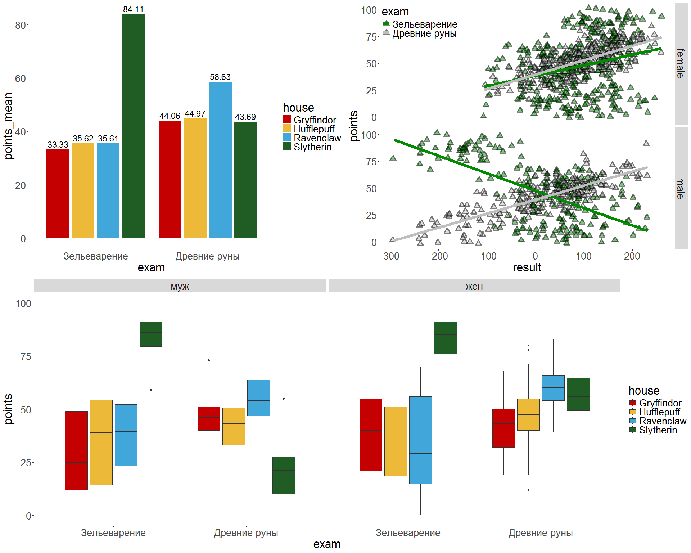<!-- -->

### Разное Задание 2

Визуализируйте средний балл по зельеварению студентов с различным происхождением. Вы вольны добавить дополнительные детали и информацию на график. Проинтерпретируйте результат. Как вы думаете, почему он именно такой? Если у вас есть гипотеза, проиллюстрируйте ее еще одним графиком (или графиками). Объедините их при помощи ggarrange. (по 1 б. за первый и график и правильную интерпретацию с подтверждением в виде второго графика и текстовой аргументации). Измените порядок ваших фигур на первом графике слева направо следующим образом: маглорожденные,, чистокровные, полукровки. Скорректируйте название оси. Если у вас возникают сложности, обратитесь к шпаргалке по пакету forcats от posit. (Дополнительные 0.5 б.)


``` r
# создадим датасет для графика. среднее найдем при помощи Hmisc::mean_cl_normal (дает среднее и дов интервал)

data_for_varia_2_1 <- hogwarts |>
  select(id, sex, house, bloodStatus, `Potions exam`, result, course) |>
  group_by(bloodStatus) |>
 summarise(students_count = n(),
           result_mean= round(mean(result), digits = 2),
           Potions_exam= round(mean_cl_normal(`Potions exam`), digits = 2)) 
  
# Визуализируем график geom_pointrange

pic_varia_2_1 <- ggplot(data_for_varia_2_1)+
  geom_pointrange(
    aes(
      x = fct_relevel(bloodStatus, c("muggle-born", "pure-blood", "half-blood")), 
      y = Potions_exam$y,
      ymin = Potions_exam$ymin,
      ymax = Potions_exam$ymax,
      col = bloodStatus
    ),
    linewidth = 3,
    size = 2
  )+
 
  labs(
    x = "Происхождение студентов",
    y = "Средний балл за экзамен по зельеварению"
  )+
  theme_custom+
   theme(legend.position = "inside",
        legend.justification.inside = c(0, 1))
 

pic_varia_2_1 
```

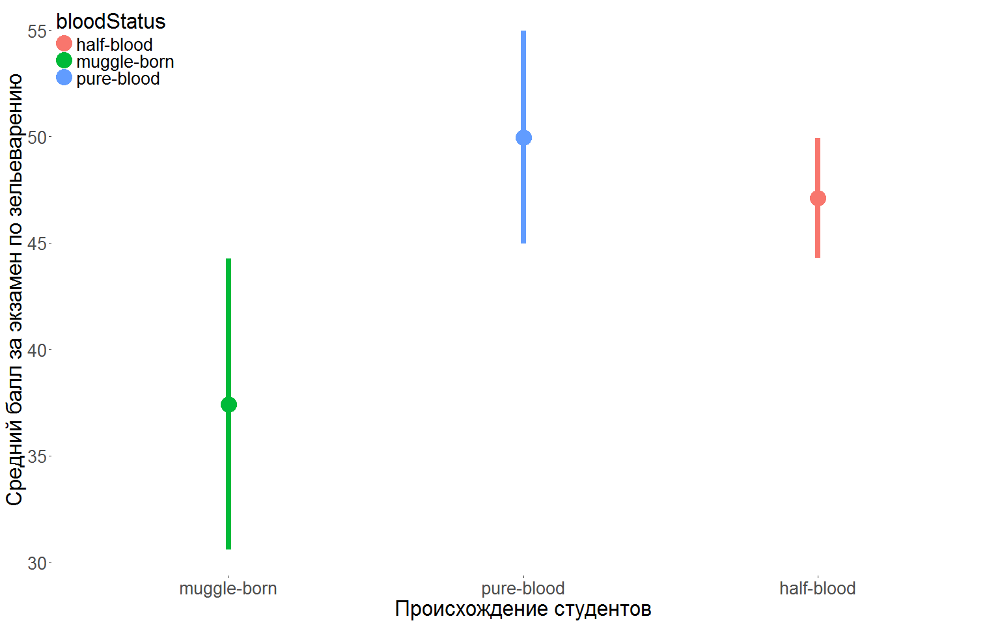<!-- -->

Средний балл студентов распредилися следующим образом: маглорожденные \< полукровки \< чистокровные. На графике заметно что Cl у чистокровных и полукровок перекрываются. ссответсвтенно их средние оценки "похожи". Возможно данные результаты связы с тем, что чистокровные и полукровки занимаются дополнительно дома? Тогда на факультетах и на разных курсах должна сохранятся данна тенденция (У маглорожденных результаты будут ниже чем у полукровок и чистокровных)


``` r
# Комментарии это ведь способ общения с читателем?
# что бы Преподаватель не заскучал вот анекдот. Чтобы приготовить колдовское зелье, просто возьмите в «Пятерочке» любой консервированный паштет. Там в составе как раз все, что нужно - шкура кабана, когти совы, мышиный порошок.
# создадим датасет для графика. среднее найдем при помощи Hmisc::mean_cl_normal (дает среднее и дов интервал)

data_for_varia_2_2 <- hogwarts |>
  select(id, sex, house, bloodStatus, `Potions exam`, result, course) |>
  group_by(bloodStatus,course, house) |>
 summarise(students_count = n(),
           result_mean= round(mean(result), digits = 2),
           Potions_exam= round(mean_cl_normal(`Potions exam`), digits = 2)) 
```

```
## `summarise()` has grouped output by 'bloodStatus', 'course'. You can override
## using the `.groups` argument.
```

``` r
# Визуализируем график geom_pointrange

pic_varia_2_2 <- ggplot(data_for_varia_2_2)+
  geom_pointrange(
    aes(
      x = course, 
      y = Potions_exam$y,
      ymin = Potions_exam$ymin,
      ymax = Potions_exam$ymax,
      col = bloodStatus,
    ),
    linewidth = 1,
    alpha = 0.7,
    size = 2, 
     position = position_dodge2(width = 0.2)
  )+
 
  labs(
    x = "Курс",
    y = "Средний балл за экзамен по зельеварению"
  )+
  ylim(0, 100)+
  theme(legend.position = "inside",
        legend.justification.inside = c(0, 1))+
  facet_grid(.~house)+
  
  theme_custom
 
pic_varia_2_2
```

```
## Warning: Removed 10 rows containing missing values or values outside the scale range
## (`geom_segment()`).
```

```
## Warning: Removed 5 rows containing missing values or values outside the scale range
## (`geom_segment()`).
```

```
## Warning: Removed 8 rows containing missing values or values outside the scale range
## (`geom_segment()`).
```

```
## Warning: Removed 9 rows containing missing values or values outside the scale range
## (`geom_segment()`).
```

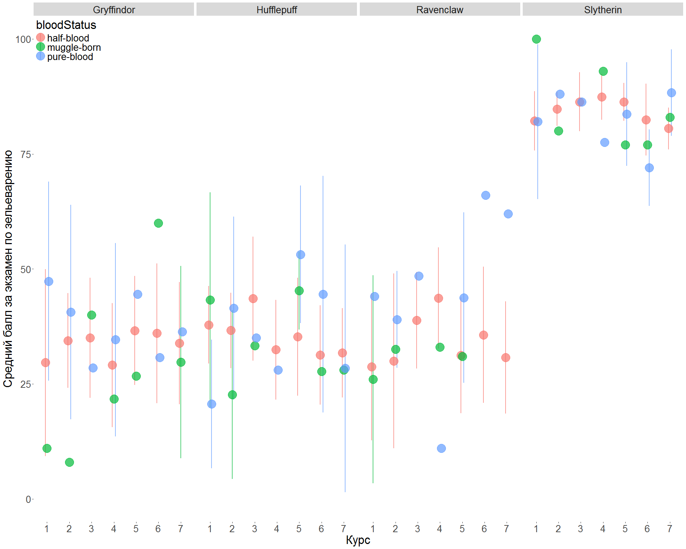<!-- -->

``` r
ggarrange(plotlist = list(pic_varia_2_1, pic_varia_2_2),
          nrow= 2,  
          heights = c(1,1))
```

```
## Warning: Removed 10 rows containing missing values or values outside the scale range
## (`geom_segment()`).
```

```
## Warning: Removed 5 rows containing missing values or values outside the scale range
## (`geom_segment()`).
```

```
## Warning: Removed 8 rows containing missing values or values outside the scale range
## (`geom_segment()`).
```

```
## Warning: Removed 9 rows containing missing values or values outside the scale range
## (`geom_segment()`).
```

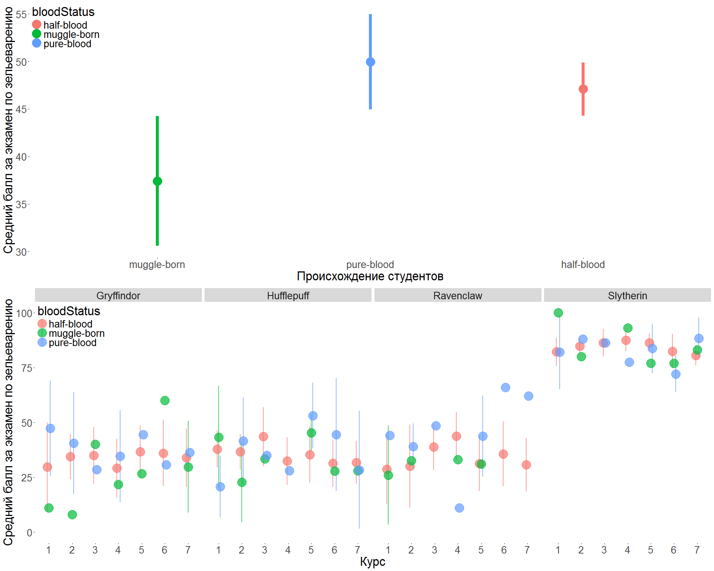<!-- -->

## Воспроизведение графика

Дополнительное задание на 4 балла. Воспроизведите график максимально близко к оригиналу и проинтерпретируйте его.


``` r
### в данном графике 4 слоя: 
# 1. виолин-плот 
# 2. Бокс-плот
# 3. Горизонтальная линия (geom_vline())
# 4. точечная диаграмма cсо средними значениями баллов. для 4 слоя построим таблицу

data_result_mean <- hogwarts |>
  select( house, result) |>
  group_by(house) |>
 summarise(result_mean= round(mean(result), digits = 0))

theme_custom1 <- theme(
    panel.background = element_rect(fill = "white"),
    plot.title = element_text(size = 30, hjust = 0.5),
    plot.subtitle = element_text(size = 20, hjust = 0.5, colour = "chocolate4"),
    strip.text = element_text(size = 20),
    axis.text = element_text(size = 20),
    axis.title = element_text(size = 25),
    axis.title.x = element_blank(),
     axis.text.x = element_blank(),
    legend.title = element_text(size = 25),
    legend.text = element_text(size = 20, face = "italic")
  )


ggplot(hogwarts, aes(x = house,
                     y = result))+
geom_violin(aes(fill = house))+
geom_boxplot(width = 0.1,
             colour = "grey")+
geom_hline(yintercept = 0,
           linetype = "dashed",
           colour = "pink",
           linewidth = 2)+

labs(
title = "Баллы студентов Хогвартса",
subtitle = "Распределение числа баллов у студентов различных факультетов Хогвартса в 2023-2024 учебном году",
y = "Количество очков",
fill = "Факультет",
caption = "Источник: нездоровая фантазия автора лекции"
   )+
facet_grid(.~sex, labeller = as_labeller( c("female" = "Девочки",
                                            "male" = "Мальчики")))+ 
  
theme_custom1+

scale_fill_manual(
                  labels = c("Gryffindor" = "Гриффиндор", 
                             "Hufflepuff" = "Пуффендуй",
                             "Ravenclaw" = "Пуффендуй",
                             "Slytherin" = "Слизерин"),
                  values = c("Gryffindor" = "#C50000", 
                             "Hufflepuff" = "#ECB939",
                             "Ravenclaw" = "#41A6D9",
                             "Slytherin" = "#1F5D25"))+
scale_y_continuous(breaks = seq(-300, 300, by = 50))+
  
   theme(legend.position = "inside",
        legend.justification.inside = c(0.5, 0))+
  geom_point(data = data_result_mean, aes(x = house,
                     y = result_mean), color = "black", fill  = "red"  , size = 14, shape = 23, alpha = 1) 
```

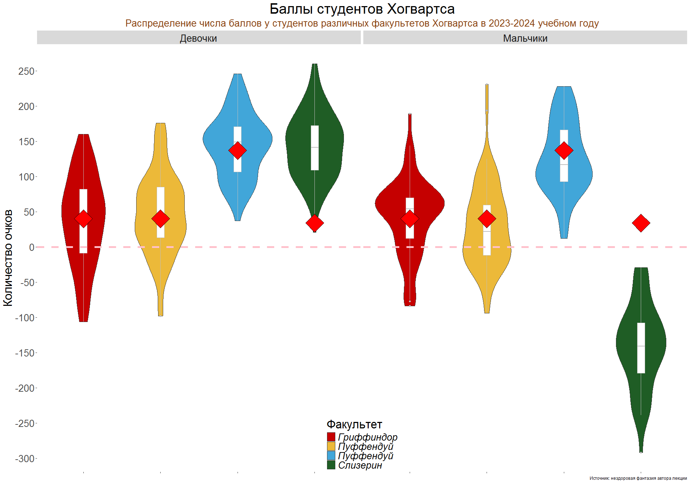<!-- -->

``` r
  # stat_summary(fun = "mean", geom = "point", color = "red", size = 4, shape = 19, alpha = 1) 
  # ggplot(data_result_mean)+
  # geom_point)
```
